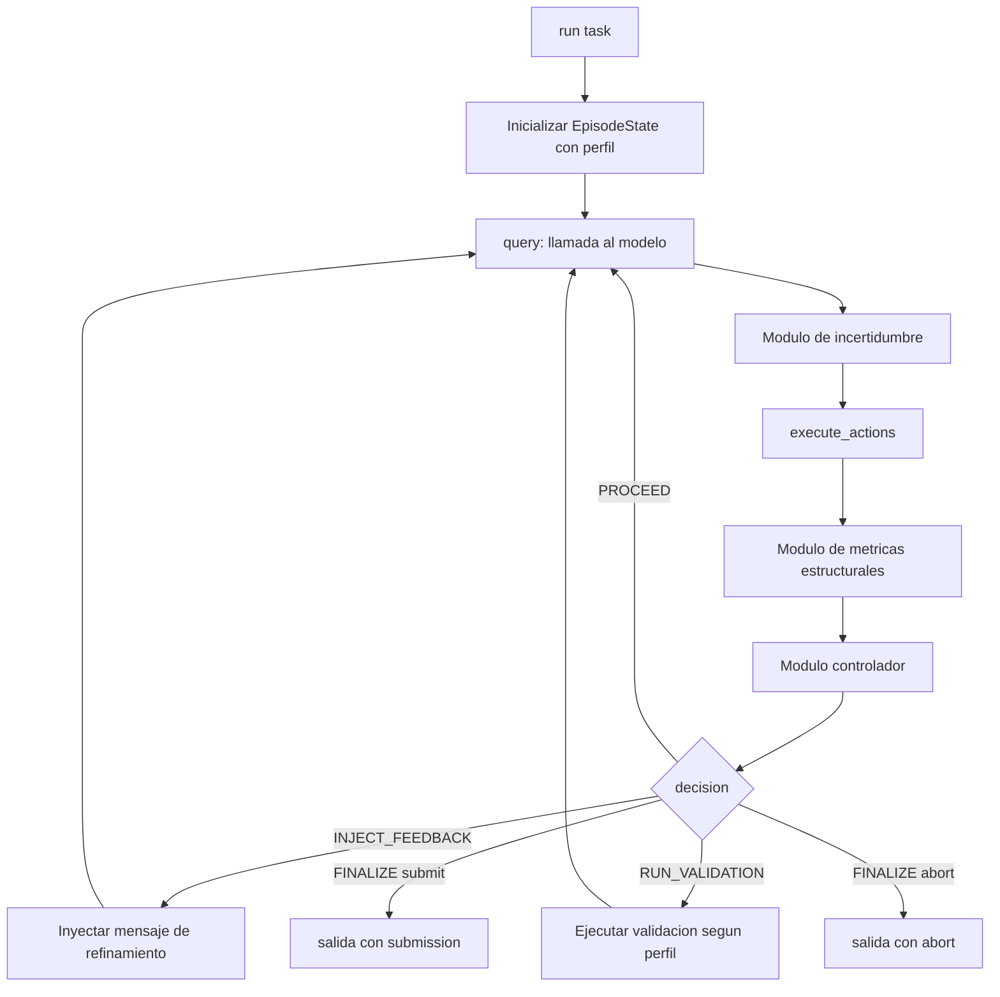
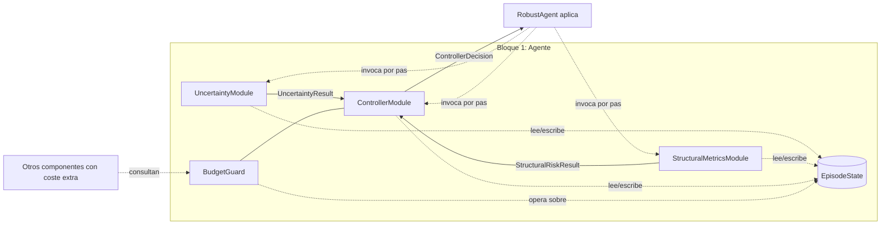

# Fase 2.1 - Especificación del bloque del agente

## 1. Objetivo y alcance

Este documento especifica el bloque del agente del TFG a un nivel **alto/medio**: arquitectura general, responsabilidades, interacciones entre módulos, contratos de datos transversales y modificaciones requeridas sobre el agente base. El detalle de bajo nivel (clases concretas, atributos, esquemas de almacenamiento, fórmulas finales) se desarrolla en los documentos de módulo y en el código.

El alcance es exclusivamente el **Bloque 1** del diseño del TFG. Quedan fuera el Bloque 2 (benchmark extendido) y el Bloque 3 (análisis de resultados), aunque se especifica la **interfaz** que el agente expone hacia ambos.

### 1.1 Documentos hermanos

La especificación del bloque del agente está repartida en cuatro documentos. **Este documento describe el sistema general**; cada módulo tiene su propio documento con su interfaz pública, submódulos internos y política de fallos.

- `docs/especificaciones/agente/modulo_incertidumbre.md` - clase `UncertaintyModule`, contrato `UncertaintyResult`; catálogo y selección de métodos de UQ.
- `docs/especificaciones/agente/modulo_metricas.md` - clase `StructuralMetricsModule`, contrato `StructuralRiskResult`.
- `docs/especificaciones/agente/modulo_controlador.md` - clase `ControllerModule`, subservicio `BudgetGuard`, contrato `ControllerDecision`.
- `src/agent/mini-swe-agent/README.md` - descripción del bucle base del agente seleccionado (`DefaultAgent`: `run → step → query → execute_actions`).

## 2. Agente base y motivación de la elección

El agente base es **`mini-SWE-agent`** (copia local en `src/agent/mini-swe-agent/`). Se ha elegido por tres motivos alineados con los objetivos del TFG:

1. **Diseño minimalista y lineal** del bucle de ejecución (`run → step → query → execute_actions`), lo que permite insertar instrumentación con cambios localizados y reproducibles.
2. **Separación explícita** entre agente, modelo y entorno mediante protocolos (`Agent`, `Model`, `Environment` en `minisweagent.__init__`), lo que permite reutilizar la base sin acoplamientos rígidos.
3. **Trazabilidad nativa** mediante `serialize()`/`save()` con un formato de trayectoria versionado (`mini-swe-agent-1.1`), reutilizable y extensible para los nuevos campos del TFG.

Componentes nucleares reutilizados:

- `minisweagent.agents.default.AgentConfig` y `DefaultAgent`.
- `minisweagent.models.litellm_model.LitellmModelConfig` y `LitellmModel`.
- `minisweagent.environments.local.LocalEnvironmentConfig` y `LocalEnvironment` (o entorno equivalente sandbox para experimentación).

## 3. Precondiciones del entorno y dependencias técnicas

El bloque del agente impone las siguientes precondiciones al contexto en el que se ejecuta. Estas precondiciones son responsabilidad del Bloque 2 (benchmark) garantizarlas.

- **PR1. Workspace bajo control de git.** El directorio sobre el que opera el agente debe ser un repositorio git válido al inicio del run. La verificación se realiza en el preámbulo de `RobustAgent.run()` mediante `git rev-parse --is-inside-work-tree`. **Esta precondición no admite degradación limpia** (a diferencia del principio general de EA.4.3): si el directorio no es un repositorio git, el run termina inmediatamente con un `exit_status` específico de precondición incumplida, antes de cualquier llamada al modelo. Si el repositorio tiene cambios no commiteados al inicio (p. ej. imágenes SWE-bench con ficheros pre-modificados por el entorno de evaluación), el módulo de métricas materializa la referencia base con `git stash create`, de modo que los diffs de cada paso reflejan exclusivamente los cambios introducidos por el agente y no los pre-existentes.
- **PR2. Acceso a un modelo LLM compatible con tool-calling.** Por defecto vía `LitellmModel`; cualquier modelo que satisfaga el protocolo `Model` es admisible.
- **PR3. Soporte opcional de logprobs.** El módulo de incertidumbre se beneficia de `logprobs=True` en la API del modelo cuando esté disponible (capa L1.b en `modulo_incertidumbre.md`, sección 5). Si no lo está, el módulo degrada limpiamente sin abortar.

La capacidad de validación adicional (suite de tests u otros mecanismos consumidos por `RUN_VALIDATION`) **no es una precondición**; es una capacidad condicional al perfil y se especifica en EA.5.4.

### 3.1 Gestión de secretos y variables de entorno

PR2 exige acceso a un modelo LLM, lo que a su vez requiere que la API key correspondiente esté disponible en el entorno del proceso **antes** de instanciar el modelo. El `RobustAgent` no gestiona la carga de secretos por sí mismo: es responsabilidad del punto de entrada que lo instancia (el CLI propio del bloque, `src/agent/cli.py`, o el benchmark en el Bloque 2).

El mecanismo es común a ambos bloques y vive en `common.env` (fuera de `src/agent/` y `src/benchmark/`, compartido como utilidad transversal):

- `common.env.load_project_env()` carga variables de entorno desde `.env` en la raíz del repositorio y, a continuación, desde el `.env` global de `mini-swe-agent` (`%APPDATA%/mini-swe-agent/.env` en Windows), sin sobrescribir variables ya definidas en el proceso salvo `override=True`. Es idempotente: llamadas repetidas no recargan salvo que se fuerce.
- `common.env.api_key_error_for_model(model_id, api_key_env=None)` valida, antes de la primera llamada al modelo, que la variable de entorno adecuada esté definida (`api_key_env` explícito si se proporciona; si no, la convención por proveedor inferida de `model_id` - Gemini, OpenAI, Anthropic). Devuelve un mensaje de error explicativo si falta, en lugar de dejar fallar la llamada HTTP con un error genérico.

`src/agent/cli.py` invoca `load_project_env()` en su `main()` antes de construir el modelo, y usa `api_key_error_for_model()` para abortar con un mensaje claro si falta la key (salvo con el modelo `deterministic` de pruebas, que no requiere API key). El Bloque 2 aplica el mismo mecanismo por su cuenta para sus propios puntos de entrada (ver `especificacion_benchmark.md` EB.3.1); el `RobustAgent` en sí no depende de `common.env` en su lógica interna.

Las API keys nunca se escriben en configuración versionada (YAML, código): solo en `.env` (gitignored) o en el entorno del proceso. Ver `README.md` (sección 3) para el procedimiento de configuración de secretos.

## 4. Arquitectura de alto nivel

### 4.1 Componentes

Sobre el bucle base de `DefaultAgent`, el bloque del agente añade tres módulos y una estructura de estado compartido:

- **Módulo de incertidumbre.** Estima la confianza del paso actual del agente. Detalle en `modulo_incertidumbre.md`.
- **Módulo de métricas estructurales.** Cuantifica el impacto sobre el código del cambio del paso actual y acumulado. Detalle en `modulo_metricas.md`.
- **Módulo controlador.** Decide la acción de control del siguiente paso a partir de las dos señales anteriores y del estado del presupuesto. Aloja también el subservicio `BudgetGuard`, autoridad única sobre el coste del run. Detalle en `modulo_controlador.md`.
- **Estado del episodio (`EpisodeState`).** Estructura única que mantiene presupuesto, perfil, traza y señales acumuladas. Compartida por los tres módulos (EA.7).

### 4.2 Flujo lógico

El flujo del agente robusto extiende el ciclo de `DefaultAgent` con tres puntos de control. Las acciones internas de `DefaultAgent` (consultar al modelo, parsear acciones, ejecutarlas, formatear observaciones) se conservan; la lógica nueva *envuelve*, no sustituye.



El diagrama representa la **lógica de control de alto nivel**. La política interna de cada módulo queda encapsulada y se especifica en su documento correspondiente.

### 4.3 Comunicación entre módulos

Los tres módulos se comunican exclusivamente mediante **contratos de datos** explícitos y a través de la lectura/escritura del `EpisodeState`. No comparten otro estado mutable.



Reglas de la comunicación:

- **Acoplamiento por interfaz.** Cada módulo define una clase con método público de evaluación (`UncertaintyModule.evaluate`, `StructuralMetricsModule.evaluate`, `ControllerModule.decide`) que recibe inputs explícitos y devuelve un contrato de datos serializable. Ninguna llamada cruzada directa entre módulos productores y consumidores fuera de esos contratos.
- **`EpisodeState` como estado compartido.** Los módulos leen y escriben en él para datos que naturalmente atraviesan pasos: historial de señales, decisiones, presupuesto, referencias git, errores no fatales. Es el **almacén único** del run; ningún módulo mantiene estado paralelo. Excepción de implementación: la señal de incertidumbre la persiste `RobustAgent.query()` tras invocar al módulo (en lugar del módulo mismo), por simetría con la gestión del coste en el mismo punto del bucle.
- **`BudgetGuard` como servicio.** Vive dentro del controlador (`MC.5` de `modulo_controlador.md`) pero su interfaz (`can_afford`, `notify_cost`) es consultable por cualquier componente que pueda incurrir en coste fuera del bucle estándar `RobustAgent.query()` (señaladamente `RUN_VALIDATION` con `self_review` o tests, y, en futuras extensiones, una eventual reincorporación de self-consistency en el módulo de incertidumbre).
- **El `RobustAgent` orquesta el flujo, no la decisión.** Invoca a los tres módulos en el orden establecido (EA.6) y aplica la decisión devuelta por el controlador, pero no decide acciones de control por su cuenta.

### 4.4 Principios de diseño

El núcleo de `mini-SWE-agent` queda intacto: las extensiones se enganchan como hooks alrededor de `query()`, `execute_actions()` y la transición entre pasos, en lugar de sustituir el bucle base. Cada módulo encapsula una responsabilidad concreta tras una interfaz pública mínima, de modo que su detalle interno puede cambiar sin afectar al resto del sistema.

Toda decisión del controlador se calcula a partir de señales explícitas y queda registrada con su justificación (`rationale`) y el snapshot de la política aplicada, de forma que el comportamiento sea determinista y auditable a partir del mismo historial. Un módulo que falle internamente (por ejemplo, incertidumbre sin logprobs o una captura de diff inestable) produce un valor neutro documentado en lugar de abortar el run, y registra el fallo en la traza; la única excepción es PR1, por tratarse de una precondición dura. El estado del episodio se persiste de forma incremental, conservando suficiente información para reconstruir la decisión de cada paso. El presupuesto de tokens, llamadas y pasos no actúa como un guard externo sino como una entrada más del controlador, que modula sus decisiones hacia opciones más conservadoras cuando el presupuesto disponible no alcanza para la acción ideal.

## 5. Perfiles de robustez del repositorio

El diseño del TFG plantea como objetivo central que el agente se adapte al nivel de robustez requerido por el repositorio sobre el que trabaja. Esta especificación lo materializa mediante **perfiles discretos** que parametrizan el comportamiento del módulo de incertidumbre y del controlador. La selección del perfil es manual al iniciar el run (parte de `RobustAgentConfig`); la posible derivación automática del perfil desde características del repositorio queda como extensión opcional fuera del alcance principal.

### 5.1 Perfiles base

Se definen tres perfiles base. Cada perfil es un conjunto coherente de parámetros que pueden sobrescribirse individualmente si fuese necesario para experimentos específicos.

| Perfil | Política de validación | Celda `(high,high)` | Fallback entradas degradadas | Uso de tokens | Uso típico |
|---|---|---|---|---|---|
| `strict` | `combined` (tests + auto-revisión) | `FINALIZE(abort)` | `RUN_VALIDATION` | Alto | Repos críticos, mantenibilidad alta |
| `balanced` | `tests` (directiva dirigida) | `FINALIZE(abort)` | `INJECT_FEEDBACK` | Medio | Caso por defecto |
| `permissive` | `none` | `RUN_VALIDATION` | `PROCEED` | Bajo | Prototipos, repos pequeños |

Los umbrales de señales y pesos de agregación son idénticos entre perfiles y se calibran vía sobreescritura en el YAML de experimento. El uso de tokens estimado refleja la frecuencia esperada de iteraciones extra por `INJECT_FEEDBACK`/`RUN_VALIDATION` y el coste de la auto-revisión cuando está activa.

### 5.2 Parámetros que cada perfil modula

Los perfiles modulan directamente los parámetros del controlador; los umbrales de señales y pesos de agregación son iguales entre perfiles y se calibran vía YAML de experimento.

Parámetros del controlador ajustados por perfil (`modulo_controlador.md` MC.4.1):

- Permisividad de la celda `(high, high)` de la matriz política, vía `high_high_per_profile`.
- Política de validación adicional (`tests` / `self_review` / `combined` / `none`), vía `validation_per_profile`.
- Acción conservadora ante entradas de incertidumbre degradadas, vía `degraded_per_profile`.

### 5.3 Selección y trazabilidad del perfil

- El perfil se fija al inicio del run y no cambia durante la ejecución.
- El nombre del perfil aplicado se serializa en la traza (`robust_agent.profile.name`) para reproducibilidad. Los parámetros efectivos del controlador quedan en `episode_state_final` (budget, decisions_history, signals_history).

### 5.4 Capacidad de validación según perfil

El perfil determina si la acción `RUN_VALIDATION` (ver `modulo_controlador.md` MC.4) está activa y de qué tipo. Esta capacidad **no es una precondición del agente** (un perfil `permissive` puede operar sin ningún tipo de validación adicional); es un parámetro condicional cuyo cumplimiento depende del entorno y del propio agente.

**Tipos de validación posibles:**

- `tests`: **validación dirigida**. El controlador inyecta una *directiva* en el historial del agente que le pide validar el cambio actual ejecutando tests. El agente decide si ejecutar tests existentes del repositorio (cuando los haya y cubran el cambio) o crear y ejecutar tests propios (cuando no los haya). La directiva incluye opcionalmente una lista de *identificadores de test prohibidos* que el agente no debe ejecutar (típicamente la suite oficial del benchmark, para evitar contaminación de la métrica funcional).
- `self_review`: solicitud al modelo de una auto-revisión del parche actual mediante un prompt directo. El controlador realiza una llamada extra al modelo y registra su respuesta en el historial.
- `combined`: directiva de `tests` (sin query) seguida de `self_review` (con query). La directiva sirve de contexto adicional para el self-review.
- `none`: sin validación adicional (la acción degenera a `PROCEED`).

**Modelo operativo de `tests` (validación dirigida).** Cuando el controlador decide `RUN_VALIDATION(tests)`:

1. El controlador renderiza la directiva con: archivos modificados del paso, niveles y scores de incertidumbre/riesgo, y bloque opcional de tests prohibidos.
2. El `RobustAgent` añade la directiva como mensaje de usuario al historial. **No invoca al modelo ni ejecuta acciones durante este paso**: el coste imputado a `validation.tests` es 0.
3. El `validation_outcome` del paso queda con `subtype=tests` y `status=directive_issued`, y su `evidence` contiene la directiva renderizada y la lista de tests prohibidos.
4. En el siguiente paso natural del bucle, el agente lee la directiva y decide su forma de validar. Las llamadas al modelo y las ejecuciones derivadas se contabilizan como `agent.query` (la auditoría de qué se ejecutó vive en la trayectoria de pasos posteriores).

**Habilitación de las capacidades.** `tests` está disponible cuando `RobustAgentConfig.controller.tests_validation_enabled` es `True`; `self_review` cuando `RobustAgentConfig.controller.self_review_enabled` es `True`. El `AgentFactory` activa ambas banderas según el perfil al construir el agente para el benchmark:

- Perfil `strict`: `tests_validation_enabled = True` y `self_review_enabled = True` → validación `combined` efectiva.
- Perfil `balanced`: solo `tests_validation_enabled = True` → validación `tests` efectiva.
- Perfil `permissive`: ninguna bandera → validación `none`, la acción degenera a `PROCEED`.

La lista de tests prohibidos vive en `RobustAgentConfig.controller.forbidden_test_ids` y la rellena, cuando proceda, el `AgentFactory` por instancia con `fail_to_pass + pass_to_pass`.

**Política de fallback** cuando la fuente requerida por el perfil no está disponible:

- `combined` → degrada a `tests` si no hay self-review configurado, o a `self_review` si no hay capacidad de tests.
- `tests` → degrada a `self_review`.
- `self_review` → degrada a `none`.
- `none` → equivalente a `PROCEED`.

Cualquier degradación queda registrada en `ControllerDecision.overrides` y, agregada, en el bloque `robust_agent` de la traza para análisis posterior.

## 6. Interacción detallada por iteración

Para cada paso del agente, el flujo es:

1. **Pre-query:** el agente lee `EpisodeState` y prepara el contexto.
2. **Query al modelo:** `RobustAgent.query()` consulta al modelo. Tras la respuesta, el mensaje se añade al historial. Si en este punto se supera `cost_limit` o `step_limit`, el bucle termina por `LimitsExceeded` sin entrar en los pasos siguientes.
3. **Módulo de incertidumbre:** `UncertaintyModule.evaluate(...)` produce un `UncertaintyResult`. En la versión inicial el módulo no realiza llamadas adicionales al modelo: solo agrega señales single-shot (que viajan en la respuesta del propio paso) y señales de proceso (calculadas sobre la traza). Detalle en `modulo_incertidumbre.md`.
4. **Ejecución de acciones:** `RobustAgent.execute_actions()` ejecuta los tool-calls en el entorno y obtiene observaciones, idéntico a `DefaultAgent`. Si el entorno detecta el patrón de envío final del modelo (`Submitted`), el bucle termina aquí sin paso del controlador.
5. **Captura de diff y módulo de métricas estructurales:** `StructuralMetricsModule.evaluate(...)` materializa la referencia git del paso, calcula diffs incremental y acumulado, y emite un `StructuralRiskResult`. Detalle en `modulo_metricas.md`.
6. **Módulo controlador:** `ControllerModule.decide(uncertainty, structural_risk)` combina los dos resultados anteriores con `EpisodeState.budget` y emite un `ControllerDecision`. Detalle en `modulo_controlador.md`.
7. **Aplicación de la decisión** por parte del `RobustAgent`:
    - `PROCEED`: continúa el bucle.
    - `INJECT_FEEDBACK`: añade un mensaje de sistema/usuario al historial con el contenido decidido por el controlador.
    - `RUN_VALIDATION`: ejecuta la política de validación del perfil; el resultado se añade como observación para el siguiente paso, se persiste paso a paso como `StepTrace.validation_outcome` (EA.8.1) y se cachea como `EpisodeState.validation_state` (EA.7) para conveniencia del bucle. Las llamadas que incurran coste (tests, self-review) se notifican al `BudgetGuard` con la atribución correspondiente.
    - `FINALIZE submit | abort`: termina el bucle con el `exit_status` correspondiente.
8. **Persistencia:** se actualiza `EpisodeState`, se construye `StepTrace` (EA.8.4) y se persiste mediante la función de guardado extendida (EA.9). Si el paso ha terminado por `Submitted` o `LimitsExceeded`, el `StepTrace` final no contiene `ControllerDecision`; el `exit_status` se registra a nivel de traza global (EA.9).

## 7. Estado del episodio

`EpisodeState` es la estructura central que mantiene la información viva del run. Su esquema completo se cierra en bajo nivel; los campos mínimos comprometidos por esta especificación son:

- `profile`: nombre del perfil activo (`strict`, `balanced`, `permissive`).
- `step_index`: índice del paso actual.
- `budget`: `cost_used`, `cost_limit`, `steps_used`, `step_limit`, y desglose por atribución (`cost_by_attribution: dict[str, float]` con entradas como `"agent.query"`, `"validation.tests"`, `"validation.self_review"`). Es el **almacén único** sobre el que opera `BudgetGuard` (`modulo_controlador.md` MC.5); ningún otro componente debe mantener contadores paralelos del presupuesto.
- `signals_history`: secuencia de entradas intercaladas con formato `{"uncertainty": UncertaintyResult_dict, "step_index": int}` y `{"structural_risk": StructuralRiskResult_dict, "step_index": int}`. La incertidumbre la agrega `RobustAgent.query()` tras evaluar el módulo; el riesgo estructural lo agrega `StructuralMetricsModule.evaluate()`.
- `decisions_history`: secuencia de `{"decision": ControllerDecision_dict, "step_index": int}`.
- `git_refs`: referencias git auxiliares (inicial del run, paso anterior, paso actual).
- `validation_state`: caché del **último** resultado de validación adicional, si la hubo. Es estado de conveniencia para el bucle. **El histórico canónico paso a paso vive en `StepTrace.validation_outcome` (EA.8.1)**, no aquí; este campo se sobrescribe en cada nueva validación y nunca debe usarse como única fuente de verdad para análisis posteriores.
- `errors`: incidencias no fatales registradas por los módulos.

`EpisodeState` se serializa como parte del `StepTrace` y permite reconstruir la decisión de cada paso.

## 8. Contratos de datos

Los contratos quedan fijados a nivel estructural; los tipos exactos (e.g. `dataclass` vs `pydantic.BaseModel`) y validaciones se cierran en bajo nivel. Todos los contratos son serializables a JSON.

Los tres contratos producidos por los módulos se especifican en sus documentos correspondientes:

- `UncertaintyResult` → `docs/especificaciones/agente/modulo_incertidumbre.md` MI.6.
- `StructuralRiskResult` → `docs/especificaciones/agente/modulo_metricas.md` MM.7.
- `ControllerDecision` → `docs/especificaciones/agente/modulo_controlador.md` MC.8.

A nivel general, el bloque del agente publica además un contrato transversal: el `StepTrace`, que agrega los tres anteriores y constituye la unidad de persistencia por paso.

### 8.1 `StepTrace`

- `step_id: int`.
- `timestamp: float`.
- `uncertainty: UncertaintyResult`.
- `structural_risk: StructuralRiskResult`.
- `decision: ControllerDecision` (opcional cuando el paso termina por `Submitted` o `LimitsExceeded`).
- `validation_outcome: dict | None` - resultado de la validación adicional aplicada **en este paso**, presente solo si la decisión del paso fue `RUN_VALIDATION` con un subtipo efectivo distinto de `none`. Estructura comprometida:
  - `subtype: str` ∈ `{tests, self_review, combined}`.
  - `status: str` ∈ `{directive_issued, directive_issued_with_review, passed, failed, error, skipped}`. Para `tests` el valor canónico es `directive_issued` (la validación se materializa como inyección de directiva, no como ejecución inmediata; ver EA.5.4). Para `combined`, cuando la directiva de tests se inyecta y el self-review se completa, el valor es `directive_issued_with_review`.
  - `summary: str` con un resumen textual breve (p. ej. `"tests directive issued (forbidden=2); self-review completed; status=directive_issued_with_review"`).
  - `cost: float` con el coste imputable a esta validación (consistente con lo notificado al `BudgetGuard`). Para `tests` puro este coste es `0.0`.
  - `evidence: dict` con metadatos de auditoría. Para `tests`/`combined`: la directiva renderizada y la lista de `forbidden_test_ids` aplicada. Para `self_review`/`combined`: prompt usado, indicador de respuesta recibida y coste imputado. El detalle exacto se cierra en bajo nivel.
  
  Esta es la **fuente de verdad** del histórico de validaciones del run; el campo `EpisodeState.validation_state` (EA.7) es solo una caché del último resultado. La presencia o ausencia de este campo permite al Bloque 3 reconstruir la línea de tiempo de validaciones sin ambigüedad y responder preguntas como las de EA.4 R3/R7 del draft de resultados. El veredicto efectivo de los tests inyectados por la directiva no vive aquí: vive en los pasos posteriores del run, donde el agente ejecuta la validación dentro de su flujo natural.
- `budget_state: dict` con `cost_used`, `cost_remaining`, `steps_used`, `steps_remaining`, y `cost_by_attribution` (snapshot del desglose definido en EA.7).
- `git_refs: dict` con referencias del paso (inicial, anterior, actual).
- `errors: list[dict]` con incidencias no fatales del paso.

## 9. Trazabilidad y formato de traza

La traza producida es un superconjunto compatible del formato base.

- Se mantiene el bloque `info`/`messages`/`trajectory_format: "mini-swe-agent-1.1"` que produce `DefaultAgent.serialize()`.
- Se añade un bloque nuevo bajo la clave `robust_agent` con:
  - `format_version: "robust-agent-1.0"`,
  - `profile`: `{"name": "<nombre_perfil>"}` - identificador del perfil aplicado,
  - `episode_state_final`: snapshot final del `EpisodeState`,
  - `steps`: lista ordenada de `StepTrace`,
  - `termination`: vía de terminación del run, con valores `{controller_finalize, model_submitted, limits_exceeded, precondition_failed, exception}`. El primer valor coexiste con un `ControllerDecision` final dentro del último `StepTrace`; los restantes implican que el último `StepTrace` puede no tener decisión final (EA.6).

Esta estrategia permite que cualquier consumidor que lea el formato `mini-swe-agent-1.1` lo siga haciendo, mientras que el Bloque 2 (benchmark) lee adicionalmente la sección `robust_agent` con su propio versionado.

## 10. Modificaciones sobre `mini-SWE-agent`

Las modificaciones quedan acotadas a las siguientes piezas. La intención es **no tocar `DefaultAgent` directamente**, sino subclasificarlo.

1. **Configuración extendida:** `RobustAgentConfig(AgentConfig)` añade campos de perfil, umbrales, pesos y rutas de salida ampliadas. La lectura de YAML ya soportada por `AgentConfig` se mantiene.
2. **Subclase de agente:** `RobustAgent(DefaultAgent)` sobreescribe el bucle:
   - el `step()` se reorganiza para insertar los hooks descritos en EA.6,
   - la `query()` se envuelve para invocar al módulo de incertidumbre tras la respuesta del modelo,
   - la `execute_actions()` se envuelve para capturar diff e invocar el módulo estructural a su salida, preservando el manejo nativo de `Submitted` por el entorno,
   - el preámbulo de `run()` verifica las precondiciones declaradas en EA.3 (señaladamente PR1) y aborta el run con `exit_status` específico si no se cumplen.
3. **Módulos nuevos:** `UncertaintyModule`, `StructuralMetricsModule`, `ControllerModule`, junto con `EpisodeState` y `StepTrace`. Se exponen como clases independientes inyectables al `RobustAgent` para facilitar testeo y experimentación. Su especificación detallada está en los documentos por módulo.
4. **Persistencia ampliada:** se sobrescribe `serialize()`/`save()` del agente para incluir los nuevos campos preservando el formato base (EA.9).
5. **Punto de entrada:** se añade un CLI propio del TFG en `src/agent/cli.py`, ejecutable como `python -m agent.cli` (coherente con `python -m benchmark.run`), que instancia `RobustAgent` con un perfil dado. El CLI carga secretos con `common.env.load_project_env()` y valida la API key del modelo antes de arrancar (EA.3.1).

No se modifica ningún archivo del upstream de `mini-swe-agent` en `src/agent/mini-swe-agent/`. Todas las extensiones residen en `src/agent/` del proyecto del TFG y consumen `mini-swe-agent` como dependencia.

## 11. Organización del código

El bloque del agente se organiza siguiendo dos convenciones explícitas que reflejan los principios de EA.4.4 (bajo acoplamiento, alta cohesión, una clase por archivo cuando aporta separación útil):

- **Una carpeta por módulo**, sufijada con `_module/` para que el nombre revele su rol en cualquier referencia (`from agent.uncertainty_module import ...`).
- **El archivo principal del módulo lleva el mismo nombre que la carpeta** (`uncertainty_module.py` dentro de `uncertainty_module/`), para que cualquier mención a un archivo de código sea inequívoca y no haya múltiples `module.py` en el árbol.

Vista completa del paquete:

```text
src/agent/
├── __init__.py                              # exporta API pública completa del bloque
├── robust_agent.py                          # RobustAgent (subclase de DefaultAgent)
├── config.py                                # RobustAgentConfig, configs de módulo
├── episode_state.py                         # EpisodeState, Profile, Budget
├── step_trace.py                            # StepTrace
│
├── uncertainty_module/
│   ├── __init__.py                          # re-exporta UncertaintyModule, UncertaintyResult
│   ├── uncertainty_module.py                # UncertaintyModule (clase principal)
│   ├── uncertainty_result.py                # UncertaintyResult (contrato)
│   ├── single_shot.py                       # SingleShotSignals (Capa 1)
│   ├── process.py                           # ProcessSignals (Capa 2)
│   └── aggregator.py                        # UncertaintyAggregator
│
├── structural_metrics_module/
│   ├── __init__.py                          # re-exporta StructuralMetricsModule, StructuralRiskResult
│   ├── structural_metrics_module.py         # StructuralMetricsModule (clase principal)
│   ├── structural_risk_result.py            # StructuralRiskResult (contrato)
│   ├── diff_collector.py                    # DiffCollector
│   ├── computer.py                          # StructuralMetricsComputer
│   └── aggregator.py                        # RiskAggregator
│
├── controller_module/
│   ├── __init__.py                          # re-exporta ControllerModule, ControllerDecision, BudgetGuard
│   ├── controller_module.py                 # ControllerModule (clase principal)
│   ├── controller_decision.py              # ControllerDecision (contrato)
│   ├── policy.py                            # PolicyEngine
│   ├── budget_guard.py                      # BudgetGuard
│   ├── stability.py                         # StabilityMonitor
│   └── logger.py                            # DecisionLogger
│
├── environments/
│   ├── __init__.py                          # build_local_environment, resolve_bash
│   └── local_factory.py                     # BashLocalEnvironment (soporte bash en Windows)
│
└── models/
    ├── __init__.py
    └── json_bash_model.py                   # JsonBashModel (tool-calling vía JSON para Gemini)
```

Reglas adicionales:

- **Superficie pública por módulo:** cada `__init__.py` de módulo reexporta la clase principal y los contratos de datos que produce. Los submódulos internos (`SingleShotSignals`, `DiffCollector`, `PolicyEngine`, etc.) son importables para tests pero no aparecen en la API por defecto. El `__init__.py` raíz del paquete reexporta la API de experimentación completa: `RobustAgent`, `RobustAgentConfig`, los tres módulos, sus contratos, `EpisodeState`, `Budget`, `Profile`, `StepTrace` y `BudgetGuard`.
- **Contratos junto a su productor.** Cada archivo de contrato (`uncertainty_result.py`, `structural_risk_result.py`, `controller_decision.py`) vive dentro de la carpeta del módulo que lo emite y lleva el mismo nombre que la clase que define, en `snake_case`. `StepTrace`, que agrega los tres contratos anteriores, vive en el core del agente (`src/agent/step_trace.py`). La dirección de dependencia es siempre del core hacia los módulos, no entre módulos.
- **`BudgetGuard` se reexporta desde `controller_module`** porque es un servicio público consultable por otros componentes del agente (señaladamente cuando se incurra en coste fuera del bucle estándar). Su implementación vive en `controller_module/budget_guard.py`.
- **`environments/`** contiene adaptadores de entorno específicos de la plataforma (`BashLocalEnvironment` para soporte bash en Windows) y no forma parte del núcleo del bloque del agente.
- **`models/`** contiene adaptadores de modelo (`JsonBashModel` para Gemini sin tool-calling nativo) y tampoco forma parte del núcleo.

El detalle por módulo (qué clases viven en qué archivo y qué expone su `__init__.py`) se reproduce en el documento de cada módulo, junto a su interfaz pública.

## 12. Interfaz con el Bloque 2 (benchmark extendido)

El acoplamiento agente ↔ benchmark queda fijado por dos puntos:

- **Entrada:** el agente expone una interfaz programática estable (`RobustAgent.run(task, **kwargs)`) compatible con el protocolo `Agent` del paquete base. El benchmark instancia el agente con el `RobustAgentConfig` adecuado y lanza la tarea.
- **Salida:** el benchmark consume exclusivamente el archivo de traza extendida (`robust-agent-1.0`) producido por `save()`. Toda la información necesaria para evaluar corrección, coste, riesgo estructural e incertidumbre está contenida en ese archivo. El benchmark no inspecciona el estado interno del agente en tiempo de ejecución.

Esto permite desarrollar Bloque 1 y Bloque 2 en paralelo una vez fijado este contrato.

## 13. Referencias técnicas

- `src/agent/mini-swe-agent/README.md`
- `src/agent/mini-swe-agent/src/minisweagent/__init__.py`
- `src/agent/mini-swe-agent/src/minisweagent/agents/default.py`
- `src/agent/mini-swe-agent/src/minisweagent/models/litellm_model.py`
- `src/agent/mini-swe-agent/src/minisweagent/environments/local.py`
- `docs/especificaciones/agente/modulo_incertidumbre.md`
- `docs/especificaciones/agente/modulo_metricas.md`
- `docs/especificaciones/agente/modulo_controlador.md`
