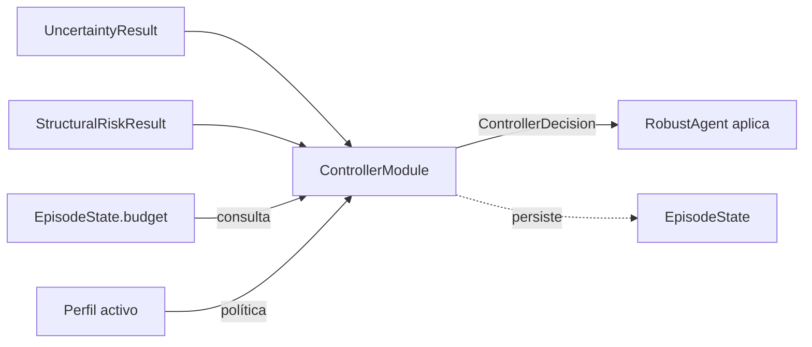

# Módulo controlador

> Documento de especificación de **alto/medio nivel** del módulo. La spec global del bloque del agente, los perfiles de robustez (incluida la capacidad de validación condicional al perfil) y el flujo end-to-end están en `especificacion_agente.md`.

## 1. Función

Decidir, en cada paso del agente, la **acción de control del siguiente paso** combinando tres entradas: la incertidumbre estimada por el módulo de incertidumbre, el riesgo estructural estimado por el módulo de métricas, y el estado del presupuesto del run. El controlador es el punto de integración del bloque del agente: ningún otro módulo decide acciones de control.

El controlador **decide** la acción; la **aplicación** efectiva (inyectar mensajes, ejecutar validación, finalizar) la realiza el `RobustAgent` interpretando el `ControllerDecision` devuelto. Esta separación mantiene al controlador puro y testeable.

## 2. Posición en el flujo



El módulo se invoca tras los módulos de incertidumbre y métricas, una vez por paso, y entrega su decisión al `RobustAgent`. Mantiene además el `BudgetGuard`, que actúa también como **servicio consultable** por otros componentes del agente que puedan incurrir en coste fuera del bucle estándar (MC.5).

## 3. Entradas y dependencias

**Entradas por paso (parámetros del método `decide`):**

- `uncertainty: UncertaintyResult` (producido por el módulo de incertidumbre).
- `structural_risk: StructuralRiskResult` (producido por el módulo de métricas).

**Dependencias inyectadas en construcción:**

- Configuración del módulo (parte de `RobustAgentConfig`): perfil activo, matriz política, pesos de los correctores, capacidades de validación (`tests_validation_enabled`, `self_review_enabled`), template de la directiva de validación dirigida (`validation_directive_template`) y lista opcional de tests prohibidos (`forbidden_test_ids`).
- Referencia al `EpisodeState`: lectura de `budget`, `decisions_history`, `signals_history`, `validation_state`, y registro de `ControllerDecision` y errores en el propio `EpisodeState`.

## 4. Acciones de control

El controlador emite **una sola acción por paso** del siguiente conjunto cerrado. La elección de cuatro verbos ortogonales evita solapamientos semánticos.

| Acción | Significado operativo | Efecto sobre el siguiente paso |
|---|---|---|
| `PROCEED` | Continuar normalmente. | Nueva `query()` con el contexto actual sin alteraciones. |
| `INJECT_FEEDBACK` | Inyectar al historial un mensaje de sistema/usuario que orienta al modelo (p. ej. señalando alta dispersión del diff o pidiendo restringir el alcance). | Nueva `query()` con el contexto enriquecido. |
| `RUN_VALIDATION` | Ejecutar la validación adicional según el perfil (`tests`, `self_review`, `combined`, o `none`; ver EA.5.4). En el modelo de validación dirigida, `tests` se materializa como la inyección de una directiva en el historial del agente, no como la ejecución directa de un comando shell. | El resultado se persiste paso a paso en `StepTrace.validation_outcome` (EA.8.1) y se cachea en `EpisodeState.validation_state`; nueva `query()`. Para `tests` puro, `validation_outcome.status == "directive_issued"` y la ejecución real corre por el bucle estándar del agente en pasos posteriores. |
| `FINALIZE` | Terminar el run. Sub-tipo obligatorio: `submit` o `abort`. | El bucle termina; `submit` produce salida normal, `abort` produce salida controlada de fallo. |

Notas operativas:

- `RUN_VALIDATION` con sub-tipo `none` (cuando el perfil así lo configura) degenera en `PROCEED` y se registra para auditoría.
- Las acciones del controlador **cuentan dentro del `step_limit`** del agente. Las llamadas adicionales que disparen (`RUN_VALIDATION` con `self_review`, ejecución de tests cuando se contabilice como coste) cuentan dentro del `cost_limit`.
- Si el presupuesto disponible no permite la acción decidida, se aplica *clamping* mediante el corrector de presupuesto del propio controlador (MC.4.2).

### 4.1 Política de decisión

La política base es por reglas sobre la matriz combinada `(uncertainty_level × risk_level)`. Se cubren las nueve celdas. Las acciones por celda son **valores por defecto**; los perfiles los modulan reasignando algunas celdas.

| u \ r | r=low | r=medium | r=high |
|---|---|---|---|
| **u=low** | `PROCEED` | `PROCEED` | `RUN_VALIDATION` |
| **u=medium** | `PROCEED` | `INJECT_FEEDBACK` | `RUN_VALIDATION` |
| **u=high** | `INJECT_FEEDBACK` | `RUN_VALIDATION` | `FINALIZE(abort)` o `RUN_VALIDATION` según perfil |

### 4.2 Correctores

Sobre la matriz actúan dos correctores:

- **Corrector de presupuesto** (`BudgetGuard`, MC.5): si la acción decidida no cabe en el presupuesto restante, se reduce a `FINALIZE(abort)`. El evento queda registrado en `ControllerDecision.overrides` bajo la clave `budget_clamp`.
- **Corrector de finalización por estabilidad** (`StabilityMonitor`, MC.6): si en una ventana reciente el `score` de incertidumbre y el `score` de riesgo son bajos y la `cumulative_surface_signature` (firma del diff acumulado, provista por el módulo de métricas) es constante y no vacía, la celda `(low, low)` se promueve a `FINALIZE(submit)`. El uso de la firma **acumulada** (en lugar de la incremental) garantiza que la promoción requiera cambios reales en el repositorio: si el agente no ha modificado ningún fichero, `cumulative_surface_signature` es vacía y no se produce promoción.

Toda decisión queda acompañada de un `rationale` legible y de un `policy_snapshot` con los umbrales y pesos exactos aplicados.

### 4.3 Vías de terminación del run

`FINALIZE` no es la única forma de terminar. El run puede acabar por tres vías, todas reflejadas en el `exit_status` y el campo `termination` de la traza global:

- `FINALIZE(submit | abort)` - decidido por el controlador.
- `Submitted` - disparado por el entorno al detectar el patrón de envío final del modelo (mecanismo nativo de `mini-SWE-agent`). Termina sin paso del controlador en esa iteración.
- `LimitsExceeded` - `cost_limit` o `step_limit` agotados durante una llamada a `query()` o tras una notificación de coste a `BudgetGuard`. Tampoco pasa por el controlador.

Solo la primera produce un `ControllerDecision` en el último paso; las otras dos producen un cierre limpio sin decisión final.

## 5. Subservicio `BudgetGuard`

`BudgetGuard` es un componente del controlador con doble rol: corrector interno de la decisión, y **servicio consultable** por otros módulos del agente.

### 5.1 Rol y propiedad de estado

- Es la **autoridad única sobre el presupuesto** del run.
- **Opera sobre `EpisodeState.budget`** como almacén único de estado. No mantiene estado propio paralelo.
- Mantiene un desglose por atribución (`cost_by_attribution: dict[str, float]`) con entradas estables como `"agent.query"`, `"validation.tests"`, `"validation.self_review"`, etc.

### 5.2 Interfaz pública del servicio

```text
BudgetGuard
├─ can_afford(operation: str, expected_cost: float) -> bool
└─ notify_cost(amount: float, attribution: str) -> None
```

- **`can_afford(operation, expected_cost) -> bool`**: consulta pura, no altera estado. Uso típico: el propio controlador antes de decidir `RUN_VALIDATION` cuando el subtipo implica coste de modelo (`self_review`, `combined`).
- **`notify_cost(amount, attribution) -> None`**: mutación. Cualquier componente que incurra en coste fuera del bucle estándar `RobustAgent.query()` debe notificarlo. La etiqueta `attribution` permite trazar el coste por componente en `EpisodeState.budget` y en `StepTrace.budget_state`.

Esta interfaz está pensada para mantenerse estable a lo largo del TFG: si en una extensión futura se reincorpora self-consistency en el módulo de incertidumbre, las llamadas adicionales se imputarán mediante `notify_cost(..., attribution="uncertainty.l3")` sin tocar el contrato del servicio.

## 6. Interfaz pública del módulo

El módulo se materializa como una clase con instancia única por run, inyectada al `RobustAgent`.

### 6.1 Clase `ControllerModule`

```text
ControllerModule
├─ __init__(config, episode_state)
├─ decide(uncertainty, structural_risk) -> ControllerDecision
└─ budget_guard: BudgetGuard      # acceso de lectura al subservicio
```

- **`__init__(config, episode_state)`**: construye el controlador con su configuración (perfil, matriz política, parámetros de los correctores) y la referencia al `EpisodeState`. Inicializa los submódulos internos (MC.7) y el `BudgetGuard`.
- **`decide(uncertainty, structural_risk) -> ControllerDecision`**: punto de entrada principal. Aplica la política base (MC.4.1), después los correctores (MC.4.2), y devuelve un `ControllerDecision` (MC.8). Registra la decisión en `EpisodeState.decisions_history`.
- **`budget_guard`**: atributo público que expone el `BudgetGuard` (MC.5) para que otros componentes lo consulten.

### 6.2 Política ante entradas degradadas

Si las entradas son insuficientes (p. ej. `UncertaintyResult` neutro por fallo aguas arriba), el controlador adopta la celda más conservadora compatible con el perfil:

- `permissive` → `PROCEED`,
- `balanced` → `INJECT_FEEDBACK`,
- `strict` → `RUN_VALIDATION`.

Si el controlador mismo lanza excepción inesperada, el agente termina el run con `FINALIZE(abort)` y se registra el fallo en la traza.

## 7. Submódulos internos

La descomposición interna se documenta para guiar el bajo nivel; no forma parte de la interfaz pública.

- **`PolicyEngine`** - aplica la matriz de decisión (MC.4.1) con los parámetros del perfil activo y emite la decisión cruda.
- **`BudgetGuard`** - corrector de presupuesto y servicio consultable (MC.5). Aunque conceptualmente es un submódulo, su interfaz pública es estable y accesible desde fuera del controlador.
- **`StabilityMonitor`** - alimenta el corrector de finalización por estabilidad (MC.4.2) consumiendo `signals_history` y la `cumulative_surface_signature` del módulo de métricas. Requiere que la firma acumulada sea no vacía (hay cambios reales en el repo) y constante durante la ventana de estabilidad.
- **`DecisionLogger`** - emite `ControllerDecision` y persiste su rastro en `EpisodeState.decisions_history`.

## 8. Salida: contrato `ControllerDecision`

- `action: str` ∈ `{PROCEED, INJECT_FEEDBACK, RUN_VALIDATION, FINALIZE}`.
- `subtype: str | None` (obligatorio si `action == FINALIZE`: `submit | abort`; opcional para `RUN_VALIDATION`: `tests | self_review | combined | none`).
- `rationale: str` legible.
- `policy_snapshot: dict` con umbrales y pesos efectivos (perfil + correctores aplicados).
- `overrides: dict` con cualquier modificación impuesta por `BudgetGuard` o `StabilityMonitor` respecto a la decisión cruda de `PolicyEngine`. Si está vacío, no hubo override. Aquí se registran también las degradaciones de la capacidad de validación (EA.5.4).
- `payload: dict` con datos específicos de la **intención** de la acción. Este campo describe *qué pretende hacer el agente*, no el resultado de ejecutarlo. Por acción:
  - `INJECT_FEEDBACK`: `feedback_text` con el mensaje a inyectar.
  - `RUN_VALIDATION` con subtipo `tests` o `combined`: `directive` con la directiva renderizada (modelo de validación dirigida, EA.5.4) y `forbidden_test_ids` con la lista de identificadores de test prohibidos aplicada en el render (puede ser vacía).
  - `RUN_VALIDATION` con subtipo `self_review` o `combined`: `prompt` con el texto del prompt de auto-revisión.
  - `subtype` siempre presente en `RUN_VALIDATION` para indicar el subtipo efectivo tras la cadena de fallback.

El **resultado** de una `RUN_VALIDATION` se persiste de forma separada en `StepTrace.validation_outcome` (EA.8.1), porque se obtiene tras la aplicación de la decisión y por tanto no pertenece a la decisión misma. Esta separación mantiene el `ControllerDecision` inmutable una vez emitido y deja una línea de tiempo paso a paso clara para análisis posteriores.

El contrato es estable: el `RobustAgent` y los consumidores del benchmark dependen exclusivamente de estos campos.

## 9. Organización del código

El módulo se ubica en `src/agent/controller_module/`. La carpeta sigue la convención `*_module/` del bloque del agente y el archivo principal lleva el mismo nombre que la carpeta para evitar ambigüedad en referencias.

```text
src/agent/controller_module/
├── __init__.py                  # re-exporta ControllerModule, ControllerDecision, BudgetGuard
├── controller_module.py       # ControllerModule (clase principal de MC.6)
├── controller_decision.py    # ControllerDecision (contrato de MC.8)
├── policy.py                    # PolicyEngine (MC.7)
├── budget_guard.py              # BudgetGuard (MC.5 + MC.7)
├── stability.py                 # StabilityMonitor (MC.7)
└── logger.py                    # DecisionLogger (MC.7)
```

Convenciones:

- **Superficie pública del paquete:** `ControllerModule`, `ControllerDecision` y `BudgetGuard`. Este último se reexporta porque es un **servicio público** consultable por otros componentes del agente cuando incurran en coste fuera del bucle estándar (MC.5.2). El resto es detalle de implementación.
- **Una sola instancia por run** del `ControllerModule`, inyectada al `RobustAgent`. El `BudgetGuard` también es único por run y se accede vía `controller.budget_guard` (atributo público de MC.6.1).

## 10. Referencias

- `especificacion_agente.md`: spec general, perfiles (incluida `EA.5.4` capacidad de validación), `EpisodeState`, contrato de traza, organización completa del paquete `src/agent/`.
- `docs/especificaciones/agente/modulo_incertidumbre.md`: productor de `UncertaintyResult`.
- `docs/especificaciones/agente/modulo_metricas.md`: productor de `StructuralRiskResult`, `surface_signature` y `cumulative_surface_signature`.
