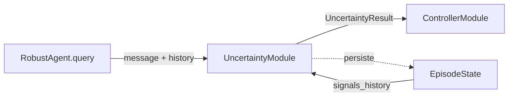

# Módulo de incertidumbre

> Documento de especificación de **alto/medio nivel** del módulo. La spec global del bloque del agente, los perfiles de robustez y el flujo end-to-end están en `especificacion_agente.md`. La selección y justificación de los métodos de UQ aplicados aquí se detalla en la sección 5 de este documento.

## 1. Función

Estimar la confianza del paso actual del agente combinando señales del modelo y señales de proceso. La salida del módulo es una de las dos entradas que el controlador combina para decidir la acción de control del siguiente paso.

## 2. Posición en el flujo



El módulo se invoca tras la respuesta del modelo (post-`query()`) y antes de la ejecución de acciones. No bloquea el bucle ni añade latencia significativa: en la versión inicial todas sus señales son cálculos sobre la respuesta y la traza acumulada.

## 3. Entradas y dependencias

**Entradas por paso (parámetros del método `evaluate`):**

- `message`: mensaje generado por el modelo en el paso actual (contenido textual, acciones parseadas, `extra` con `response`, `cost`, `timestamp`).
- `recent_history`: ventana reciente de mensajes (tamaño configurable por perfil).

**Dependencias inyectadas en construcción:**

- Configuración del módulo (parte de `RobustAgentConfig`): pesos de combinación L1/L2, umbrales `low/medium/high`, tamaño de la ventana de proceso, parámetros del detector de hedging.
- Referencia al `EpisodeState`: lectura de señales acumuladas previas para L2 (cycle, failure rate, volatility) y registro de incidencias en `EpisodeState.errors`.

El módulo **no realiza llamadas adicionales al modelo** en la versión inicial. Por tanto **no necesita referencia al `Model` ni al `BudgetGuard`**. Si en el futuro se reincorpora self-consistency restringida a puntos de decisión (extensión opcional descrita al final de la sección 5), esas dependencias se añadirán explícitamente en el constructor y el contrato de salida se ampliará.

## 4. Interfaz pública

El módulo se materializa como una clase con instancia única por run, inyectada al `RobustAgent`. Las firmas concretas se cierran en bajo nivel; lo comprometido aquí es la **superficie pública** y el **contrato de cada operación**.

### 4.1 Clase `UncertaintyModule`

```text
UncertaintyModule
├─ __init__(config, episode_state)
├─ evaluate(message, recent_history) -> UncertaintyResult
└─ reset() -> None
```

- **`__init__(config, episode_state)`**: construye el módulo con su configuración y la referencia al `EpisodeState` compartido. Inicializa los submódulos internos (MI.5).
- **`evaluate(message, recent_history) -> UncertaintyResult`**: punto de entrada principal. Calcula las señales L1 y L2 sobre las entradas, las agrega y devuelve un `UncertaintyResult` (MI.6). No muta el `EpisodeState` salvo para registrar incidencias en `errors` cuando ocurran. Idempotente respecto a llamadas repetidas con la misma entrada.
- **`reset() -> None`**: rearma el estado interno reiniciable entre runs (cachés de hedging, ventanas de proceso). No toca el `EpisodeState`.

Esta es la **única superficie pública** del módulo. El resto de clases internas (MI.5) son detalle de implementación y no deben invocarse desde fuera.

## 5. Submódulos internos

La descomposición interna se documenta para guiar el bajo nivel; ninguno de estos componentes forma parte de la interfaz pública y pueden cambiar sin romper consumidores.

- **`SingleShotSignals`** - Capa 1 (single-shot del modelo).
  - L1.a *Verbalized confidence*: extracción de un valor de confianza estructurado solicitado al modelo en el `system_template`.
  - L1.b *Token-level entropy*: cálculo a partir de los `logprobs` de la respuesta cuando el proveedor los devuelve. Normalizada por longitud.
  - L1.c *Hedging features*: detector léxico ligero sobre el contenido textual del mensaje.
- **`ProcessSignals`** - Capa 2 (señales de proceso).
  - L2.a *Cycle detection*: acciones equivalentes en una ventana reciente.
  - L2.b *Observation failure rate*: ratio reciente de fallos del entorno.
  - L2.c *Trajectory volatility*: reversiones detectadas a partir del diff acumulado del run.
- **`UncertaintyAggregator`** - combinación lineal de subseñales con los pesos del perfil, normalización intra-capa, y discretización en `level` mediante umbrales del perfil. La política de calibración se describe en la sección 6.

## 6. Salida: contrato `UncertaintyResult`

El módulo produce un único `UncertaintyResult` por paso. Estructura comprometida (los tipos exactos -`dataclass` vs `pydantic.BaseModel`- se cierran en bajo nivel; el resultado es serializable a JSON):

- `score: float` en `[0,1]`.
- `level: str` ∈ `{low, medium, high}` discretizado según los umbrales del perfil activo.
- `components: dict[str, float]` con al menos las subseñales: `verbalized`, `token_entropy`, `hedging`, `cycle`, `failure_rate`, `volatility`.
- `evidence: dict` con metadatos crudos para auditoría:
  - `logprobs_available: bool`,
  - `omitted_components: list[str]` con las subseñales que no pudieron calcularse en este paso y el motivo (p. ej. `"token_entropy:no_logprobs"`),
  - `error: dict | None` con la traza del fallo si alguna subseñal o el módulo entero falló.
- `cost_overhead: float` con coste atribuible al módulo en este paso. **Siempre 0 en la versión inicial** (el módulo no realiza llamadas adicionales al modelo).

El contrato es estable: el controlador y los consumidores del benchmark dependen exclusivamente de estos campos. Cualquier campo adicional que se introduzca en el futuro (p. ej. `consistency` cuando se reincorpore L3) será aditivo y no romperá consumidores existentes.

## 7. Política ante fallos del módulo

- Si una **subseñal** no puede computarse (p. ej. ausencia de logprobs para L1.b), su contribución se omite, los pesos se renormalizan sobre las restantes y se registra en `evidence.omitted_components`. El run continúa.
- Si **todo el módulo** falla por excepción inesperada, se emite un `UncertaintyResult` neutro (`score=0.5`, `level=medium`) con `evidence.error` poblado, y se continúa el run. El controlador adopta una política conservadora cuando recibe un `UncertaintyResult` neutro (ver `modulo_controlador.md` MC.6).
- Estos eventos quedan reflejados en `EpisodeState.errors` y, agregados, en el `StepTrace` del paso para análisis posterior.

Esta política respeta el principio de **degradación limpia** del bloque del agente: ningún fallo del módulo de incertidumbre aborta el run.

## 8. Organización del código

El módulo se ubica en `src/agent/uncertainty_module/`. La carpeta sigue la convención `*_module/` del bloque del agente y el archivo principal lleva el mismo nombre que la carpeta para evitar ambigüedad en referencias.

```text
src/agent/uncertainty_module/
├── __init__.py                  # re-exporta UncertaintyModule, UncertaintyResult
├── uncertainty_module.py        # UncertaintyModule (clase principal de MI.4)
├── uncertainty_result.py        # UncertaintyResult (contrato de MI.6)
├── single_shot.py               # SingleShotSignals (Capa 1, MI.5)
├── process.py                   # ProcessSignals (Capa 2, MI.5)
└── aggregator.py                # UncertaintyAggregator (MI.5)
```

Convenciones:

- **Superficie pública del paquete:** únicamente `UncertaintyModule` y `UncertaintyResult`. El resto es detalle de implementación, importable desde tests si hace falta pero no exportado por defecto.
- **Una sola instancia por run** del `UncertaintyModule`, inyectada al `RobustAgent`.

## 9. Referencias

- `especificacion_agente.md`: spec general, perfiles, `EpisodeState`, contrato de traza, organización completa del paquete `src/agent/`.
- `docs/especificaciones/agente/modulo_controlador.md`: consumidor principal del `UncertaintyResult`.
