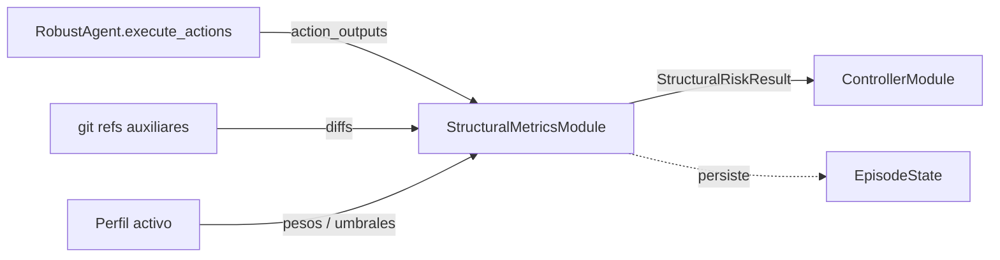

# Módulo de métricas estructurales

> Documento de especificación de **alto/medio nivel** del módulo. La spec global del bloque del agente, los perfiles de robustez y el flujo end-to-end están en `especificacion_agente.md`.

## 1. Función

Cuantificar el impacto del cambio introducido por el paso actual sobre la estructura del repositorio, y mantener una vista acumulada del riesgo del run. La salida del módulo es la segunda de las dos entradas que el controlador combina para decidir la acción de control.

## 2. Posición en el flujo



El módulo se invoca tras la ejecución de acciones del paso (post-`execute_actions()`) y antes del controlador. Toda la lógica de captura de diff trabaja sobre **referencias git auxiliares** y nunca modifica el área de trabajo visible al modelo.

## 3. Precondición y captura del diff

El módulo depende de la precondición **PR1** declarada en la spec general (workspace bajo control de git válido al inicio del run). Si PR1 no se cumple, el run no llega a este módulo: `RobustAgent.run()` aborta antes del primer paso.

La captura se realiza con git apoyándose en referencias auxiliares:

- **Diff incremental del paso:** `git diff <ref_paso_anterior>..<ref_actual>`.
- **Diff acumulado del run:** `git diff <ref_inicial_run>..<ref_actual>`.
- La referencia de cada paso se materializa con `git stash create` (sin modificar el árbol de trabajo). Si el árbol no tiene cambios pendientes, `stash create` puede devolver código de salida 1 en algunas versiones de git (p. ej. la imagen Docker de SWE-bench) en lugar de 0; el `DiffCollector` trata ese caso como «árbol limpio» y reutiliza `HEAD` como referencia del paso. **El contrato de salida del módulo no cambia**.

## 4. Entradas y dependencias

**Entradas por paso (parámetros del método `evaluate`):**

- `action_outputs`: lista de resultados (`returncode`, `stdout`/`stderr`, `exception_info`) de las acciones ejecutadas en `execute_actions`. En la versión actual se recibe pero no se consume directamente; el módulo calcula los diffs exclusivamente a través de referencias git.

**Dependencias inyectadas en construcción:**

- Configuración del módulo (parte de `RobustAgentConfig`): pesos de combinación de métricas, umbrales `low/medium/high`, conjuntos de glob para detectar ficheros de test (`test_touch_ratio`).
- Referencia al `EpisodeState`: lectura de referencias git (`git_refs`) y registro de incidencias en `errors`.
- Ruta lógica del repositorio (`repo_path`, p. ej. `/testbed` en SWE-bench) y, si aplica, el `Environment` del agente (`DockerEnvironment`, `LocalEnvironment`, etc.) para ejecutar `git` **dentro** del entorno aislado en lugar del host.

## 5. Interfaz pública

El módulo se materializa como una clase con instancia única por run, inyectada al `RobustAgent`.

### 5.1 Clase `StructuralMetricsModule`

```text
StructuralMetricsModule
├─ __init__(config, episode_state, repo_path, env=None)
├─ initialize_baseline() -> None
├─ evaluate(action_outputs) -> StructuralRiskResult
├─ get_cumulative_patch(initial_ref) -> str
└─ cleanup() -> None
```

- **`__init__(config, episode_state, repo_path, env=None)`**: construye el módulo con su configuración, la referencia al `EpisodeState` compartido, la ruta lógica del repositorio (`env.config.cwd`, p. ej. `/testbed`) y el `Environment` del agente. Si `env` expone `execute`, `DiffCollector` enruta los comandos `git` por ese entorno (Docker, local, etc.); si no, usa `subprocess` en el host (tests unitarios con repo temporal).
- **`initialize_baseline() -> None`**: invocado una sola vez por `RobustAgent.run()` en su preámbulo (tras verificar PR1). Fija la referencia inicial del run y la registra en `EpisodeState.git_refs`. Si el workspace tiene cambios pre-existentes (p. ej. imágenes SWE-bench), usa `git stash create` como referencia base para aislar los cambios del agente. Si la precondición PR1 no se cumple, este método lanza la excepción que `RobustAgent` traduce en `exit_status` específico (no se realiza degradación limpia para esta precondición; ver EA.3).
- **`evaluate(action_outputs) -> StructuralRiskResult`**: punto de entrada principal. Materializa la referencia del paso con `git stash create`, calcula diffs incremental y acumulado, computa la batería de métricas y devuelve un `StructuralRiskResult` (MM.7). Actualiza `EpisodeState.git_refs` con la referencia del paso actual. Idempotente respecto a llamadas repetidas si el área de trabajo no ha cambiado. Si el cálculo falla, devuelve un resultado neutro (`score=0.5`, `level=medium`) con `evidence.error` como dict.
- **`get_cumulative_patch(initial_ref) -> str`**: devuelve el diff acumulado en texto desde `initial_ref` hasta el estado actual. Lo usa `RobustAgent` para obtener el parche real cuando el controlador decide `FINALIZE(submit)`. Devuelve cadena vacía ante cualquier error.
- **`cleanup() -> None`**: invocado por `RobustAgent.run()` al terminar el run. No-op en la implementación actual: las referencias de paso se materializan con `git stash create` (refs efímeras gestionadas automáticamente por git), por lo que no hay estado persistente que limpiar.

Esta es la **única superficie pública** del módulo.

## 6. Submódulos internos

La descomposición interna se documenta para guiar el bajo nivel; no forma parte de la interfaz pública.

- **`DiffCollector`** - gestiona referencias git auxiliares (rama de instrumentación o `git stash` por paso) y produce diffs incremental y acumulado en formato estructurado. Ejecuta `git` vía `Environment.execute` cuando el agente corre en un entorno aislado (benchmark SWE-bench con Docker); en caso contrario usa el host.
- **`StructuralMetricsComputer`** - calcula la batería de métricas (MM.7.2) a partir del diff y de metadatos del repo.
- **`RiskAggregator`** - combina las métricas en `score` y `level` aplicando los pesos del perfil activo y la calibración.

## 7. Salida: contrato `StructuralRiskResult`

### 7.1 Estructura

- `score: float` en `[0,1]`.
- `level: str` ∈ `{low, medium, high}` discretizado según los umbrales del perfil activo.
- `metrics: dict[str, float | int]` con la batería de MM.7.2.
- `diff_summary: dict` con resumen ligero del diff: lista de ficheros tocados, conteo por extensión, hunks, `surface_signature` (firma del diff incremental del paso) y `cumulative_surface_signature` (firma del diff acumulado desde el baseline).
- `cost_overhead: float` con coste atribuible al módulo en este paso (típicamente 0; las operaciones de git no se contabilizan como coste de modelo).
- `evidence: dict` con metadatos crudos para auditoría: métricas omitidas y motivo, errores de cálculo no fatales.

### 7.2 Batería de métricas estructurales

La batería inicial es la siguiente. Las fórmulas finales y las normalizaciones se cierran en bajo nivel.

- `files_changed` y `files_changed_ratio` (sobre tamaño del repo).
- `hunks` y `hunks_per_file`.
- `lines_added`, `lines_deleted`, `net_lines`.
- `dispersion_score`: dispersión de los cambios entre directorios.
- `test_touch_ratio`: proporción del cambio que afecta a ficheros de test.
- `surface_signature`: hash compacto (SHA-256 truncado a 16 hex) del conjunto de líneas tocadas en el diff **incremental** del paso. Devuelve cadena vacía si el diff incremental no contiene cambios.
- `cumulative_surface_signature`: mismo hash aplicado al diff **acumulado** (desde el baseline hasta el estado actual del paso). Devuelve cadena vacía si no se ha producido ningún cambio desde el inicio del run. Es la firma que el `StabilityMonitor` usa para detectar convergencia (ver `modulo_controlador.md` MC.6).
- `cumulative_lines_changed`: total de líneas tocadas (añadidas + eliminadas) en el diff acumulado del run.

El contrato externo es estable: el controlador y los consumidores del benchmark dependen de los nombres de métricas listados. Métricas adicionales en el futuro serán aditivas.

## 8. Política ante fallos del módulo

- Si la **captura del diff** falla (estado inesperado del repo, conflicto en la rama de instrumentación), el módulo emite un `StructuralRiskResult` neutro con `evidence.error` poblado y registra la incidencia en `EpisodeState.errors`. **No aborta el run**.
- Si una **métrica concreta** no se puede calcular (p. ej. el repo es demasiado grande para `files_changed_ratio`), se omite, los pesos se renormalizan sobre las restantes y se registra en `evidence.omitted_components`.
- El **fallo de la precondición PR1** es la única excepción a la política de degradación limpia: lo gestiona `initialize_baseline()` antes del primer paso (MM.5.1).

## 9. Organización del código

El módulo se ubica en `src/agent/structural_metrics_module/`. La carpeta sigue la convención `*_module/` del bloque del agente y el archivo principal lleva el mismo nombre que la carpeta para evitar ambigüedad en referencias.

```text
src/agent/structural_metrics_module/
├── __init__.py                          # re-exporta StructuralMetricsModule, StructuralRiskResult
├── structural_metrics_module.py         # StructuralMetricsModule (clase principal de MM.5)
├── structural_risk_result.py            # StructuralRiskResult (contrato de MM.7)
├── diff_collector.py                    # DiffCollector (MM.6)
├── computer.py                          # StructuralMetricsComputer (MM.6)
└── aggregator.py                        # RiskAggregator (MM.6)
```

Convenciones:

- **Superficie pública del paquete:** únicamente `StructuralMetricsModule` y `StructuralRiskResult`. El resto es detalle de implementación, importable desde tests si hace falta pero no exportado por defecto.
- **Una sola instancia por run** del `StructuralMetricsModule`, inyectada al `RobustAgent`.

## 10. Referencias

- `especificacion_agente.md`: spec general, precondiciones (PR1), perfiles, `EpisodeState`, contrato de traza, organización completa del paquete `src/agent/`.
- `docs/especificaciones/agente/modulo_controlador.md`: consumidor principal del `StructuralRiskResult` y del `surface_signature` (corrector de estabilidad).
