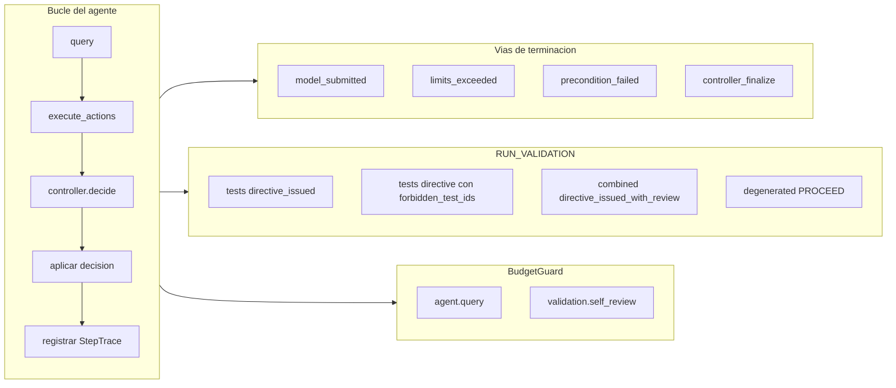

# Diseño de los tests de integración end-to-end (Fase 3, paso 5)

Documento de **diseño** de los tests E2E del bloque del agente robusto, redactado antes de escribir el código de la suite. Describe qué se prueba, qué queda fuera de alcance y el coste estimado de ejecutarlos y mantenerlos. La suite resultante, ya implementada, vive en `tests/agent/test_robust_agent_e2e.py` y sigue fielmente la estructura por bloques descrita aquí.

## Contexto y relación con otros tests

| Capa | Ubicación | Qué valida |
|------|-----------|------------|
| Unitarios (fases 2b–4b) | `tests/agent/test_structural_metrics_module.py`, `test_uncertainty_module.py`, `test_controller_module.py` | Interfaces públicas de cada módulo, política del controlador, degradación limpia, PR1 git |
| Integración E2E (paso 5) | `tests/agent/test_robust_agent_e2e.py` | `RobustAgent` completo: bucle `query → execute_actions → controller → aplicar decisión → StepTrace → serialize` |

Los tests E2E **no sustituyen** a los unitarios. Comprueban el *wiring* entre módulos y el contrato de la traza `robust-agent-1.0`; los unitarios siguen siendo la red de seguridad para la semántica interna de cada módulo.

Referencia de implementación: [especificacion_agente.md](especificacion_agente.md) (TE.6, TE.8, TE.9) y la suite en `tests/agent/test_robust_agent_e2e.py`.

## Objetivo

Ejecutar runs cortos del `RobustAgent` sobre:

- un **repositorio git local efímero** (misma técnica que los tests de métricas estructurales),
- un **`DeterministicModel`** de `mini-sWE-agent` (sin LLM real, sin red, sin API keys),
- un **`LocalEnvironment`** con `cwd` apuntando al repo.

Y verificar que la traza serializada cumple el contrato comprometido: `StepTrace` por paso, `validation_outcome` cuando aplique, y `termination` según la vía de cierre del run.

## Infraestructura común (fixtures)

Helpers compartidos en el archivo de tests (no exportados):

- Fixture `e2e_workdir` - subdirectorio único bajo **`tests/agent/tmp/`** del repositorio del proyecto (autocontenido: no se usa el TMP del sistema). Se borra al terminar cada test.
- `_init_clean_git_repo(workdir)` - `git init`, commit inicial, árbol limpio (PR1), con repo en `workdir/repo`.
- `_make_output(...)` - salidas del `DeterministicModel` con acciones y metadatos.
- `_build_agent(...)` - `RobustAgent` + `LocalEnvironment(cwd=repo)` + plantillas mínimas (`system_template`, `instance_template`).
- `_load_trace(output_path)` - lee el JSON de `agent.save()` y devuelve el dict completo.

El contenido generado bajo `tests/agent/tmp/` está ignorado en git salvo `.gitkeep` (ver `.gitignore`).

Variables de entorno en la suite: `MSWEA_SILENT_STARTUP=1` para evitar ruido de Rich al importar `minisweagent`.

## Vista de cobertura

---

## Bloque A - Forma de la traza (smoke E2E)

**Objetivo:** un único test que ejecuta una tarea trivial de 1 paso (el modelo emite `COMPLETE_TASK_AND_SUBMIT_FINAL_OUTPUT`) y valida la **forma estructural** de la traza, sin fijar valores numéricos de señales.

**Escenario:** 1 paso, perfil `balanced`, repo limpio, `output_path` en fichero temporal.

**Aserciones sobre el JSON de `save()`:**

| Ámbito | Comprobación |
|--------|----------------|
| Formato base | Existen `info`, `messages`, `trajectory_format == "mini-swe-agent-1.1"` |
| Bloque robusto | Existe `robust_agent` con `format_version == "robust-agent-1.0"` |
| Perfil | `robust_agent.profile` tiene `name` y `params` |
| Estado final | `episode_state_final` incluye las claves de EA.7: `profile`, `step_index`, `budget`, `signals_history`, `decisions_history`, `git_refs`, `validation_state`, `errors` |
| Pasos | `steps` es lista no vacía; cada entrada tiene exactamente las 9 claves de `StepTrace` (TE.8.1): `step_id`, `timestamp`, `uncertainty`, `structural_risk`, `decision`, `validation_outcome`, `budget_state`, `git_refs`, `errors` |
| Señales (rangos) | En cada paso: `0 <= uncertainty.score <= 1`, `uncertainty.level in {low, medium, high}`; si `structural_risk` no está vacío, mismos rangos para riesgo |
| Terminación | `termination == "model_submitted"` |

**Coste:** 1 test, ~0,5 s.

---

## Bloque B - Vías de terminación

Un test por cada valor de `termination` comprometido en EA.9.

### B1 - `model_submitted`

| Campo | Valor |
|-------|--------|
| Escenario | Modelo con una salida cuyo comando es `echo COMPLETE_TASK_AND_SUBMIT_FINAL_OUTPUT` (patrón nativo de `LocalEnvironment`) |
| `termination` | `"model_submitted"` |
| Último mensaje | `role == "exit"`, `exit_status == "Submitted"` |
| Último `StepTrace` | `decision is None`, `structural_risk == {}` (la excepción `Submitted` aborta dentro de `execute_actions`, antes del riesgo estructural y del controlador; EA.6.8) |

### B2 - `limits_exceeded`

| Campo | Valor |
|-------|--------|
| Escenario | `step_limit=1`; paso 1 con acción no terminal; al intentar el paso 2, `query()` lanza `LimitsExceeded` **antes** de incrementar `n_calls` |
| `termination` | `"limits_exceeded"` |
| `steps` | Longitud 1 (solo el paso que llegó a iniciarse); el paso abortado **no** genera `StepTrace` |
| Paso 1 | `uncertainty` poblado, `decision` presente si el controlador corrió |

### B3 - `precondition_failed`

| Campo | Valor |
|-------|--------|
| Escenario | Repo con cambio sin commitear tras el commit inicial → falla PR1 en `initialize_baseline()` |
| `termination` | `"precondition_failed"` |
| `steps` | `[]` |
| `episode_state_final.signals_history` | `[]` |
| Modelo | No se invoca (`n_calls == 0` tras `run()`) |

### B4 - `controller_finalize`

**Decisión de diseño:** se usa el **corrector de presupuesto** (`BudgetGuard`), no umbrales artificiales de señales, porque es **100 % determinista** en CI. La variante “natural” (forzar `(high, high)` con hedging + diff grande) queda descartada por posible inestabilidad ante cambios de pesos o umbrales.

| Campo | Valor |
|-------|--------|
| Escenario | Perfil `strict`, `tests_validation_enabled=True` y `self_review_enabled=True`, `cost_limit` muy bajo (p. ej. `0.04`) con `validation_costs["combined"] == 0.05`; una sola query con coste `0.01` y decisión base que pida `RUN_VALIDATION(combined)` (p. ej. `u=medium`, `r=high` vía mensaje con hedging + comando que modifique un archivo) |
| Efecto | `BudgetGuard` hace clamp a `FINALIZE(abort)` |
| `termination` | `"controller_finalize"` |
| Último `StepTrace` | `decision.action == "FINALIZE"`, `decision.subtype == "abort"`, `"budget_clamp" in decision.overrides` |
| Último mensaje | `exit_status == "ControllerFinalize"` |

**Coste del bloque B:** 4 tests, ~3 s.

---

## Bloque C - Aplicación de la decisión al bucle

Comprueba que `_apply_decision` altera el historial de mensajes como corresponde (EA.6.7).

### C1 - `INJECT_FEEDBACK`

| Campo | Valor |
|-------|--------|
| Escenario | Configuración que en paso 1 produzca `INJECT_FEEDBACK` (p. ej. incertidumbre y riesgo en `medium`); paso 2 cierra con submit |
| Aserción | Tras el paso 1, existe un mensaje `role == "user"` cuyo `content` contiene el texto de `steps[0].decision.payload.feedback_text` (plantilla `feedback_template`) |
| Aserción | El run continúa y termina en el paso 2 |

### C2 - `RUN_VALIDATION` (directiva en historial)

| Campo | Valor |
|-------|--------|
| Escenario | Perfil `balanced`, `tests_validation_enabled=True`, paso 1 fuerza `RUN_VALIDATION(tests)` |
| Aserción | Tras el paso 1, existe un mensaje `role == "user"` cuyo `content` contiene la cabecera `Validacion solicitada por el controlador` y el cuerpo `Valida tu cambio actual ejecutando tests` |
| Detalle de `validation_outcome` | Bloque D |

### C3 - `PROCEED`

| Campo | Valor |
|-------|--------|
| Cobertura | Implícita en smoke (Bloque A) y en escenarios multi-paso sin inyección extra entre la decisión `PROCEED` y el siguiente `query()` |

### C4 - `FINALIZE`

| Campo | Valor |
|-------|--------|
| Cobertura | Cubierto por B4 (no se duplica) |

**Coste del bloque C:** 2 tests nuevos (~1 s); C3 y C4 reutilizan otros bloques.

---

## Bloque D - `validation_outcome`

Contrato EA.8.1: `subtype`, `status`, `summary`, `cost`, `evidence`. Solo presente en pasos donde se ejecutó validación con subtipo efectivo distinto de `none`.

En el modelo de validación dirigida (EA.5.4), `tests` no ejecuta un comando shell durante el paso: inyecta una directiva en el historial del agente. El veredicto efectivo de los tests se materializa en pasos posteriores del run, no en este `validation_outcome`.

### D1 - `tests` directiva inyectada

| Campo | Valor |
|-------|--------|
| Configuración | `tests_validation_enabled=True`, `forbidden_test_ids=None` (o `[]`) |
| Aserciones | `subtype == "tests"`, `status == "directive_issued"`, `cost == 0.0`, `evidence.directive` contiene `Valida tu cambio actual ejecutando tests`, `evidence.forbidden_test_ids == []` |

### D2 - `tests` con `forbidden_test_ids` configurados

| Campo | Valor |
|-------|--------|
| Configuración | `tests_validation_enabled=True`, `forbidden_test_ids=["tests/foo::test_bug_fix", "tests/foo::test_regression"]` |
| Aserciones | `evidence.directive` contiene la cabecera `Restriccion importante` y los IDs configurados; `evidence.forbidden_test_ids` igual a la lista pasada |

### D3 - `combined` con self-review

| Campo | Valor |
|-------|--------|
| Perfil | `strict`, `tests_validation_enabled=True`, `self_review_enabled=True` |
| Modelo | Secuencia con salida extra para la auto-revisión (`cost=0.05` en `extra`) |
| Aserciones | `subtype == "combined"`, `status == "directive_issued_with_review"`, `cost == 0.05`, `evidence` contiene `directive` y `review_received == True`; `episode_state_final.budget.cost_by_attribution["validation.self_review"] == 0.05` |

### D4 - degradación `RUN_VALIDATION → PROCEED`

| Campo | Valor |
|-------|--------|
| Escenario | Perfil `balanced`, `tests_validation_enabled=False` y `self_review_enabled=False`, escenario que en política base sería `RUN_VALIDATION` |
| Aserciones | Decisión efectiva `PROCEED` con `overrides.validation_degenerated`; `validation_outcome is None` en ese paso |

**Coste del bloque D:** 4 tests, ~2 s.

---

## Bloque E - Contabilidad de presupuesto

**Objetivo:** verificar que `RobustAgent.query()` notifica `agent.query` y que `_run_validation` notifica `validation.self_review`, y que `serialize()` alinea `episode_state_final.budget.cost_used` con `agent.cost`.

**Escenario:** 2 pasos - paso 1 dispara `RUN_VALIDATION(combined)` con self-review `cost=0.05`; paso 2 submit. Costes de query `0.01` cada una.

**Aserciones:**

- `cost_by_attribution["agent.query"]` ≈ suma de costes de queries del bucle principal.
- `cost_by_attribution["validation.self_review"] == 0.05`.
- `episode_state_final.budget.cost_used == agent.cost` (tras cargar traza o inspeccionar agente).

**Coste:** 1 test, ~1 s.

---

## Bloque F - `StabilityMonitor` (promoción a `FINALIZE(submit)`)

**Decisión de diseño:** **sí se incluye** un test E2E. El corrector ya tiene cobertura unitaria (`test_stability_corrector_promotes_low_low_to_finalize_submit`), pero el test E2E valida que el historial de `signals_history` alimentado por el hook de métricas en runs reales permite la promoción.

| Campo | Valor |
|-------|--------|
| Escenario | 3 pasos con la misma acción de shell idempotente (p. ej. `echo step` sin modificar ficheros), mensajes con baja incertidumbre (`confidence` alto, sin hedging); tras 3 pasos con la misma `surface_signature` y scores bajos, el paso 3 debe promover `(low, low)` a `FINALIZE(submit)` |
| Aserciones | `steps[2].decision.action == "FINALIZE"`, `decision.subtype == "submit"`, `"stability_promotion" in decision.overrides`; `termination == "controller_finalize"` |
| Alternativa si el escenario es frágil | Repetir exactamente el mismo comando en los 3 pasos y no tocar el working tree entre pasos |

**Coste:** 1 test, ~1,5 s.

---

## Resumen de inventario

| Bloque | Tests | Tiempo aprox. |
|--------|-------|----------------|
| A - Smoke traza | 1 | 0,5 s |
| B - Terminación | 4 | 3 s |
| C - Aplicación decisión | 2 | 1 s |
| D - validation_outcome | 4 | 2 s |
| E - Presupuesto | 1 | 1 s |
| F - StabilityMonitor | 1 | 1,5 s |
| **Total** | **13** | **~10–20 s** |

La suite, `tests/agent/test_robust_agent_e2e.py`, está organizada por bloques con docstrings que citan la sección de la spec verificada.

---

## Lo que estos tests NO cubren

Quedan **fuera de alcance** del paso 5 (gaps explícitos):

1. **LLMs reales** (`LitellmModel`, APIs de proveedores). Solo `DeterministicModel`.
2. **Logprobs reales** desde un proveedor; solo valores sintéticos en `extra` si hace falta forzar niveles.
3. **Entornos no locales** (Docker, Singularity, SWE-ReX).
4. **Regresión semántica de fórmulas** de agregación (pesos, umbrales, normalización de métricas). Responsabilidad de los unitarios.
5. **Self-consistency / capa L3** de incertidumbre (extensión futura fuera del alcance de esta versión).
6. **Bloque 2 (benchmark)** como consumidor de la traza; aquí solo se valida que el JSON emitido cumple contrato.
7. **Degradación limpia por fallo interno de módulo** durante un run E2E (ya cubierta en unitarios de cada módulo).
8. **Concurrencia, paralelismo, recuperación tras crash**.
9. **Repos git patológicos** (submódulos, worktrees, sparse checkout); solo repos triviales.
10. **Validez estricta de `timestamp`** frente al reloj; solo `float > 0`.
11. **CLI del TFG** (`src/agent/cli.py`, EA.10) como punto de entrada: los tests E2E instancian `RobustAgent` directamente, sin pasar por la capa de línea de comandos.
12. **Perfil `permissive` end-to-end** como caso dedicado; se asume representativo con `balanced` y `strict` salvo donde el escenario lo exija.

---

## Costes y riesgos

### Coste de ejecución

- **Dependencias:** Python ≥ 3.10, `git` en PATH, paquete `agent` y `mini-swe-agent` instalables en editable (como en el README de Fase 3).
- **Red / dinero:** ninguno.
- **Tiempo:** dominado por `git` por paso; suite completa acotada a ~20 s en máquina de desarrollo típica.

### Coste de mantenimiento

- Los tests se acoplan al **contrato JSON** (`claves` de `StepTrace`, valores de `termination`, presencia de `validation_outcome`). Cambios de contrato en spec deben romper tests a propósito.
- Cambios internos de implementación que no alteren el contrato **no** deberían romper la suite.

### Riesgos de flakiness

| Riesgo | Mitigación |
|--------|------------|
| `controller_finalize` inestable por umbrales | Uso de clamp por presupuesto (B4) |
| Comandos shell no portables (Bloque E, F) | Preferir `python -c "..."` frente a `exit 1` / `echo` cuando se necesite controlar `returncode` desde la matriz de outputs del modelo determinista |
| Promoción de estabilidad (F) no dispara | Misma acción en 3 pasos sin tocar ficheros; si falla en CI, revisar ventana y umbrales `stability_*` en config |

---

## Referencias

- [especificacion_agente.md](especificacion_agente.md) - TE.6 (iteración), TE.8.1 (`StepTrace`), TE.9 (traza y `termination`)
- [modulo_controlador.md](modulo_controlador.md) - TE.4 (acciones), TE.5 (`BudgetGuard`), TE.4.2 (`StabilityMonitor`)
- Implementación: [RobustAgent](../../api/agent/robust_agent.md), [StepTrace](../../api/agent/episode_state.md#agent.step_trace.StepTrace)
- Tests unitarios existentes: `tests/agent/test_*_module.py`
