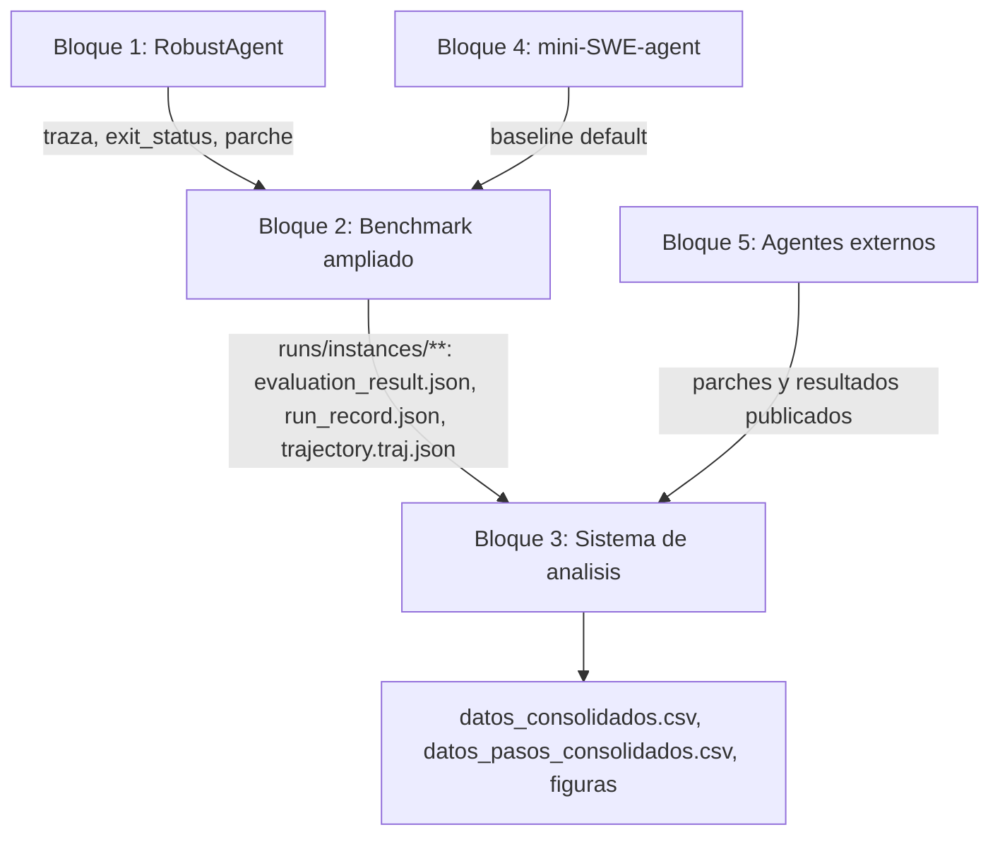
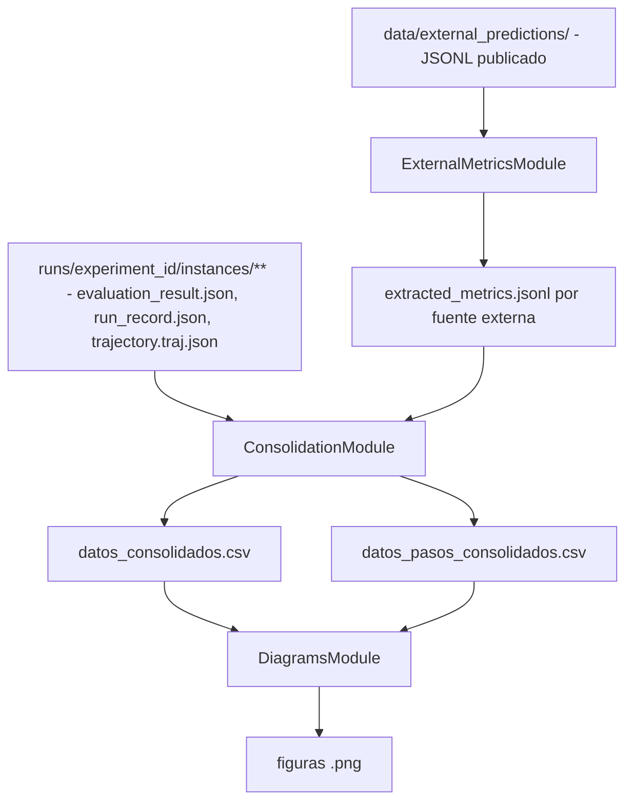
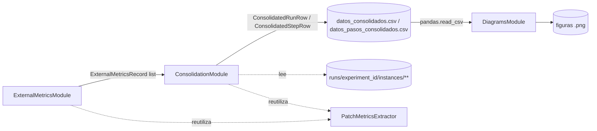

# Fase 2.3 - Especificación del sistema de análisis

## 1. Objetivo y alcance

Este documento especifica el **Bloque 3: sistema de análisis** del TFG a un nivel **alto/medio**: arquitectura general, responsabilidades, interacciones entre módulos, contratos de datos transversales (en particular el esquema de `datos_consolidados.csv` y `datos_pasos_consolidados.csv`) y catálogo de diagramas. El detalle de bajo nivel (firmas concretas de funciones, formato exacto de ficheros intermedios, estilo visual de cada figura) se desarrolla en los documentos de módulo.

El alcance es exclusivamente el **Bloque 3** del diseño experimental del TFG. Quedan fuera el Bloque 1 (agente), ya especificado en `especificacion_agente.md`, y el Bloque 2 (benchmark ampliado), ya especificado en `especificacion_benchmark.md`. El Bloque 3 **consume** la salida de ambos sin modificarla.

El sistema de análisis se diseña deliberadamente **poco complejo**: no reimplementa lógica de ejecución ni de evaluación funcional, no recalcula `resolved`, y no introduce nuevos contratos de agente o de benchmark. Su función es doble: (1) incorporar resultados de agentes externos precomputados sin ejecutarlos, y (2) consolidar en un único fichero tabular limpio los campos de todas las fuentes (ejecuciones propias + externas) para poder graficar las comparaciones que responden a los objetivos del TFG (métricas estructurales, relación éxito/coste/estructura, comparación frente a líneas base y compromisos coste/fiabilidad/control).

### 1.1 Documentos hermanos

La especificación del sistema de análisis se reparte en varios documentos. **Este documento describe el sistema general**; cada módulo tiene su propio documento con interfaz pública, contratos de datos, política de fallos y detalle interno:

- `docs/especificaciones/analisis/modulo_metricas_agentes_externos.md` - `ExternalMetricsModule`, contratos `ExternalPatchRecord` / `ExternalMetricsRecord`.
- `docs/especificaciones/analisis/modulo_consolidacion.md` - `ConsolidationModule`, contratos `ConsolidatedRunRow` / `ConsolidatedStepRow`, algoritmo de escaneo y resolución de reintentos.
- `docs/especificaciones/analisis/modulo_diagramas.md` - `DiagramsModule`, interfaz de generación de figuras y estilo visual común.

## 2. Contexto en el diseño experimental

El Bloque 3 recibe los resultados estructurados producidos por el Bloque 2 (benchmark ampliado) y los combina con resultados públicos de agentes externos (Bloque 5) para producir tablas y gráficas comparativas. Su posición en el diseño general es la siguiente:



El análisis se organiza en torno a las cuatro dimensiones definidas metodológicamente: **éxito funcional, coste, incertidumbre e impacto estructural del parche**. Estas dimensiones determinan tanto los campos consolidados (SAN.6-SAN.7) como los diagramas (SAN.8), y responden a los objetivos del TFG en métricas estructurales, relación éxito/coste/estructura, comparación frente a líneas base y compromisos coste/fiabilidad/control.

## 3. Precondiciones y dependencias técnicas

- **PA1. Árbol de resultados del Bloque 2 disponible.** El sistema de análisis lee directamente el árbol `runs/<experiment_id>/instances/<instance_id>/<agent_id>/<run_id>/` (`evaluation_result.json`, `run_record.json`, `trajectory.traj.json`) tal como lo deja `BenchmarkResultsModule`. No requiere que el experimento esté `finalized`; puede ejecutarse sobre un `manifest.json` en estado `running` o `aborted` para análisis incrementales, siempre que existan runs `completed`.
- **PA2. Parches externos descargados localmente.** El módulo de métricas de agentes externos requiere los ficheros JSONL de predicciones publicadas (`data/external_predictions/<source_id>/`) descargados previamente, según el procedimiento de `modulo_metricas_agentes_externos.md`.
- **PA3. `gold_patch` accesible por instancia.** Tanto para runs propios como para externos, las métricas comparativas frente al *golden patch* (`jaccard_files`, `jaccard_lines`, etc.) requieren el parche de referencia de SWE-bench Lite, obtenido vía el mismo dataset que usa el Bloque 2 (`BenchmarkDatasetModule` / `datasets.load_dataset`).
- **PA4. Entorno Python con `pandas` y `matplotlib`.** El sistema de análisis se ejecuta en el **mismo `.venv`** que Bloque 1/2, no en un entorno aparte. Ambas librerías se declaran en el extra `dev` de `pyproject.toml` (`pip install -e ".[dev]"`), junto con el resto del sistema experimental del TFG. No se añaden frameworks de visualización adicionales (sin `seaborn`, `plotly`) para mantener el sistema simple.
- **PA5. Extractor de métricas de parche reutilizable.** El Bloque 3 reutiliza `PatchMetricsExtractor` (`src/benchmark/evaluation_module/extractors/patch_metrics.py`) para calcular métricas de parche sobre *cualquier* diff - propio o externo - sin depender del agente que lo generó. Esta reutilización es la que hace viable la comparabilidad estructural con agentes externos.
- **PA6. Robustez ante experimento en curso o interrumpido.** El árbol `runs/<experiment_id>/` puede estar incompleto (`manifest.json` en `running`/`aborted`, reintentos sin evaluar aún) en el momento de ejecutar el análisis. `ConsolidationModule` debe degradar limpiamente run a run: si `run_record.json` existe pero `evaluation_result.json` todavía no (evaluación pendiente o run en curso), la fila se incluye igualmente con los campos de identificación/estado/coste disponibles en `run_record.json` y los campos derivados de `evaluation_result.json` a `null`.

La degradación limpia aplica igual que en Bloque 1/2: si una fuente de datos no está disponible para una fila (p. ej. incertidumbre para `default` o para un agente externo), el campo correspondiente queda a `null`/`NaN` en el CSV en lugar de omitir la fila o inventar un valor.

## 4. Arquitectura de alto nivel

### 4.1 Componentes

El Bloque 3 se organiza en **tres módulos**, deliberadamente simples y de responsabilidad única:

- **Módulo de métricas de agentes externos (`ExternalMetricsModule`).** Descarga (o localiza ya descargados) los parches publicados de agentes externos y les extrae las métricas comparables, sin ejecutar ningún agente ni consumir tokens. Es **independiente** del resto del sistema de análisis: no depende del árbol de resultados del Bloque 2 ni de `pandas`/`matplotlib`, y puede desarrollarse y ejecutarse en solitario. Por ello fue el **primer módulo implementado** del Bloque 3.
- **Módulo de consolidación (`ConsolidationModule`).** Escanea el árbol de resultados del Bloque 2, combina esos datos con la salida del módulo anterior, y produce dos ficheros tabulares limpios: `datos_consolidados.csv` (una fila por *run*) y `datos_pasos_consolidados.csv` (una fila por paso, solo disponible para runs con traza `robust_agent`). Es el módulo que decide, de forma explícita y documentada, qué campos se consolidan (SAN.6-SAN.7).
- **Módulo de diagramas (`DiagramsModule`).** Lee exclusivamente `datos_consolidados.csv` / `datos_pasos_consolidados.csv` y genera las figuras con `matplotlib` (SAN.8). No vuelve a tocar los ficheros de traza ni el árbol de `runs/`; su única entrada es el CSV consolidado, lo que hace que las figuras sean reproducibles a partir de un único artefacto versionable.

Esta descomposición separa **obtención** (externos), **consolidación** (limpieza y unificación de esquema) y **presentación** (gráficas), de forma análoga a la separación dataset/ejecución/evaluación/resultados del Bloque 2, pero con muchos menos módulos porque el Bloque 3 no ejecuta nada: solo lee, transforma y grafica.

### 4.2 Flujo lógico



El flujo es **unidireccional y por lotes**: no hay retroalimentación hacia el Bloque 1 o 2. El módulo de métricas externas puede ejecutarse en cualquier momento, incluso antes de que termine el experimento principal, porque no depende de sus resultados. El módulo de consolidación sí depende de ambas entradas, pero es **idempotente**: puede relanzarse tantas veces como se quiera sobre un árbol de `runs/` parcial o completo y siempre regenera el CSV desde cero a partir del estado actual en disco (sin fusión incremental con ejecuciones previas del propio script).

### 4.3 Comunicación entre módulos



Reglas de comunicación:

- **Acoplamiento por ficheros, no por objetos en memoria.** La única interfaz de facto entre módulos es un artefacto persistido en disco: `extracted_metrics.jsonl` entre el módulo 1 y el módulo 2, y `datos_consolidados.csv` / `datos_pasos_consolidados.csv` entre el módulo 2 y el módulo 3. Esto permite ejecutar cada módulo por separado, versionar los artefactos intermedios y depurar el pipeline por etapas.
- **Sin dependencia del Bloque 1 ni del Bloque 2 en tiempo de ejecución.** El Bloque 3 solo lee artefactos ya persistidos por el Bloque 2 (`evaluation_result.json`, `run_record.json`, `trajectory.traj.json`); no importa código de `src/agent` ni instancia agentes. Sí importa y reutiliza utilidades puras de `src/benchmark/evaluation_module/extractors/` (señaladamente `PatchMetricsExtractor`) porque son funciones sin estado sobre un diff, no acoplamiento al ciclo de ejecución.
- **`datos_consolidados.csv` como fuente única de verdad para graficar.** El módulo de diagramas no debe volver a leer `runs/` ni las trazas; toda la información necesaria para las figuras debe estar ya en el CSV. Si un diagrama nuevo necesita un campo no consolidado, el campo se añade al esquema de consolidación (SAN.6), no se lee ad-hoc desde el módulo de diagramas.

### 4.4 Principios de diseño

El Bloque 3 evita deliberadamente cualquier motor de agregación genérico o almacén de datos adicional (base de datos, parquet particionado, etc.): un CSV plano es suficiente para la escala del experimento (cientos de runs) y facilita tanto la inspección manual como la reproducibilidad. `datos_consolidados.csv` usa las mismas columnas para runs propios y para agentes externos; los campos no disponibles para una fuente (por ejemplo `uncertainty_mean` para `default` o para `agentless_v1.5`) quedan a valor nulo, nunca se omiten ni se sustituyen por un valor por defecto no nulo.

Las métricas de parche se calculan con la misma lógica (`PatchMetricsExtractor`) para runs propios y externos, lo que garantiza comparabilidad real y evita divergencias de fórmula entre fuentes. El módulo de métricas de agentes externos, en particular, no ejecuta ningún LLM: su coste es exclusivamente de red (descarga) y CPU (parseo y diffing), lo que permite iterar sobre él de forma independiente y adelantarlo respecto a la finalización del experimento principal. Tanto la extracción externa como la consolidación son deterministas dado el mismo estado de `runs/` y `data/external_predictions/`, de modo que relanzar el pipeline completo reproduce el mismo CSV salvo que haya cambiado el estado en disco.

Un campo no disponible se serializa como nulo con causa documentada, nunca se omite la fila completa, en línea con la política de degradación de Bloque 1/2. Por último, el Bloque 3 no reevalúa runs propios: lee `resolved` y `evaluable` directamente de `runs/.../evaluation_result.json` (`functional.resolved`, `functional.status`). Para agentes externos, `resolved` se obtiene de los `results.json` publicados en el repositorio `SWE-bench/experiments` cuando la fuente declara `results_url` en `ExternalSourceConfig` (`modulo_metricas_agentes_externos.md`); si no hay URL publicada, el campo queda `null`. El Bloque 3 nunca recalcula el veredicto funcional por su cuenta.

## 5. Fuentes de datos de entrada

| Fuente | Ubicación | Consumida por |
|---|---|---|
| Resultados de ejecuciones propias | `runs/<experiment_id>/instances/<instance_id>/<agent_id>/<run_id>/{evaluation_result.json, run_record.json, trajectory.traj.json}` | `ConsolidationModule` |
| Log de llamadas por run (respaldo) | `runs/<experiment_id>/instances/<instance_id>/<agent_id>/<run_id>/llm_debug.jsonl` | `ConsolidationModule` (solo si `trajectory.traj.json` falta o está corrupta) |
| Manifiesto del experimento | `runs/<experiment_id>/manifest.json`, `runs/<experiment_id>/dataset_summary.json` | `ConsolidationModule` (metadatos globales del pool de 120 instancias; **no** basta para derivar `sample_group`, ver SAN.6.1) |
| Parches externos publicados | `data/external_predictions/<source_id>/*.jsonl` (formato `{"instance_id", "model_patch", "model_name_or_path"}`) | `ExternalMetricsModule` |
| Resultados funcionales publicados del agente externo | `results.json` del release en `SWE-bench/experiments` (URL en `ExternalSourceConfig.results_url`; cache local `published_results.json`) | `ExternalMetricsModule` |
| `gold_patch` por instancia | Dataset `SWE-bench/SWE-bench_Lite` (mismo mecanismo que `BenchmarkDatasetModule`) | Ambos módulos 1 y 2, para métricas comparativas |

Las fuentes externas incorporadas son **cuatro**, según la decisión documentada en esta sección y detallada en `modulo_metricas_agentes_externos.md`:

| `source_id` | Sistema | Versión | Modelo |
|---|---|---|---|
| `agentless_v1.5` | Agentless | v1.5.0 (oct 2024) | claude-3-5-sonnet-20241022 |
| `aider_20240523` | Aider | 20240523 | gpt-4o + claude-3-opus |
| `moatless_claude35_20241117` | Moatless Tools | 20241117 | claude-3-5-sonnet-20241022 |
| `openhands_claude35_20240725` | OpenHands | 20240725 | claude-3-5-sonnet@20240620 |

AutoCodeRover se descartó porque no publica parches individuales en formato estándar SWE-bench en su release. El diseño del módulo no se acopla a estas fuentes concretas: cualquier fuente adicional se incorpora como un nuevo `source_id` bajo `data/external_predictions/`, siempre que publique parches en formato `instance_id` + `model_patch`.

## 6. Contrato central: `datos_consolidados.csv`

Fichero tabular con **una fila por *run*** (ejecuciones propias del Bloque 2 + entradas de agentes externos emparejadas por instancia). Es el artefacto de entrada único para `DiagramsModule` y para cualquier análisis estadístico posterior.

### 6.1 Aclaración de campos de identificación de configuración

Para mantener coherencia con la terminología ya fijada en `especificacion_benchmark.md` (SAN.5, SAN.7.2, SAN.8.3) se fijan las siguientes definiciones, que resuelven la relación entre `agent_id`, `configuration_id`, `source_type` y `sample_group`:

- **`agent_id`**: mismo identificador estable que usa el Bloque 2 (`default`, `robust_strict`, `robust_balanced`, `robust_permissive`, `robust_no_intervention`, `robust_v2`). Para agentes externos, el `source_id` de cada fuente: `agentless_v1.5`, `aider_20240523`, `moatless_claude35_20241117`, `openhands_claude35_20240725`.
- **`configuration_id`**: equivalente al `group_id` de Bloque 2 (`<agent_id>__<model_id>`, ver `especificacion_benchmark.md` EB.8.3), construido con el `model_id` **normalizado** (mismo criterio que `ResumeDetector._normalize_model_id` en `src/benchmark/results_module/resume.py`: se elimina el prefijo de proveedor LiteLLM). Esta normalización es necesaria porque runs de un mismo `agent_id` pueden tener `model_id` distinto entre intentos por el fallback automático Vertex AI ↔ AI Studio (`gemini/gemini-2.5-flash` vs `vertex_ai/gemini-2.5-flash` observado en la práctica sobre `runs/full-lite-120inst-6agents/`); sin normalizar, un mismo agente quedaría fragmentado en dos `configuration_id` distintos por una cuestión puramente operativa. `configuration_id` es la clave primaria recomendada para agrupar filas en los diagramas. **Excepción para externos:** `ConsolidationModule` asigna `configuration_id = agent_id` (sin sufijo de modelo) en filas `source_type == external`, para que cada agente externo aparezca como una sola barra en los diagramas que agrupan por configuración, dado que el `model_id` ya es homogéneo dentro de cada fuente publicada.
- **`source_type`**: `own` (ejecutado dentro del entorno propio, Bloque 2) o `external` (parche precomputado, Bloque 5). Determina qué familias de campos pueden estar disponibles (columna "Disponibilidad" de SAN.6.2).
- **`sample_group`**: cohorte de instancias a la que pertenece el run - `main`, `ablation` o `external`. Se deriva de forma directa y verificable: para runs propios, `ablation` si `run_record.json.agent_run_config.dataset_slice_size` no es `null` (los dos agentes de ablación, `robust_no_intervention` y `robust_v2`, son los únicos que declaran `dataset_slice_size: 40` en `configs/experiment.full.yaml`), `main` en caso contrario; para filas de `source_type == external`, siempre `external`. Es necesario para no mezclar denominadores distintos al calcular tasas agregadas (p. ej. no comparar directamente una tasa de resolución sobre 120 instancias con una sobre 40 sin dejarlo explícito). Nótese que `dataset_summary.json` por sí solo **no** basta para esta derivación: solo registra el pool global de 120 instancias, no qué subconjunto usó cada agente de ablación.

### 6.2 Esquema de campos

Los campos se agrupan en las mismas familias usadas por el diseño experimental (identificación, estado/resultado, coste/esfuerzo, incertidumbre, riesgo estructural, controlador, parche, comparación con *golden patch*, procedencia). La columna **Fuente** indica el origen del dato; la columna **Disponibilidad** indica en qué `source_type` está poblado (`own`, `external`, `ambos`).

#### Identificación

| Campo | Fuente | Disponibilidad |
|---|---|---|
| `run_id` | `run_record.json` / sintético para externos (`ext-<source_id>-<instance_id>`) | ambos |
| `instance_id` | `evaluation_result.json` / JSONL externo | ambos |
| `repository` | derivado de `instance_id` (prefijo `org/repo`) | ambos |
| `agent_id` | `evaluation_result.json` / definido por `source_id` externo | ambos |
| `configuration_id` | `<agent_id>__<model_id>` (SAN.6.1) | ambos |
| `source_type` | `own` \| `external` | ambos |
| `model_id` | `run_record.json.agent_run_config.model_id` / `model_name_or_path` del JSONL externo | ambos |
| `sample_group` | `run_record.json.agent_run_config.dataset_slice_size` (own, SAN.6.1) / fijo `external` | ambos |

#### Estado y resultado

| Campo | Fuente | Disponibilidad |
|---|---|---|
| `run_status` | `run_record.json.status` (`completed`, `failed`, `precondition_failed`) | own; externo fijo a `completed` si hay parche |
| `exit_status` | `run_record.json.exit_status` | own |
| `termination` | traza `robust_agent.termination` si existe, si no `null` | own (parcial) |
| `failure_category` | derivado de `exit_status`/`status` (`limits_exceeded`, `empty_submission`, `precondition_failed`, `exception`, `none`) | own |
| `patch_available` | `bool(model_patch)` | ambos |
| `submitted` | `exit_status == "Submitted"` (own) / `true` si hay `model_patch` (externo) | ambos |
| `empty_submission` | `exit_status == "EmptySubmission"` | own |
| `evaluable` | `functional.status == "evaluated"` | ambos (según disponibilidad de evaluación) |
| `resolved` | `runs/.../evaluation_result.json` → `functional.resolved` (own) / resultado publicado o reevaluado (externo) | ambos |

`retry_count` se documenta en la familia "Coste y esfuerzo" junto con `run_sequence`, porque ambos se derivan del mismo mecanismo (SAN.6.3.1).

#### Coste y esfuerzo

| Campo | Fuente | Disponibilidad |
|---|---|---|
| `steps_used` | `extended.run_metrics.steps_used` (`evaluation_result.json`); si no disponible, `info.model_stats.api_calls` de `trajectory.traj.json` | own |
| `cost_usd` | `run_record.json.cost_usd` | own |
| `duration_seconds` | `run_record.json.duration_seconds` | own |
| `prompt_tokens` | suma de `usage.prompt_tokens` sobre `trajectory.traj.json.messages[].extra.response.usage` (presente solo en mensajes `assistant`; ausente en runs sin traza, p. ej. fallos previos a la primera llamada) | own |
| `completion_tokens` | suma de `usage.completion_tokens` sobre el mismo campo | own |
| `total_tokens` | suma de `usage.total_tokens` sobre el mismo campo | own |
| `run_sequence` | índice de intento del `run_id` **canónico** elegido para esta fila: `0` para el `run_id` base, `N` si es el `N`-ésimo reintento (sufijo `-rN`) - ver SAN.6.3.1 | own |
| `retry_count` | número total de intentos encontrados en la cadena de reintentos de ese `(instance_id, agent_id, model_id)` antes de llegar al canónico - ver SAN.6.3.1 | own |
| `started_at` | `run_record.json.started_at` (epoch) | own |
| `completed_at` | `run_record.json.ended_at` (epoch) | own |

No disponibles para `source_type == external`: no hay traza de ejecución para agentes externos precomputados. `llm_debug.jsonl` (log paralelo por llamada, con la misma información de `usage` y coste) se considera fuente de **respaldo/validación cruzada** si `trajectory.traj.json` estuviera dañado, no fuente primaria.

#### Incertidumbre *(solo `own`, y solo agentes con traza `robust_agent`)*

| Campo | Fuente |
|---|---|
| `uncertainty_mean`, `uncertainty_max`, `uncertainty_final`, `uncertainty_std`, `uncertainty_p95` | agregados sobre `robust_agent.episode_state_final.signals_history[].uncertainty.score` |
| `uncertainty_high_ratio` | proporción de pasos con `uncertainty.level == "high"` |
| `cycle_mean`, `failure_rate_mean`, `hedging_mean`, `volatility_mean` | medias sobre `uncertainty.components.{cycle, failure_rate, hedging, volatility}` |
| `uncertainty_missing_components` | conteo de componentes en `uncertainty.evidence.omitted_components` |

#### Riesgo estructural *(solo `own`, y solo agentes con traza `robust_agent`)*

| Campo | Fuente |
|---|---|
| `structural_risk_mean`, `structural_risk_max`, `structural_risk_final`, `structural_risk_p95` | agregados sobre `signals_history[].structural_risk.score` |
| `structural_risk_high_ratio` | proporción de pasos con `structural_risk.level == "high"` |
| `files_changed_ratio`, `hunks_per_file`, `net_lines` | del último `structural_risk.metrics` del episodio |
| `cumulative_lines_changed` | `structural_risk.diff_summary.cumulative_lines_changed` del último paso (suma de líneas del diff acumulado desde el inicio del episodio) |
| `surface_final_size` | `len(structural_risk.diff_summary.files_touched)` del último paso (ficheros tocados **en ese paso incremental**, no acumulado; ver nota) |

> **Nota (campo descartado):** `revert_count` figuraba en la lista de métricas propuesta inicialmente pero **no existe como señal real**: en la versión inicial del módulo (`d0e31c8`) era una constante `0` sin lógica de cálculo, y fue eliminada por completo del contrato en el commit `053a62f` (`src/agent/structural_metrics_module/computer.py`). Confirmado sobre datos: runs generados con el código vigente (p. ej. `matplotlib__matplotlib-18869/robust_strict/r-74944485-r1`) ya no incluyen la clave en `structural_risk.metrics`. Se elimina de `datos_consolidados.csv`.
>
> **Nota (`surface_*`):** `structural_risk.diff_summary` no contiene tamaños, sino **firmas hash** (`surface_signature`, `cumulative_surface_signature`, cadenas de 16 caracteres usadas internamente por el `StabilityMonitor` para detectar convergencia, no aptas para análisis cuantitativo). Se descarta `surface_cumulative_size` (no hay un acumulado de "ficheros tocados" persistido; el proxy equivalente ya está cubierto por `cumulative_lines_changed`). `surface_final_size` se define como el nº de ficheros tocados en el **último paso incremental** (distinto de `files_modified_count`, que se calcula sobre el patch final completo vía `PatchMetricsExtractor`).

#### Controlador *(solo `own`, y solo agentes con traza `robust_agent`)*

| Campo | Fuente |
|---|---|
| `controller_intervention_count` | conteo de entradas con `decision.action != "PROCEED"` en `decisions_history` (**nota de anidamiento**: cada entrada es `{"decision": {...}, "step_index": N}`; el campo `action` cuelga de `decision`, no del nivel superior) |
| `proceed_count`, `feedback_count`, `validation_count`, `abort_count` | conteo por `decision.action` (`PROCEED`, `INJECT_FEEDBACK`, `RUN_VALIDATION`, `FINALIZE` con `decision.subtype == "abort"`) |
| `first_intervention_step` | `step_index` de la primera entrada con `decision.action != "PROCEED"` |
| `controller_intervention_ratio` | `controller_intervention_count / steps_used` |
| `high_high_encounter_count` | conteo de pasos con `decision.policy_snapshot.uncertainty_level == "high"` y `decision.policy_snapshot.risk_level == "high"` |
| `final_controller_action` | `decision.action` de la última entrada de `decisions_history` |
| `validation_success_count`, `validation_failure_count` | conteo sobre `StepTrace.validation_outcome.status` a lo largo de `robust_agent.steps` (cada paso trae `decision` y `validation_outcome` como hermanos directos, a diferencia de `episode_state_final.decisions_history`/`signals_history`, que los envuelven en `{campo: {...}, step_index}`; ambas fuentes son equivalentes, se documentan las dos porque conviven en la traza) |

> **Observación empírica (dataset parcial, no es un defecto de captura):** sobre los ~460 runs con traza `robust_agent` completados hasta ahora, `decision.action` solo toma los valores `PROCEED` y `FINALIZE` (subtype `submit`); no se ha observado aún ningún `INJECT_FEEDBACK`, `RUN_VALIDATION` ni `FINALIZE(abort)`. Consistentemente, `structural_risk.level == "high"` no aparece nunca y `uncertainty.level == "high"` tampoco (solo `low`/`medium`, con `medium` en ~4 % de los pasos de incertidumbre y ~0.04 % de los de riesgo estructural). Esto implica que, con los datos actuales, todos los campos de intervención del controlador (`controller_intervention_count`, `feedback_count`, `validation_count`, `abort_count`, `high_high_encounter_count`, `validation_success_count`, `validation_failure_count`) serán `0` en prácticamente todas las filas. La captura es correcta; simplemente no hay todavía intervenciones no triviales registradas en la porción de instancias ya ejecutadas. Conviene tenerlo presente al interpretar gráficas relacionadas hasta disponer del dataset completo.

#### Parche *(campos calculados de forma uniforme para `own` y `external` vía `PatchMetricsExtractor` extendido, SAN.6.3.2)*

| Campo | Fuente |
|---|---|
| `files_modified_count` | `len(patch_metrics.files_modified)` |
| `lines_added`, `lines_deleted` | `patch_metrics.lines_added` / `lines_deleted` |
| `churn_total` | `lines_added + lines_deleted` |
| `hunks_count` | `patch_metrics.hunks_count` |
| `dispersion_score`, `test_touch_ratio` | recalculados sobre el diff final (SAN.6.3.2), reutilizando la misma fórmula que `structural_metrics_module/computer.py` |

#### Comparación con *golden patch*

| Campo | Fuente |
|---|---|
| `matching_files_count` | `len(files_intersection_with_gold)` |
| `unexpected_files_count` | `len(files_unexpected)` |
| `missing_files_count` | `len(files_missing_vs_gold)` |
| `jaccard_files`, `jaccard_lines` | `patch_metrics.jaccard_files` / `jaccard_lines` |

#### Procedencia

| Campo | Fuente |
|---|---|
| `patch_path` | `run_record.json.model_patch_path` / ruta del JSONL externo |
| `trajectory_path` | `run_record.json.trajectory_path` (`null` para externos) |
| `evaluation_path` | ruta a `evaluation_result.json` (`null` para externos sin evaluación local) |
| `external_release` | versión del release externo (p. ej. `v1.5.0`, `v20240620`), solo `external` |
| `external_source` | nombre del sistema externo (p. ej. `Agentless`, `AutoCodeRover`), solo `external` |
| `external_model_id` | `model_name_or_path` del JSONL externo (p. ej. `claude-3-5-sonnet-20241022`, `gpt-4o-2024-05-13`), solo `external` |

### 6.3 Notas de diseño

#### 6.3.1 Selección del run canónico ante reintentos

`BenchmarkExecutionModule` genera un `run_id` determinista por `(instance_id, agent_id, model_id, seed)` (`BenchmarkExecutionModule.run_id`, hash de 8 caracteres). Cuando un intento falla de forma transitoria (429, timeout de Docker, Ctrl+C) y la política de reintentos decide reintentar, el nuevo intento recibe el `run_id` base con sufijo `-rN` y su `run_record.json` incluye `environment.retry_of` apuntando al `run_id` base (`src/benchmark/execution_module/execution_module.py::_run_with_retries`, `run_executor.py`). Esto significa que **un mismo run lógico puede tener varios directorios en disco** bajo `instances/<instance_id>/<agent_id>/` (`r-<hash>`, `r-<hash>-r1`, `r-<hash>-r2`, ...), cada uno con su propio `run_record.json` y, potencialmente, su propio `evaluation_result.json`.

`datos_consolidados.csv` debe contener **una única fila por run lógico**, no una fila por intento físico, para no distorsionar denominadores de tasas agregadas (`especificacion_benchmark.md` EB.8.4). La regla de selección es:

1. Agrupar los directorios de run por `(instance_id, agent_id)` que comparten la misma raíz de hash (`r-<hash>` y todos sus `r-<hash>-rN`).
2. El **run canónico** es el de mayor `N` para el que exista `run_record.json` en disco (el intento más reciente conocido), siguiendo la cadena `environment.retry_of` para reconstruirla si el orden en disco no fuese suficiente.
3. `retry_count` = número de directorios encontrados en la cadena menos uno (0 si no hubo reintentos).
4. `run_sequence` = `N` del run canónico elegido (0 si es el `run_id` base sin sufijo).
5. Si el run canónico aún no tiene `evaluation_result.json` (experimento en curso, evaluación pendiente para ese intento concreto - situación observada en la práctica sobre `runs/full-lite-120inst-6agents/` durante una ejecución interrumpida y reanudada), los campos derivados de ese fichero quedan a `null` según PA6, sin bloquear la fila ni sustituir por el intento anterior.

Los intentos no canónicos (fallidos y superados por un reintento posterior) no generan fila propia en `datos_consolidados.csv`; quedan documentados solo de forma agregada en `retry_count`. Si en el futuro interesara auditar intentos fallidos individualmente, se haría en un fichero aparte, no en el CSV de consolidación principal.

#### 6.3.2 Métricas de parche uniformes entre fuentes

Las métricas de incertidumbre, riesgo estructural y controlador **solo existen para runs propios con traza `robust_agent`** (variantes `robust_*`); no existen para `default` (mini-SWE-agent puro) ni para agentes externos, porque dependen de la instrumentación específica del RobustAgent (`especificacion_agente.md` EA.7-8). En cambio, las **métricas de parche** (SAN.6 "Parche") sí deben ser comparables entre `default`, `robust_*` y externos, porque son propiedades del diff final, no del proceso que lo generó.

Por ello, el módulo de consolidación no copia `dispersion_score`/`test_touch_ratio`/`hunks_per_file` desde `signals_history` (que solo existe para `robust_*`), sino que los recalcula de forma independiente sobre el `model_patch` final de cada run -propio o externo- reutilizando la misma fórmula de agregación que `structural_metrics_module/computer.py`, pero aplicada una única vez sobre el diff completo en lugar de paso a paso. Esta decisión es la que permite que la familia de "Estructura de los parches" de los diagramas (SAN.8) compare `default`, `robust_*` y `agentless_v1.5` en igualdad de condiciones.

#### 6.3.3 Tasa de resolución (métrica agregada principal)

La **tasa de resolución** reportada en diagramas y tablas del Bloque 3 sigue la política de `especificacion_benchmark.md` EB.8.4:

\[
\text{resolution\_rate} = \dfrac{\#\{\text{filas con } \texttt{resolved == true}\}}{\#\{\text{filas del grupo}\}}
\]

- **Numerador**: únicamente instancias con `resolved == true`. Cualquier otro valor (`false`, `null`, ausente) no incrementa el numerador.
- **Denominador**: **todas** las filas del grupo analizado (configuración, repositorio, cohorte externa, etc.), sin excluir límites agotados, excepciones, precondición fallida ni filas sin evaluación funcional.
- **No se modifica** el campo `resolved` en `datos_consolidados.csv`: la conversión implícita «ausente = no resuelto» ocurre solo en la lógica de agregación (`resolution_metrics.py`).
- **`evaluable`**: métrica descriptiva secundaria (conteo de filas con `functional.status == "evaluated"` o equivalente externo). **No** es el denominador de la tasa principal y no debe etiquetarse como «tasa de resolución».
- Para agentes externos con 120 filas consolidadas pero sin predicción en una instancia (p. ej. Moatless y `pytest-dev__pytest-7168`), esa fila permanece en el denominador y cuenta como no resuelta.

Implementación: función centralizada `resolution_rate_pct()` / `resolution_rate_stats()` en `diagrams_module/resolution_metrics.py`; todas las figuras que muestran tasas de resolución deben usarla.

## 7. Contrato secundario: `datos_pasos_consolidados.csv`

Fichero tabular con **una fila por paso**, exclusivamente para runs propios con traza `robust_agent` (`source_type == own` y `trace_format == robust-agent-1.0`). No existe para `default` ni para agentes externos. Es la entrada de los diagramas que necesitan resolución temporal dentro del run (mapa incertidumbre × riesgo × acción, series de intervención).

| Campo | Fuente |
|---|---|
| `run_id` | igual que en `datos_consolidados.csv` |
| `instance_id` | igual que en `datos_consolidados.csv` |
| `configuration_id` | igual que en `datos_consolidados.csv` |
| `step_index` | `StepTrace.step_id` / índice de la entrada en `signals_history` |
| `uncertainty_score` | `signals_history[].uncertainty.score` |
| `uncertainty_level` | `signals_history[].uncertainty.level` |
| `structural_risk_score` | `signals_history[].structural_risk.score` |
| `structural_risk_level` | `signals_history[].structural_risk.level` |
| `controller_action` | `decisions_history[].decision.action` (`null` si el paso no tuvo decisión, p. ej. paso final por `Submitted`) |

## 8. Diagramas

Los diagramas se generan exclusivamente a partir de `datos_consolidados.csv` y `datos_pasos_consolidados.csv` (SAN.4.3). Se agrupan en un conjunto **mínimo**, necesario para cubrir las cuatro dimensiones de análisis (SAN.2), y un conjunto **adicional**, que profundiza en relaciones específicas de interés para la discusión de resultados. Las convenciones de estilo visual (etiquetas cortas, anotaciones numéricas, rejilla, symlog, leyendas) están detalladas en `modulo_diagramas.md` MDI.5 y MDI.5.1.

### 8.1 Diagramas mínimos

1. **Tasa de resolución por configuración** - porcentaje de instancias resueltas sobre el **total de filas** por `agent_id` (`resolved == true` / total de instancias de la configuración), respetando `sample_group` (SAN.6.1/SAN.6.3.3) para no mezclar denominadores de 120 y 40 instancias sin indicarlo. El `n` mostrado en etiquetas es el total de instancias, no el subconjunto evaluable. Etiqueta `0.0%` visible cuando la tasa es cero real.
2. **Estados finales** - distribución de éxitos, fallos, parches vacíos y errores (`run_status`, `failure_category`, `empty_submission`) por configuración; valor numérico en cada segmento de la barra apilada.
3. **Coste y esfuerzo** - coste (`cost_usd`), pasos (`steps_used`), duración (`duration_seconds`) y tokens (`total_tokens`) por configuración (solo `own`).
4. **Estructura de los parches** - archivos modificados, *churn*, *hunks* y dispersión (`files_modified_count`, `churn_total`, `hunks_count`, `dispersion_score`) por configuración, incluyendo externos. Panel 2×2 con etiquetas de agente en los cuatro subpaneles; *churn* en escala symlog si el rango lo exige.
5. **Estructura de parches resueltos** - igual que el anterior, filtrado a `resolved == true`, para comparar solo entre soluciones correctas.
6. **Incertidumbre y resultado** - relación de `uncertainty_mean` con `resolved`, `cost_usd` y `structural_risk_mean` (solo `robust_*`). Títulos «A / B»; leyendas bajo los paneles de barras y de dispersión incertidumbre–riesgo con fórmulas en lenguaje natural.
7. **Intervenciones del controlador** - frecuencia de cada acción (`proceed_count`, `feedback_count`, `validation_count`, `abort_count`) por perfil; valores sobre cada barra agrupada.
8. **Baseline frente a RobustAgent** - comparación de `default (mini-swe-agent)` con los tres perfiles robustos (`robust_strict`, `robust_balanced`, `robust_permissive`) en resolución, coste y churn.
9. **Ablaciones** - comparación de `robust_balanced` con `robust_no_intervention` y `robust_v2` (`sample_group == ablation`).
10. **Agentes externos** - resolución y churn comparables frente a `default` y perfiles robustos principales; `resolved` de externos desde resultados publicados; nota de modelos distintos por agente.
11. **Compromiso coste-rendimiento** - resolución frente a coste (`cost_usd`) y frente a riesgo estructural (`structural_risk_mean`), por configuración.

### 8.2 Diagramas adicionales

- **Mapa incertidumbre × riesgo × acción** - a partir de `datos_pasos_consolidados.csv`, comprueba la aplicación real de la matriz de decisión (`uncertainty_level` × `structural_risk_level` → `controller_action`) frente a la matriz teórica de `especificacion_agente.md` EA.5.1. Texto de celda con color adaptativo al fondo.
- **Coste o tokens por solución resuelta** - `cost_usd`/`total_tokens` normalizado sobre instancias con `resolved == true`; tokens en miles en el eje Y.
- **Resolución acumulada frente a coste** - curva de instancias resueltas acumuladas a medida que aumenta el gasto, por configuración; origen en (0, 0).
- **Resultados por repositorio** - tasa de resolución (SAN.6.3.3: todas las filas del repositorio en el denominador) y coste desglosados por `repository`, para detectar diferencias entre proyectos.
- **Motivos de terminación** - desglose de `termination` por configuración (`robust_*`); valor numérico en cada segmento apilado.

## 9. Organización del código

Siguiendo la misma convención que Bloque 1 y Bloque 2 (una carpeta por módulo sufijada `_module/`, archivo principal homónimo, contratos junto a su productor):

```text
src/analysis/
├── __init__.py                                  # exporta API publica del bloque
│
├── external_metrics_module/
│   ├── __init__.py                              # re-exporta ExternalMetricsModule, contratos
│   ├── external_metrics_module.py               # ExternalMetricsModule (clase principal)
│   ├── external_patch_record.py                 # ExternalPatchRecord (contrato de entrada)
│   ├── external_metrics_record.py               # ExternalMetricsRecord (contrato de salida)
│   ├── external_source_config.py                # ExternalSourceConfig (parametros por fuente)
│   ├── external_metrics_config.py               # ExternalMetricsConfig (parametros operativos)
│   ├── downloader.py                            # Downloader (descarga + extraccion ZIP)
│   ├── jsonl_loader.py                          # JsonlLoader (parseo del JSONL de origen)
│   ├── matcher.py                               # Matcher (emparejamiento por instance_id)
│   └── published_results_loader.py              # PublishedResultsLoader (results.json publicados)
│
├── consolidation_module/
│   ├── __init__.py                              # re-exporta ConsolidationModule, contratos
│   ├── consolidation_module.py                  # ConsolidationModule (clase principal)
│   ├── consolidated_run_row.py                  # ConsolidatedRunRow (esquema S6.2)
│   ├── consolidated_step_row.py                 # ConsolidatedStepRow (esquema S7)
│   ├── runs_scanner.py                          # RunsScanner (escaneo + seleccion canonica)
│   ├── trajectory_reader.py                     # TrajectoryReader (parseo de trazas robust_agent)
│   └── row_builder.py                           # RowBuilder + dispersion_score/test_touch_ratio (S7)
│
└── diagrams_module/
    ├── __init__.py                              # re-exporta DiagramsModule, AnalysisFrames, etc.
    ├── diagrams_module.py                       # DiagramsModule + FIGURE_REGISTRY (clase principal)
    ├── analysis_frames.py                       # AnalysisFrames (carga y tipado de CSV)
    ├── style.py                                 # COLOR_MAP, figsize, DPI, helpers (S5)
    └── figures/                                 # funciones puras plot_<nombre>, una por diagrama
        ├── resolution_rate.py                   # 8.1.1
        ├── final_states.py                      # 8.1.2
        ├── cost_effort.py                       # 8.1.3
        ├── patch_structure.py                   # 8.1.4
        ├── patch_structure_resolved.py          # 8.1.5
        ├── uncertainty_outcome.py               # 8.1.6
        ├── controller_interventions.py          # 8.1.7
        ├── baseline_vs_robust.py                # 8.1.8
        ├── ablations.py                         # 8.1.9
        ├── external_agents.py                   # 8.1.10
        ├── cost_performance_tradeoff.py         # 8.1.11
        └── additional/                          # diagramas de S8.2
```

La orquestacion del pipeline completo (consolidar + graficar) se expone via `src/analysis/run.py`, ejecutable como `python -m analysis.run`, siguiendo el mismo patron que `python -m benchmark.run` y `python -m agent.cli`. A diferencia del benchmark (que gestiona Docker, workers, reintentos y señales durante horas), el análisis es una transformación de datos pura que no requiere gestión de estado en ejecución: ~130 líneas son suficientes y el módulo puede importarse también desde notebooks. Véase `src/analysis/run.py` para el uso típico. Exit code `0` si no hay errores inesperados en figuras; `2` solo si alguna figura falla con excepción distinta de `FigureDataError` (las omisiones por datos insuficientes van a `DiagramsReport.skipped` y no alteran el exit code).

Reglas adicionales:

- **Sin dependencia de Bloque 1.** El paquete `src/analysis` no importa `src/agent`; toda la información de `robust_agent` se obtiene parseando el JSON de la traza, no instanciando clases del agente.
- **Dependencia mínima de Bloque 2.** `src/analysis` puede reutilizar utilidades puras sin estado de `src/benchmark/evaluation_module/extractors/` (señaladamente `PatchMetricsExtractor`), pero no instancia `BenchmarkRunner` ni ningún componente con efectos de ejecución.
- **Contratos junto a su productor**, igual que en Bloque 1/2: `ExternalPatchRecord`/`ExternalMetricsRecord` viven en `external_metrics_module/`; `ConsolidatedRunRow`/`ConsolidatedStepRow` viven en `consolidation_module/`.

## 10. Interfaz con el Bloque 2 (benchmark)

- **Entrada.** El Bloque 3 escanea el árbol `runs/<experiment_id>/instances/**` producido por `BenchmarkResultsModule` (SAN.8.1 de `especificacion_benchmark.md`), leyendo `evaluation_result.json`, `run_record.json` y, cuando existe, `trajectory.traj.json`. No usa `BenchmarkExport` en memoria porque el análisis se ejecuta como proceso separado, después de que el benchmark ha terminado de escribir a disco.
- **Sin modificación de artefactos.** El Bloque 3 es estrictamente de lectura sobre `runs/`; nunca escribe dentro del árbol del experimento. Toda su salida vive en una ubicación propia (SAN.11).
- **Sin acoplamiento de código.** El único acoplamiento de código permitido es la reutilización de extractores puros de métricas de parche (SAN.4.4, SAN.9); el resto del pipeline de análisis no importa clases de `src/benchmark`.

## 11. Interfaz con las fuentes externas (Bloque 5)

- **Entrada.** JSONL de predicciones publicadas en `data/external_predictions/<source_id>/`, siguiendo el formato estándar SWE-bench (`instance_id`, `model_patch`, `model_name_or_path`), según `modulo_metricas_agentes_externos.md`.
- **Salida del módulo 1.** `data/external_predictions/<source_id>/extracted_metrics.jsonl`, con un `ExternalMetricsRecord` por instancia emparejada con el conjunto de instancias del experimento (matching por `instance_id`, garantizado para el subconjunto de 120 instancias por ser un subconjunto de SWE-bench Lite completo).
- **Sin ejecución.** El módulo 1 nunca invoca un LLM ni un agente; su única actividad es red (descarga), IO (lectura de JSONL) y CPU (diffing contra `gold_patch`).

## 12. Salidas del sistema de análisis

```text
data/<experiment_id>/
├── datos_consolidados.csv
├── datos_pasos_consolidados.csv
└── figures/
    ├── resolution_rate.png
    ├── final_states.png
    ├── cost_effort.png
    ├── patch_structure.png
    ├── patch_structure_resolved.png
    ├── uncertainty_outcome.png
    ├── controller_interventions.png
    ├── baseline_vs_robust.png
    ├── ablations.png
    ├── external_agents.png
    ├── cost_performance_tradeoff.png
    └── additional/
        ├── uncertainty_risk_action_map.png
        ├── cost_per_solved.png
        ├── cumulative_resolution_vs_cost.png
        ├── results_by_repository.png
        └── termination_reasons.png
```

El directorio `data/` en su totalidad (descargas de terceros en `data/external_predictions/` y salidas del pipeline en `data/<experiment_id>/`) está en `.gitignore`; su política de versionado está cerrada en `modulo_consolidacion.md` MCO.8.

## 13. Referencias técnicas

- `docs/especificaciones/analisis/modulo_metricas_agentes_externos.md`
- `docs/especificaciones/analisis/modulo_consolidacion.md`
- `docs/especificaciones/analisis/modulo_diagramas.md`
- `especificacion_agente.md`
- `especificacion_benchmark.md`
- `docs/especificaciones/benchmark/modulo_resultados.md`
- `src/benchmark/evaluation_module/extractors/patch_metrics.py`
- `src/benchmark/evaluation_module/extractors/run_metrics.py`
- `src/agent/structural_metrics_module/computer.py`
- `configs/experiment.full.yaml`
