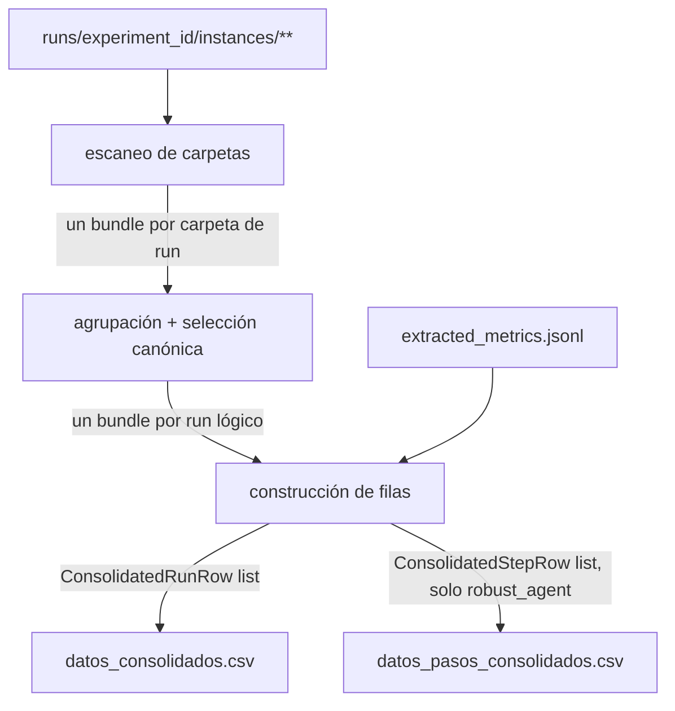

# Módulo de consolidación (`ConsolidationModule`)

> Documento de especificación de **alto/medio nivel** del módulo. La spec global del Bloque 3 (arquitectura, esquema completo de `datos_consolidados.csv` y `datos_pasos_consolidados.csv`, semántica de `agent_id`/`configuration_id`/`source_type`/`sample_group`) está en `especificacion_analisis.md` SAN.6-7. Este documento **no repite** el esquema de campos; se centra en el algoritmo de producción, los contratos intermedios y la política de fallos.

## 1. Función

Escanear el árbol de resultados del Bloque 2 (`runs/<experiment_id>/instances/**`), combinarlo con la salida del módulo de métricas de agentes externos (`extracted_metrics.jsonl`), y producir dos ficheros tabulares limpios: `datos_consolidados.csv` (una fila por run lógico) y `datos_pasos_consolidados.csv` (una fila por paso, solo runs propios con traza `robust_agent`). Es el módulo que decide, de forma explícita, **qué fila representa cada run lógico** ante cadenas de reintentos (`especificacion_analisis.md` `SAN.6.3.1`) y **cómo se recalculan** las métricas de parche de forma uniforme entre fuentes (`SAN.6.3.2`).

El módulo es de **lectura pura** sobre `runs/`: nunca escribe dentro del árbol del experimento.

## 2. Posición en el flujo



Se invoca **después** de que el experimento ha escrito (parcial o totalmente) su árbol de resultados, y opcionalmente después del módulo de métricas externas.

## 3. Entradas y dependencias

**Entradas por invocación (parámetros del método `consolidate`):**

- `runs_root: Path` - ruta a `runs/<experiment_id>/`.
- `external_metrics_paths: list[Path]` - rutas a los `extracted_metrics.jsonl` producidos por `ExternalMetricsModule`. Lista vacía si no se incluyen externos en esta pasada.

**Dependencias inyectadas en construcción:**

- Configuración del módulo (parte de `AnalysisConfig`): patrones de test para recalcular `test_touch_ratio` (mismos por defecto que `StructuralMetricsConfig.test_globs` en `src/agent/config.py`).

El módulo reutiliza:

- `PatchMetricsExtractor` (`src/benchmark/evaluation_module/extractors/patch_metrics.py`) para las métricas básicas de parche.
- La **fórmula** de `StructuralMetricsComputer._dispersion_score` / `_test_touch_ratio` (`src/agent/structural_metrics_module/computer.py`) para recalcular esas dos métricas sobre el diff final completo. La clase no se importa (SAN.9 prohíbe depender de `src/agent`); la lógica se reimplementa como dos funciones puras de ~15 líneas en `consolidation_module.py` - duplicación mínima y deliberada para no romper el principio de independencia de bloques.

## 4. Interfaz pública

### 4.1 Clase `ConsolidationModule`

```text
ConsolidationModule
├─ __init__(config)
└─ consolidate(runs_root, external_metrics_paths) -> tuple[list[ConsolidatedRunRow], list[ConsolidatedStepRow]]
write_csv(run_rows, step_rows, output_dir) -> tuple[Path, Path]   ← función de módulo o método estático
```

- **`consolidate(runs_root, external_metrics_paths)`**: punto de entrada único. Encadena internamente escaneo → agrupación y selección canónica → construcción de filas por cada run lógico, más una fila por cada `ExternalMetricsRecord` cargado de `external_metrics_paths`. Es **idempotente**: relanzarla sobre el mismo estado en disco produce el mismo resultado sin fusión incremental con ejecuciones anteriores del script.
- **`write_csv(run_rows, step_rows, output_dir)`**: serializa ambas listas a `datos_consolidados.csv` y `datos_pasos_consolidados.csv` en `output_dir`, sobrescribiendo si ya existen.

Esta es la **única superficie pública** del módulo. La descomposición interna (MCO.5) es detalle de implementación: se reparte en submódulos (MCO.9) porque el volumen de lógica de cada responsabilidad -escaneo y selección canónica, parseo de trazas, construcción de filas- lo justifica.

## 5. Submódulos internos

La descomposición interna se documenta para guiar el bajo nivel; ninguno de estos componentes forma parte de la interfaz pública y pueden cambiar sin romper consumidores.

- **`RunsScanner`** - recorre `runs_root/instances/*/*/*/` y devuelve directamente la lista de registros canónicos (un registro por run lógico). Internamente hace dos pasos: (1) enumerar carpetas de run que contengan `run_record.json` (las que no lo tienen se ignoran por completo); (2) aplicar la regla de selección canónica de `especificacion_analisis.md` SAN.6.3.1: agrupar por la raíz de hash `r-(?P<hash>[0-9a-f]{8})`, ordenar por sufijo `-rN` y seleccionar el de mayor `n`, anotando `run_sequence` y `retry_count`. Se fusionan en un único componente porque el escaneo sin resolución de reintentos no tiene ningún consumidor independiente.

- **`TrajectoryReader`** - dado un `trajectory.traj.json` ya parseado, extrae y agrega los campos derivados de la traza: tokens (suma de `usage.*` sobre `messages[].extra.response.usage`), y para trazas `robust_agent`: `uncertainty.*` y `structural_risk.*` de `signals_history`, campos del controlador de `decisions_history`, y `validation_outcome` de `steps`. Justifica su propio fichero por el volumen del anidamiento que encapsula: cada entrada de `decisions_history` tiene la forma `{"decision": {...}, "step_index": N}` (el campo `action` cuelga de `decision`, no del nivel superior) y `TrajectoryReader` normaliza todo esto antes de devolverlo a `RowBuilder`.

- **`RowBuilder`** - recibe el registro canónico (con los ficheros ya parseados y la salida de `TrajectoryReader`) y construye el `ConsolidatedRunRow` o la lista de `ConsolidatedStepRow`, mapeando campo a campo el esquema de `especificacion_analisis.md` `SAN.6.2` / `SAN.7`. Aplica degradación limpia campo a campo: si una fuente falta o está corrupta, el campo queda `null`/`NaN`; nunca se omite la fila. También construye las filas de runs externos a partir de `ExternalMetricsRecord`, dejando a `null` las familias no aplicables a `source_type == external` y fijando `configuration_id = agent_id` (sin sufijo de modelo) para evitar fragmentar barras de diagramas por variaciones irrelevantes del identificador de modelo publicado. Las dos funciones puras `dispersion_score`/`test_touch_ratio` (`MCO.7`) viven aquí como funciones de módulo, sin clase propia, dado que son ~15 líneas estables sin estado.

## 6. Política ante fallos

- **`run_record.json` ausente**: carpeta ignorada por completo. No es un run válido.
- **`evaluation_result.json` ausente o corrupto** (PA6): fila incluida igualmente con los campos de identificación/estado/coste de `run_record.json`; campos derivados de `evaluation_result.json` a `null`.
- **`trajectory.traj.json` ausente o corrupto**: campos derivados de la traza a `null`; si `evaluation_result.json.extended.run_metrics.steps_used` está disponible, se usa como fallback para `steps_used`.
- **JSON inválido en cualquier fichero**: tratado igual que «ausente», con un registro en log de la ruta y el error de parseo.
- **`model_patch` vacío**: `PatchMetricsExtractor.extract(model_patch=None, ...)` devuelve el contrato vacío correcto; no requiere manejo especial.
- El módulo **nunca aborta** por el estado de un run individual. La degradación es campo a campo, nunca fila a fila.

## 7. Recálculo uniforme de métricas de parche

`dispersion_score` y `test_touch_ratio` se calculan aplicando la misma fórmula que `StructuralMetricsComputer` (`src/agent/structural_metrics_module/computer.py`), pero sobre el diff final completo en lugar de sobre el diff incremental de cada paso. Esto garantiza que la familia «Estructura de parches» de los diagramas compara `default`, `robust_*` y `agentless_v1.5` en igualdad de condiciones (SAN.6.3.2).

Las dos fórmulas reimplementadas localmente son:

- **`dispersion_score(files: list[str]) -> float`**: entropía de Shannon de la distribución de ficheros modificados por directorio de primer nivel, normalizada por la entropía máxima. Devuelve 0.0 si no hay ficheros o todos pertenecen al mismo directorio.
- **`test_touch_ratio(patch_text: str, test_globs: list[str]) -> float`**: proporción de líneas modificadas (añadidas + eliminadas en el diff) que caen en rutas que matchean alguno de los `test_globs`. Devuelve 0.0 si el patch está vacío.

## 8. Política de `.gitignore`

Esta sección fija la política anunciada en `especificacion_analisis.md` SAN.12:

- `data/` → ignorado en su totalidad. Contiene descargas de terceros (`data/external_predictions/`) y salidas reproducibles del pipeline (`data/<experiment_id>/`). Para versionar una instantánea puntual del CSV final, usar `git add -f` sobre el fichero concreto, nunca relajando el `.gitignore` general.

Entrada en `.gitignore`:

```gitignore
data/
```

## 9. Organización del código

```text
src/analysis/consolidation_module/
├── __init__.py               # re-exporta ConsolidationModule, ConsolidatedRunRow, ConsolidatedStepRow
├── consolidation_module.py   # ConsolidationModule - fachada que orquesta los submódulos (MCO.5)
├── consolidated_run_row.py   # ConsolidatedRunRow (contrato serializado, esquema `SAN.6.2` de la spec general)
├── consolidated_step_row.py  # ConsolidatedStepRow (contrato serializado, esquema `SAN.7` de la spec general)
├── runs_scanner.py           # RunsScanner - escaneo + selección canónica (MCO.5)
├── trajectory_reader.py      # TrajectoryReader - parseo y normalización de trazas (MCO.5)
└── row_builder.py            # RowBuilder + funciones puras dispersion_score/test_touch_ratio (MCO.5 y MCO.7)
```

Convenciones:

- **Sin dependencia de `src/agent`**: toda la información de `robust_agent` se obtiene parseando el JSON de la traza, no instanciando clases del Bloque 1.
- **Dependencia mínima de `src/benchmark`**: únicamente `PatchMetricsExtractor` (utilidad pura); no instancia `BenchmarkRunner` ni ningún componente con efectos de ejecución.

## 10. Referencias

- `especificacion_analisis.md`: spec global, esquema completo de `datos_consolidados.csv` (`SAN.6`) y `datos_pasos_consolidados.csv` (`SAN.7`), regla de selección del run canónico (`SAN.6.3.1`), recálculo uniforme de métricas de parche (`SAN.6.3.2`).
- `docs/especificaciones/analisis/modulo_metricas_agentes_externos.md`: productor de `extracted_metrics.jsonl`.
- `docs/especificaciones/benchmark/modulo_resultados.md`: productor del árbol `runs/<experiment_id>/instances/**`.
- `src/benchmark/evaluation_module/extractors/patch_metrics.py`: `PatchMetricsExtractor`, reutilizado sin modificación.
- `src/agent/structural_metrics_module/computer.py`: fórmula de referencia para `dispersion_score`/`test_touch_ratio` (reimplementada, no importada).
- `src/benchmark/results_module/resume.py`: mecanismo de reintentos y normalización de `model_id`.
