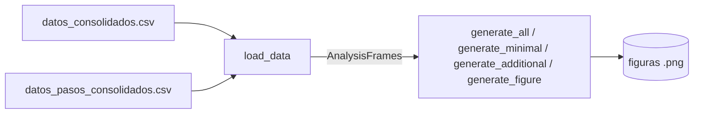

# Módulo de diagramas (`DiagramsModule`)

> Documento de especificación de **alto/medio nivel** del módulo. El catálogo de diagramas (qué figuras existen y qué campos usan) está cerrado en `especificacion_analisis.md` SAN.8. Este documento se centra en la interfaz pública, el estilo visual común y la política de fallos por figura.

## 1. Función

Leer exclusivamente `datos_consolidados.csv` y `datos_pasos_consolidados.csv` (nunca el árbol `runs/` ni las trazas) y generar con `matplotlib` el catálogo completo de figuras `.png` definido en `especificacion_analisis.md` SAN.8. Es el único módulo del Bloque 3 que produce salida visual; no calcula ninguna métrica nueva, solo agrega/filtra/agrupa sobre columnas ya consolidadas.

## 2. Posición en el flujo



Se invoca **después** de `ConsolidationModule`, como último paso del pipeline del Bloque 3. Puede relanzarse de forma aislada tantas veces como se quiera sin tocar `runs/` ni recalcular nada, siempre que el CSV consolidado no haya cambiado.

## 3. Entradas y dependencias

**Entradas por invocación:**

- `csv_path: Path` - ruta a `datos_consolidados.csv`.
- `steps_csv_path: Path | None` - ruta a `datos_pasos_consolidados.csv`; `None` si no se van a generar los diagramas que lo requieren (mapa incertidumbre × riesgo × acción, `SAN.8.2` de la spec general).
- `output_dir: Path` - directorio de salida para las figuras (`data/<experiment_id>/figures/`).

**Dependencias inyectadas en construcción:**

- Configuración del módulo (parte de `AnalysisConfig`): tamaño/DPI por defecto de las figuras, mapa de colores por `configuration_id` (MDI.5), formato de salida (`.png` por defecto).

El módulo depende únicamente de `pandas` (carga y agregación) y `matplotlib` (renderizado) - PA4 de la spec general. No importa nada de `src/agent` ni `src/benchmark`.

## 4. Interfaz pública

### 4.1 Clase `DiagramsModule`

```text
DiagramsModule
├─ __init__(config)
├─ load_data(csv_path, steps_csv_path=None) -> AnalysisFrames
├─ generate_all(frames, output_dir) -> DiagramsReport
├─ generate_minimal(frames, output_dir) -> DiagramsReport
├─ generate_additional(frames, output_dir) -> DiagramsReport
└─ generate_figure(name, frames, output_dir) -> Path
```

- `load_data(csv_path, steps_csv_path=None) -> AnalysisFrames`: carga ambos CSV con `pandas.read_csv`, aplica tipado explícito de columnas booleanas/categóricas (`resolved`, `run_status`, `source_type`, `sample_group`, etc., que `pandas` podría inferir de forma ambigua desde texto plano) y devuelve un contenedor `AnalysisFrames` (MDI.6) con los `DataFrame` ya listos para las funciones de figura.
- `generate_all(frames, output_dir) -> DiagramsReport`: genera el catálogo completo (mínimo `SAN.8.1` + adicional `SAN.8.2` de la spec general). Encadena `generate_figure(name, ...)` para cada nombre registrado; una figura que falle no interrumpe al resto (`MDI.7`).
- `generate_minimal(frames, output_dir) -> DiagramsReport` / `generate_additional(frames, output_dir) -> DiagramsReport`: subconjuntos de `generate_all` restringidos a `SAN.8.1` u `SAN.8.2` respectivamente, útiles para iterar rápido sobre el conjunto mínimo durante el desarrollo.
- `generate_figure(name, frames, output_dir) -> Path`: genera una única figura por nombre (clave del `FIGURE_REGISTRY`, MDI.5), pensada para depuración puntual o regeneración de una figura concreta sin rehacer todo el catálogo. Lanza `KeyError` si `name` no está registrado (a diferencia de los métodos plural, que degradan por figura en vez de abortar).

`DiagramsReport` es un contrato simple de retorno: `generated` (lista de rutas `.png` creadas), `skipped` (figuras omitidas por datos insuficientes — `FigureDataError`, con motivo por nombre) y `failed` (figuras con excepción inesperada, posible bug). Solo `failed` hace que `python -m analysis.run` devuelva exit code `2`; las omisiones en `skipped` son esperables cuando el experimento aún no tiene resueltos, externos, etc. (MDI.7).

## 5. Registro de figuras y estilo visual común

Cada figura del catálogo (`SAN.8.1`/`SAN.8.2` de la spec general) se implementa como una función pura `plot_<nombre>(frames: AnalysisFrames, output_path: Path) -> Path` en su propio fichero bajo `figures/`, y se registra en un diccionario `FIGURE_REGISTRY: dict[str, Callable]` en `diagrams_module.py`. Esto permite añadir una figura nueva sin tocar la clase principal: basta con escribir la función y añadir una entrada al registro.

Convenciones de estilo compartidas (`style.py`), aplicadas por todas las funciones de figura para dar coherencia visual al catálogo completo:

- **Tamaño y resolución**: `figsize=(8, 5)` por defecto (figuras de una sola serie/panel); `(10, 6)` para las que comparan más de 4 configuraciones o incluyen subplots; paneles 2×2 con altura extra cuando el eje X lleva muchas etiquetas rotadas (`patch_structure`, `patch_structure_resolved`). `dpi=150` al guardar; `bbox_inches="tight"` con `pad_inches=0.08`.
- **Paleta de colores estable por** `configuration_id`: `COLOR_MAP: dict[str, str]` fijo (no generado dinámicamente por `matplotlib`), para que un mismo agente tenga siempre el mismo color en todas las figuras del catálogo y las comparaciones visuales entre figuras distintas sean consistentes. Se define una vez con los `agent_id` esperados del experimento (`default`, `robust_strict`, `robust_balanced`, `robust_permissive`, `robust_no_intervention`, `robust_v2`, `agentless_v1.5`, `aider_20240523`, `moatless_claude35_20241117`, `openhands_claude35_20240725`) y un color de reserva determinista (hash del nombre) para cualquier `configuration_id` no previsto, de forma que el módulo no falla si aparece una configuración nueva.
- **Etiquetas cortas de agente** (`DISPLAY_AGENT_NAMES` / `format_agent_label()`): en ejes y leyendas se muestran nombres legibles sin modelo ni fecha de release. Convenciones fijas: `default` → `default (mini-swe-agent)`; externos → `agentless`, `aider`, `moatless`, `openhands`. El `model_id` no aparece en las etiquetas de eje (sí puede figurar en el texto del diagrama de agentes externos, que advierte explícitamente de modelos distintos).
- **Tamaño de muestra**: `sample_size_labels()` añade `(n=<tamaño>)` bajo cada etiqueta de configuración cuando el diagrama agrupa por `agent_id`/`configuration_id`, para no ocultar denominadores distintos (120 vs 40 instancias).
- **Rejilla**: `enable_grid()` activa líneas de rejilla suaves (eje Y por defecto, eje X en dispersión) para facilitar la lectura.
- **Idioma y etiquetado**: títulos, ejes y leyendas en español, consistente con el resto de la documentación del proyecto. Leyenda siempre presente cuando hay más de una serie o categoría codificada por color.
- **Anotaciones numéricas en barras**: toda barra escalar relevante lleva su valor encima (`plot_metric_bar()` → `annotate_bar_value()` → `format_metric_value()`). Tras dibujar las barras, `finalize_bar_axis()` ajusta el límite superior del eje Y para que barras y etiquetas no se recorten (incluye barras apiladas: usa la altura total de cada columna, no la del segmento individual). En escalas **symlog** (p. ej. *churn* con outliers como `openhands`): la etiqueta se ancla con `offset points` sobre el tope de la barra (no en coordenadas de datos, que distorsionan el offset); el tope del eje se calcula con `symlog_ylim_top()` para dejar ~20 % de hueco visual logarítmico sobre la barra más alta.
- **Barras apiladas** (`final_states`, `termination_reasons`): cada segmento con valor ≥ 1 muestra el recuento centrado en el bloque (`annotate_stacked_segment()`), con color de texto blanco/negro según luminancia del fondo.
- **Tasas de resolución**: `plot_rate_bar()` + `configure_rate_axis()` fijan el eje Y en 0–100 % y escriben la etiqueta porcentual incluso cuando la tasa es 0 % real.
- **Mapa de calor** (`uncertainty_risk_action_map`): texto de celda con color adaptativo (`text_color_for_heatmap()`) — blanco sobre celdas oscuras, negro sobre claras — para que acciones como `PROCEED` sigan siendo legibles en el tono azul más intenso.
- **Guardado**: `fig.savefig(output_path, dpi=150, bbox_inches="tight", pad_inches=0.08)`, seguido de `plt.close(fig)` explícito para no acumular figuras abiertas en memoria al generar el catálogo completo en un solo proceso.
- **Datos faltantes vs. cero real**: los `NaN` se excluyen de agregados (`dropna` sobre `resolved`). Si una configuración queda con **cero filas evaluadas** (`resolved` todo `NaN`), se anota `"sin datos"`. Si hay filas evaluadas pero ninguna resuelta (`resolved=False` en todas), la tasa es **0% real**: `style.plot_rate_bar()` fija el eje Y en 0–100 y escribe la etiqueta `0.0%` para que no se confunda con ausencia de dato ni desaparezca por autoescala de matplotlib.
- `sample_group` **visible cuando aplica**: los diagramas que mezclan `main` y `ablation` (o el eje de comparación por configuración en general) deben anotar explícitamente el tamaño de muestra (`n=` en el título o subtítulo) para no sugerir comparabilidad directa entre denominadores de 120 y 40 instancias (`especificacion_analisis.md` `SAN.6.1`/`SAN.8.1`).

### 5.1 Convenciones de presentación por figura

Además del estilo común, estas figuras aplican reglas específicas acordadas para la presentación de resultados:

| Figura | Reglas adicionales |
|--------|-------------------|
| `patch_structure`, `patch_structure_resolved` | Panel 2×2; **todas** las subfiguras muestran etiquetas de configuración en el eje X (rotadas 45°, `clip_on=False` en ticks para que no se recorten entre filas); `hspace` amplio entre filas; eje Y **symlog** en *churn total* si el ratio máximo/mínimo ≥ 20. |
| `final_states`, `termination_reasons` | Barras apiladas con valor numérico en cada segmento de color. |
| `uncertainty_outcome` | Tres paneles; títulos con formato **«métrica A / métrica B»** (no «frente a»). Panel izquierdo: leyenda bajo el gráfico con colores de resultado y fórmulas en lenguaje natural (incertidumbre media del run; media por grupo). Panel central: pie de figura «Cada punto: coste (USD) / incertidumbre media del run». Panel derecho: leyenda bajo el gráfico con perfiles `robust_*` y la línea «Cada punto: riesgo estructural medio / incertidumbre media del run» (mismo patrón que el panel izquierdo). |
| `baseline_vs_robust` | Título de figura: **«default (mini-swe-agent) frente a RobustAgent»**; comparación de `default` con `robust_strict`, `robust_balanced`, `robust_permissive`. |
| `external_agents` | Panel doble (resolución + churn); churn con symlog si aplica; subtítulo advierte modelos distintos por agente externo. |
| `cost_per_solved` | Tokens en miles en el eje Y; `subplots_adjust` explícito (sin `tight_layout`) para evitar huecos de maquetación. |
| `cumulative_resolution_vs_cost` | Curva acumulada desde (0, 0), no estilo escalón. |

## 6. Submódulos internos

La descomposición interna se documenta para guiar el bajo nivel; ninguno de estos componentes forma parte de la interfaz pública.

- **`AnalysisFrames`** (en `analysis_frames.py`) - contenedor simple con los `DataFrame` ya cargados y tipados (`runs` y `steps`). Encapsula la lectura con `pandas.read_csv` y el tipado explícito de columnas ambiguas (`resolved`, `run_status`, `source_type`, `sample_group`…), de forma que ninguna función de figura tenga que hacerlo por su cuenta.

- **`style.py`** - constantes de theming compartidas por todas las funciones de figura: `COLOR_MAP` fijo por `configuration_id`, `DISPLAY_AGENT_NAMES`, tamaños de figura, DPI, y helpers de anotación (`plot_metric_bar`, `plot_rate_bar`, `finalize_bar_axis`, `symlog_ylim_top`, `annotate_stacked_segment`, `text_color_for_heatmap`, `format_agent_label`, anotación `"sin datos"`). Es el único estado global permitido en el paquete.

- **`FIGURE_REGISTRY`** (dict en `diagrams_module.py`) - diccionario `{nombre: (callable, grupo)}` donde `grupo` es `"minimal"` o `"additional"`. Es el único punto de registro de una figura nueva: añadir un diagrama al catálogo no requiere tocar `generate_all`/`generate_minimal`/`generate_additional`, solo escribir la función `plot_<nombre>` en su fichero de `figures/` y añadir la entrada al registro.

- **Funciones de figura** (en `figures/*.py` y `figures/additional/*.py`) - funciones puras `plot_<nombre>(frames: AnalysisFrames, output_path: Path) -> Path`, una por fichero. No mantienen estado ni importan entre sí; su única dependencia compartida es `style.py`. Lanzan `FigureDataError` si los datos necesarios no están disponibles (MDI.7).

## 7. `AnalysisFrames`: contrato de datos interno

Contenedor simple (no serializado) que agrupa los `DataFrame` ya cargados y tipados, para no repetir la lectura/tipado en cada función de figura:

- `runs: pandas.DataFrame` - contenido de `datos_consolidados.csv`.
- `steps: pandas.DataFrame | None` - contenido de `datos_pasos_consolidados.csv`, `None` si no se cargó.

Cada función `plot_<nombre>` recibe `AnalysisFrames` y filtra/agrupa internamente las columnas que necesita (p. ej. por `source_type`, `sample_group`, `resolved`); ninguna función vuelve a leer CSV ni accede a `runs/`.

## 8. Política ante fallos

- **Columna ausente o** `DataFrame` **vacío tras el filtrado** (p. ej. no hay filas `source_type == "external"` porque no se pasaron `--external`, o no hay `resolved == True` todavía): la función de figura correspondiente lanza una excepción controlada `FigureDataError` con un mensaje explícito; `generate_all`/`generate_minimal`/`generate_additional` capturan esa excepción, registran el nombre y el motivo en `DiagramsReport.skipped`, y continúan con la siguiente figura del catálogo. El pipeline nunca se detiene por una figura individual.
- **Excepción inesperada de** `matplotlib` (no `FigureDataError`): se captura igual que el caso anterior con el nombre completo de la excepción, para no perder visibilidad del catálogo completo por un fallo aislado, pero se registra con mayor severidad en el log (posible bug, no solo dato incompleto).
- `generate_figure(name, ...)` **(singular)**: no aplica esta captura - propaga la excepción directamente, porque su caso de uso es depuración puntual de una figura concreta, donde interesa ver el fallo completo.

## 9. Organización del código

```text
src/analysis/diagrams_module/
├── __init__.py                          # re-exporta DiagramsModule, AnalysisFrames, DiagramsReport
├── diagrams_module.py                   # DiagramsModule (clase principal de MDI.4) + FIGURE_REGISTRY
├── analysis_frames.py                   # AnalysisFrames (MDI.6 y MDI.7), carga y tipado de columnas
├── style.py                             # COLOR_MAP, tamaños, DPI, helpers de anotación "sin datos" (MDI.6)
└── figures/
    ├── resolution_rate.py               # 8.1.1 Tasa de resolución por configuración
    ├── final_states.py                  # 8.1.2 Estados finales
    ├── cost_effort.py                   # 8.1.3 Coste y esfuerzo
    ├── patch_structure.py               # 8.1.4 Estructura de los parches
    ├── patch_structure_resolved.py      # 8.1.5 Estructura de parches resueltos
    ├── uncertainty_outcome.py           # 8.1.6 Incertidumbre y resultado
    ├── controller_interventions.py      # 8.1.7 Intervenciones del controlador
    ├── baseline_vs_robust.py            # 8.1.8 Baseline frente a RobustAgent
    ├── ablations.py                     # 8.1.9 Ablaciones
    ├── external_agents.py               # 8.1.10 Agentes externos
    ├── cost_performance_tradeoff.py     # 8.1.11 Compromiso coste-rendimiento
    └── additional/
        ├── uncertainty_risk_action_map.py    # 8.2 Mapa incertidumbre x riesgo x acción
        ├── cost_per_solved.py                # 8.2 Coste/tokens por solución resuelta
        ├── cumulative_resolution_vs_cost.py  # 8.2 Resolución acumulada frente a coste
        ├── results_by_repository.py          # 8.2 Resultados por repositorio
        └── termination_reasons.py            # 8.2 Motivos de terminación
```

Convenciones:

- **Superficie pública del paquete:** `DiagramsModule`, `AnalysisFrames`, `DiagramsReport`. Las funciones individuales de `figures/` son invocables directamente en tests, pero no forman parte de la API pública recomendada fuera del propio paquete (se accede vía `generate_figure(name, ...)`).
- **Una función pura por figura.** Ninguna función de `figures/` mantiene estado ni depende de variables globales salvo `style.py` (constantes compartidas de theming).
- `FIGURE_REGISTRY` **como único punto de alta de una figura nueva**: añadir un diagrama al catálogo no requiere tocar `generate_all`/`generate_minimal`/`generate_additional`, solo escribir la función y registrar su nombre y su pertenencia a "mínimo" o "adicional".

