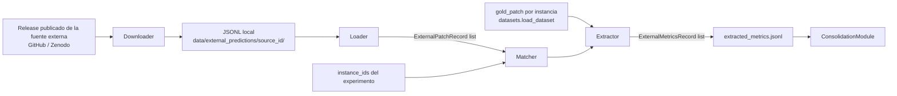

# Módulo de métricas de agentes externos (`ExternalMetricsModule`)

> Documento de especificación de **alto/medio nivel** del módulo. La spec global del Bloque 3 (arquitectura, contratos transversales de `datos_consolidados.csv`) está en `especificacion_analisis.md`. La decisión de qué agentes externos se incorporan y por qué se documenta en `especificacion_analisis.md`, sección 5.

## 1. Función

Incorporar al análisis comparativo los resultados de agentes externos **sin ejecutarlos**: descarga (o localiza ya descargados) los parches publicados por la fuente externa, los empareja por `instance_id` con el conjunto de instancias del experimento, y les extrae las mismas métricas de parche que se usan para los runs propios. Se diseñó como el **primer módulo del Bloque 3** porque es independiente del resto (no depende del árbol `runs/` del Bloque 2 ni de `pandas`/`matplotlib`) y no consume tokens de LLM.

El módulo **no ejecuta ningún agente ni LLM**. Su única actividad es red (descarga), IO (lectura de JSONL) y CPU (parseo de diffs y cálculo de métricas). Para `resolved`, rellena el campo desde los `results.json` publicados en `SWE-bench/experiments` cuando la fuente declara `results_url`; no invoca `sb-cli` ni reevalúa localmente salvo que se añada explícitamente un camino futuro de reevaluación puntual (MEX.6).

## 2. Posición en el flujo



El módulo se invoca **una vez por fuente externa**, típicamente antes o en paralelo a la ejecución del experimento principal (no depende de sus resultados). Su salida persistida (`extracted_metrics.jsonl`) es leída después por `ConsolidationModule` (`modulo_consolidacion.md`) como una fuente de entrada más, al mismo nivel que el árbol `runs/`.

## 3. Entradas y dependencias

**Entradas por invocación (parámetros del método `run`):**

- `source_config: ExternalSourceConfig` - configuración declarativa de la fuente externa:
  - `source_id: str` - identificador estable (p. ej. `agentless_v1.5`, `aider_20240523`).
  - `release_url: str` - URL de descarga: ZIP para Agentless; JSONL directo para las demás fuentes vía el repositorio `SWE-bench/experiments`.
  - `archive_member: str | None` - nombre del JSONL dentro del ZIP si aplica; `None` si la URL ya es un JSONL directo.
  - `local_cache_dir: Path` - directorio de destino (`data/external_predictions/<source_id>/`).
  - `default_agent_id: str` - identificador a asignar en `ExternalMetricsRecord.agent_id` (coincide con `source_id`).
  - `external_release: str | None` - versión del release (p. ej. `v1.5.0`, `20240523`), propagada a `datos_consolidados.csv::external_release`.
  - `external_source_name: str | None` - nombre legible del sistema (p. ej. `Agentless`, `Aider`), mapeado a `datos_consolidados.csv::external_source`.
  - `results_url: str | None` - URL del `results.json` publicado en `SWE-bench/experiments` para esa fuente (lista de `instance_id` resueltos). Si está definida, `ExternalMetricsModule` descarga o reutiliza `published_results.json` en `local_cache_dir` y rellena `resolved`/`resolved_source` por instancia.
- `instance_ids: list[str]` - conjunto de `instance_id` del experimento a emparejar. Se inyecta explícitamente desde el llamador (`python -m analysis.run` o notebook), típicamente leído de `runs/<experiment_id>/dataset_summary.json`. **El módulo no lee el árbol `runs/` directamente** para mantener su independencia (MEX.4.4 de la spec general); solo recibe la lista de IDs ya resuelta.
- `gold_patch_lookup: Callable[[str], str | None]` - función inyectada que resuelve `instance_id -> gold_patch`. En la integración real se obtiene de `datasets.load_dataset("SWE-bench/SWE-bench_Lite", split="test")` (misma llamada HuggingFace que usa `BenchmarkDatasetModule`, pero inyectada como función, no importando el módulo del Bloque 2).

**Dependencias inyectadas en construcción:**

- `ExternalMetricsConfig`: directorio base de `data/external_predictions/`, política de reintentos de red (MEX.6), tamaño máximo de descarga aceptado.

El módulo **reutiliza `PatchMetricsExtractor`** (`src/benchmark/evaluation_module/extractors/patch_metrics.py`) como única dependencia de código del Bloque 2: es una utilidad pura sin estado sobre un diff, no un componente con efectos de ejecución (PA5 de la spec general).

## 4. Interfaz pública

### 4.1 Clase `ExternalMetricsModule`

```text
ExternalMetricsModule
├─ __init__(config)
├─ ensure_downloaded(source_config) -> Path
├─ load_patches(source_config) -> list[ExternalPatchRecord]
├─ extract_metrics(patches, instance_ids, gold_patch_lookup) -> list[ExternalMetricsRecord]
├─ run(source_config, instance_ids, gold_patch_lookup) -> list[ExternalMetricsRecord]
└─ write_output(records, source_config) -> Path
```

- **`__init__(config)`**: construye el módulo con su configuración (rutas de cache, política de reintentos).
- **`ensure_downloaded(source_config) -> Path`**: descarga el release si no existe ya en `local_cache_dir` (o si el fichero existente está corrupto/incompleto), lo descomprime si es un ZIP, y devuelve la ruta al JSONL final. Idempotente: si el fichero ya existe y es válido, no repite la descarga.
- **`load_patches(source_config) -> list[ExternalPatchRecord]`**: parsea el JSONL línea a línea y devuelve la lista de registros validados (MEX.5.1). Líneas malformadas se descartan con un registro en log, sin abortar la carga completa.
- **`extract_metrics(patches, instance_ids, gold_patch_lookup, published_resolved_ids=None) -> list[ExternalMetricsRecord]`**: empareja `patches` con `instance_ids` (MEX.5.3) y calcula `patch_metrics` vía `PatchMetricsExtractor.extract(model_patch=..., gold_patch=gold_patch_lookup(instance_id))` para cada instancia emparejada. Si `published_resolved_ids` está disponible (derivado de `results_url`), asigna `resolved=True/False` y `resolved_source="published"`. Devuelve un `ExternalMetricsRecord` por cada `instance_id` de la lista de entrada (incluidas las no emparejadas, con `matched=False`).
- **`run(source_config, instance_ids, gold_patch_lookup) -> list[ExternalMetricsRecord]`**: fachada end-to-end que encadena `ensure_downloaded` → `load_patches` → `extract_metrics` → `write_output`. Punto de entrada recomendado desde `python -m analysis.run` o notebooks.
- **`write_output(records, source_config) -> Path`**: persiste `records` como JSONL en `data/external_predictions/<source_id>/extracted_metrics.jsonl` (un `ExternalMetricsRecord` serializado por línea) y devuelve la ruta escrita.

Esta es la única superficie pública del módulo. Los submódulos (MEX.5) son detalle de implementación.

## 5. Submódulos internos

- **`Downloader`** - descarga el release (HTTP GET con reintentos, MEX.6), verifica tamaño no vacío, descomprime si es necesario (ZIP → JSONL). Cachea en disco; no vuelve a descargar si el fichero de destino ya existe y no está vacío.
- **`JsonlLoader`** - parsea el JSONL línea a línea, valida que cada línea tenga al menos `instance_id` y `model_patch` (campos obligatorios del formato estándar SWE-bench), descarta silenciosamente líneas sin esos campos con log de conteo.
- **`Matcher`** - empareja `ExternalPatchRecord` (indexados por `instance_id`) contra la lista `instance_ids` del experimento. Las 120 instancias del experimento son subconjunto de las 300 del Lite completo, por lo que el caso esperado es 100% de emparejamiento con cualquiera de las cuatro fuentes externas; el módulo no asume esto y maneja explícitamente el caso contrario (MEX.6).
- **`PublishedResultsLoader`** (`published_results_loader.py`) - descarga (o lee de cache) el `results.json` de `SWE-bench/experiments` indicado por `results_url`, extrae el conjunto de `instance_id` con `resolved=True` y lo persiste como `published_results.json` junto al JSONL de parches. `ExternalMetricsRecord.load_jsonl()` rellena `resolved` desde ese cache si un JSONL antiguo lo tenía a `null`.
- **Reutilización directa de `PatchMetricsExtractor`** (Bloque 2) para el cálculo de métricas - no hay un submódulo propio de cálculo de métricas de parche, evitando divergencia de fórmula entre fuentes (principio de la SAN.4.4).

## 6. Contratos de datos

### 6.1 `ExternalPatchRecord` (entrada, una línea del JSONL de origen)

Formato estándar SWE-bench, tal como lo publica la fuente externa:

```json
{"instance_id": "astropy__astropy-12907", "model_patch": "diff --git a/...", "model_name_or_path": "claude-3-5-sonnet-20241022"}
```

- `instance_id: str` - obligatorio.
- `model_patch: str` - obligatorio; puede ser cadena vacía (parche vacío, tratado igual que un `model_patch` vacío de un run propio).
- `model_name_or_path: str` - identificador del modelo usado por la fuente externa; se copia a `ExternalMetricsRecord.model_id`.

### 6.2 `ExternalMetricsRecord` (salida, una entrada por `instance_id` del experimento)

```json
{
  "instance_id": "astropy__astropy-12907",
  "source_id": "agentless_v1.5",
  "agent_id": "agentless_v1.5",
  "model_id": "claude-3-5-sonnet-20241022",
  "model_patch": "diff --git a/...",
  "matched": true,
  "patch_metrics": {
    "lines_added": 2,
    "lines_deleted": 2,
    "hunks_count": 1,
    "files_modified": ["astropy/modeling/separable.py"],
    "files_intersection_with_gold": ["astropy/modeling/separable.py"],
    "files_unexpected": [],
    "files_missing_vs_gold": [],
    "jaccard_files": 1.0,
    "jaccard_lines": 0.73
  },
  "resolved": true,
  "resolved_source": "published",
  "external_release": "v1.5.0",
  "external_source_name": "Agentless"
}
```

- `instance_id`, `source_id`, `agent_id`, `model_id`, `model_patch`: identificación y procedencia.
- `matched: bool` - `true` si la fuente externa publicó un parche para este `instance_id`; `false` si no (caso no esperado en la práctica, pero manejado explícitamente - MEX.7). Cuando es `false`, `model_patch` es `null` y `patch_metrics` son los valores vacíos de `PatchMetricsExtractor.extract(model_patch=None, ...)`.
- `patch_metrics: dict` - salida literal de `PatchMetricsExtractor.extract(model_patch=..., gold_patch=...)` (mismo esquema que usa el Bloque 2 en `evaluation_result.json.extended.patch_metrics`); esto es lo que garantiza comparabilidad directa con runs propios en `ConsolidationModule`.
- `resolved: bool | None` - `true`/`false` si la fuente tiene `results_url` y el `instance_id` figura o no en la lista `resolved` del `results.json` publicado; `null` solo si no hay URL de resultados o la descarga falló sin cache previa.
- `resolved_source: str | None` - `null` o `"published"` (trazabilidad de que el veredicto proviene de `SWE-bench/experiments`, no de evaluación local). Valor reservado `"sb_cli_reeval"` para un posible camino futuro de reevaluación puntual.
- `external_release: str | None` - versión del release, propagada desde `ExternalSourceConfig.external_release` y mapeada a `datos_consolidados.csv::external_release`. Si falta en un JSONL antiguo, `ExternalMetricsRecord.load_jsonl()` la rellena desde `EXTERNAL_SOURCE_DEFAULTS` (`external_source_config.py`).
- `external_source_name: str | None` - nombre legible del sistema, propagado desde `ExternalSourceConfig.external_source_name` y mapeado a `datos_consolidados.csv::external_source`. Misma política de relleno automático al cargar JSONL antiguos.

## 7. Política ante fallos

- **Descarga fallida** (red, release movido, checksum de tamaño inconsistente): reintentos con backoff exponencial simple (3 intentos, 2ⁿ segundos). Si se agotan los reintentos, el módulo **aborta explícitamente** (`run()` lanza excepción) - a diferencia del resto del sistema de análisis, este es un paso de preparación de datos ejecutado una vez y de forma manual/semi-manual, no parte de un bucle con cientos de runs; no tiene sentido continuar con datos externos parciales o corruptos sin que el operador lo sepa.
- **Línea de JSONL malformada** (falta `instance_id` o `model_patch`): se descarta con log de conteo; no aborta la carga completa.
- **`instance_id` del experimento sin contraparte en la fuente externa** (`matched=False`): se registra igualmente un `ExternalMetricsRecord` con métricas vacías, en lugar de omitir la fila. Esto preserva el principio de degradación limpia del resto del sistema (SAN.4.4): `ConsolidationModule` no tiene que tratar de forma especial las instancias sin match, simplemente ve un `patch_metrics` vacío como lo vería para un run propio con `model_patch` vacío.
- **`gold_patch_lookup` devuelve `None`** para una instancia: `PatchMetricsExtractor.extract` ya contempla este caso (métricas propias disponibles, comparativas a `null`); el módulo no necesita lógica adicional.

## 8. Organización del código

```text
src/analysis/external_metrics_module/
├── __init__.py                    # re-exporta ExternalMetricsModule, contratos publicos
├── external_metrics_module.py     # ExternalMetricsModule (clase principal de MEX.4)
├── external_patch_record.py       # ExternalPatchRecord (contrato de MEX.6.1)
├── external_metrics_record.py     # ExternalMetricsRecord (contrato de MEX.6.2)
├── external_source_config.py      # ExternalSourceConfig (parametros por fuente)
├── external_metrics_config.py     # ExternalMetricsConfig (parametros operativos)
├── downloader.py                  # Downloader (MEX.5)
├── jsonl_loader.py                # JsonlLoader (MEX.5)
├── matcher.py                     # Matcher (MEX.5)
└── published_results_loader.py    # PublishedResultsLoader (results.json de SWE-bench/experiments)
```

Convenciones:

- **Superficie pública del paquete:** `ExternalMetricsModule`, `ExternalPatchRecord`, `ExternalMetricsRecord`. El resto es detalle de implementación.
- **Sin dependencia de `src/agent`.** El módulo no importa nada del Bloque 1.
- **Dependencia mínima de `src/benchmark`.** Únicamente `PatchMetricsExtractor` (utilidad pura). No instancia `BenchmarkDatasetModule`; la resolución de `gold_patch` se inyecta desde fuera como función (MEX.3), manteniendo el módulo testeable sin red ni HuggingFace en tests unitarios (se inyecta un `gold_patch_lookup` fake).

## 9. Referencias

- `especificacion_analisis.md`: spec global del Bloque 3, arquitectura de tres módulos, esquema de `datos_consolidados.csv`, catálogo de fuentes externas.
- `src/benchmark/evaluation_module/extractors/patch_metrics.py`: `PatchMetricsExtractor`, reutilizado sin modificación.
- `docs/especificaciones/analisis/modulo_consolidacion.md`: consumidor de `extracted_metrics.jsonl`.
