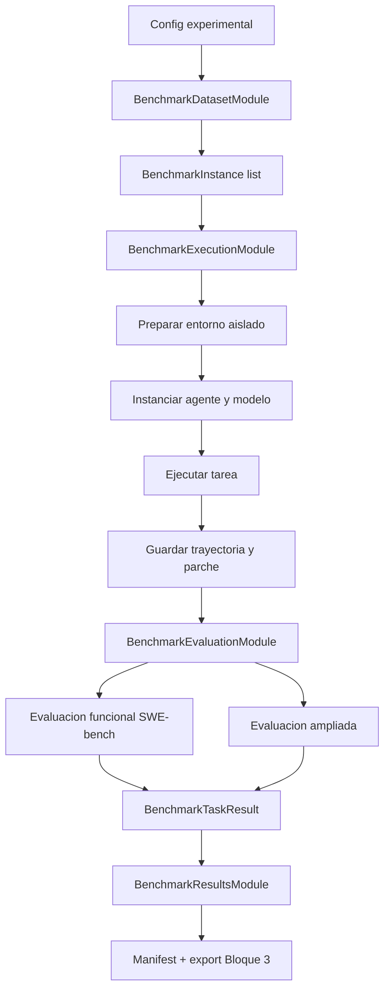
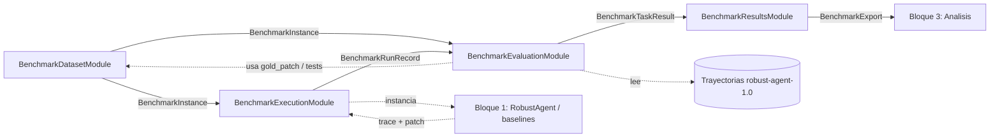

# Fase 2.2 - Especificación del benchmark extendido

## 1. Objetivo y alcance

Este documento especifica el **Bloque 2: benchmark extendido de evaluación** del TFG: arquitectura general, responsabilidades, interacciones entre módulos, contratos de datos transversales, organización del código e interfaces con el Bloque 1 (agente) y el Bloque 3 (análisis de resultados).

El objetivo del bloque es ejecutar de forma reproducible un lote de agentes sobre tareas de SWE-bench (baseline `default` y variantes robustas como `robust_strict`, `robust_balanced`, `robust_permissive`) y convertir cada ejecución en **datos comparables entre agentes**: corrección funcional (`resolved`), métricas de run (`run_metrics`) y métricas del parche emitido (`patch_metrics`). El análisis agregado (medias, correlaciones, series temporales, gráficos) y el estudio de incertidumbre/riesgo/decisiones del proceso robusto corresponden al **Bloque 3**, que lee `evaluation_result.json` para comparativas tabulares y `trajectory.traj.json` cuando necesita detalle paso a paso del bloque `robust_agent`.

El alcance de este documento es exclusivamente el **Bloque 2**. Quedan fuera:

- la lógica interna del agente robusto, ya especificada en `especificacion_agente.md`,
- el análisis estadístico, visualización y explotación final de resultados, que corresponde al Bloque 3,
- la implementación concreta de cada clase, fórmula final y esquema de almacenamiento físico, que se cierra en documentos específicos por módulo.

### 1.1 Documentos hermanos

La especificación del benchmark extendido queda repartida en varios documentos. **Este documento describe el sistema general**; cada módulo tiene su propio documento con interfaz pública, contratos de datos, política de fallos y detalle interno.

Documentos de la serie:

- `docs/especificaciones/benchmark/modulo_dataset.md` - selección, carga y normalización de instancias SWE-bench.
- `docs/especificaciones/benchmark/modulo_ejecucion.md` - harness de ejecución, matriz experimental, entornos y lanzamiento de agentes.
- `docs/especificaciones/benchmark/modulo_evaluacion.md` - evaluación funcional SWE-bench y evaluación ampliada.
- `docs/especificaciones/benchmark/modulo_resultados.md` - persistencia, manifiesto mínimo y contrato de salida hacia el Bloque 3.

## 2. Benchmark base y motivación de la elección

El benchmark base seleccionado es **SWE-bench**, tras una evaluación multicriterio (encaje con el contrato del agente, soporte nativo en mini-SWE-agent, reproducibilidad vía harness oficial y `sb-cli`, y adecuación para métricas ampliadas de parche).

Se elige SWE-bench por cuatro motivos alineados con los objetivos del TFG:

1. **Encaje con el contrato del agente.** Las tareas siguen el patrón `issue -> repositorio -> parche -> tests`, que coincide con el flujo de mini-SWE-agent y con las precondiciones del `RobustAgent`.
2. **Soporte nativo en mini-SWE-agent.** La copia local de mini-SWE-agent incluida en el repositorio trae runners `swebench.py` y `swebench_single.py`, configuraciones YAML y soporte de entornos `docker`/`singularity`, lo que permite extender el harness existente en lugar de construir uno desde cero.
3. **Reproducibilidad y evaluación funcional estándar.** SWE-bench proporciona imágenes por instancia, suites de test y harness oficial de evaluación, además de la opción de evaluación cloud vía `sb-cli`.
4. **Adecuación para métricas ampliadas.** Cada instancia contiene metadatos útiles para comparar el parche del agente con el parche de referencia y para relacionar éxito funcional con coste, incertidumbre y riesgo estructural.

### 2.1 Variantes usadas

Se distinguen dos usos:

- **SWE-bench Lite**: conjunto de iteración y validación interna del benchmark extendido. Puede ejecutarse completo o reducido con `--slice`/`--filter`.
- **SWE-bench Verified**: conjunto de evaluación final o semidefinitiva. Es el subconjunto más comparable con la literatura reciente, aunque su ejecución completa depende del presupuesto disponible.

La especificación no acopla el bloque a un subset fijo. El módulo de dataset expone `subset`, `split`, `slice_strategy`, `slice_size`, `slice_seed`, `shuffle` e `instance_ids` como parámetros configurables para poder incorporar `Lite`, `Verified`, `SWE-bench-Live` u otra variante compatible con el formato SWE-bench.

## 3. Precondiciones del entorno y dependencias técnicas

El bloque del benchmark debe garantizar las precondiciones que el agente necesita y las que la evaluación funcional requiere.

- **PB1. Instancia SWE-bench válida.** Cada tarea debe incluir al menos `instance_id`, `problem_statement`, metadatos de repositorio, parche de referencia cuando esté disponible e información de tests compatible con el harness de SWE-bench.
- **PB2. Entorno aislado por instancia.** Cada ejecución se realiza en un entorno independiente, preferentemente Docker. El estado del repositorio se comprueba antes de llamar al agente (`git status --porcelain`) y se registra en `environment_meta`, pero no bloquea el run: las imágenes oficiales de SWE-bench a veces contienen ficheros pre-modificados por configuración del entorno de test (p. ej. `setup.py`, `tox.ini`), y `sb-cli` evalúa siempre contra el `base_commit` correcto independientemente del estado inicial del directorio.
- **PB3. Compatibilidad con mini-SWE-agent.** El entorno debe poder instanciar un `Model`, un `Environment` y un agente compatible con el protocolo de mini-SWE-agent. Para el agente del TFG se instancia `RobustAgent`; para baselines se pueden instanciar `DefaultAgent` u otros agentes compatibles.
- **PB4. Persistencia de artefactos.** Cada ejecución debe producir una trayectoria serializada, un parche/model patch y metadatos suficientes para auditar el run. Si un run falla antes de generar parche, el fallo se registra explícitamente y no se oculta.
- **PB5. Evaluador funcional disponible (`sb-cli`).** En la versión inicial, la métrica funcional se calcula con `sb-cli`, autenticado mediante la variable de entorno `SWEBENCH_API_KEY` (ver EB.3.1). **Antes de ejecutar agentes**, el benchmark comprueba que `sb-cli` está accesible; si no lo está, el experimento **aborta** sin lanzar la matriz. La evaluación funcional puede desactivarse deliberadamente con `functional_backend='none'` o `evaluation_skip=True` (útil para tiradas de depuración o ablaciones que quieran ahorrar cuota de `sb-cli`): en ese caso el preflight no aplica, los runs se ejecutan igualmente y las métricas locales (`run_metrics`, `patch_metrics`) se calculan con normalidad; `functional.resolved` queda a `null`. El fallback a `swebench.harness.run_evaluation` queda fuera de esta versión inicial.
- **PB6. Configuración experimental congelada.** Cada lote de ejecuciones registra versión del código, subset, split, filtro, modelo, perfil, límites, entorno y versión del formato de salida.
- **PB7. Proveedor de modelo configurable.** El benchmark soporta dos endpoints para Gemini: AI Studio (`gemini/<model>`) y Vertex AI (`vertex_ai/<model>`). Si la variable de entorno `VERTEXAI_PROJECT` está definida, `run.py` instala un wrapper transparente que redirige todas las llamadas `gemini/*` a Vertex AI como destino primario, con fallback automático a AI Studio ante errores 429, 503 o de red. Para la comparación de reanudación, `vertex_ai/gemini-2.5-flash` y `gemini/gemini-2.5-flash` se tratan como el mismo modelo.

La degradación limpia aplica a fallos recuperables de evaluación o metadatos incompletos. El estado del repositorio (PR1) se registra como dato informativo en `run_record.json` (`environment.pr1_check`), pero no aborta el run (ver PB2).

### 3.1 Gestión de secretos y variables de entorno

El benchmark comparte con el Bloque 1 el mismo mecanismo de carga de secretos, definido en `common.env` (utilidad transversal fuera de `src/agent/` y `src/benchmark/`; ver `especificacion_agente.md` EA.3.1):

- `common.env.load_project_env()` carga `.env` de la raíz del repositorio (y el `.env` global de mini-swe-agent) al arrancar. `python -m benchmark.run` la invoca en su `main()` **antes** de configurar LiteLLM y el routing de Vertex AI (PB7), de modo que `VERTEXAI_PROJECT` y las API keys de modelo ya están disponibles en ese punto.
- `common.env.api_key_error_for_model()` valida la API key del modelo por `agent_id`/`model_id` según la convención del proveedor o el `api_key_env` explícito de `AgentRunConfig` (EB.7.2).
- `common.env.swebench_api_key_error()` valida específicamente `SWEBENCH_API_KEY` (PB5) durante el preflight de `sb-cli` en `BenchmarkRunner`; si falta, el mensaje de error indica que se define en `.env` y que se carga automáticamente al arrancar `python -m benchmark.run`.

Las API keys **no** se declaran en el YAML de experimento ni en ningún fichero versionado: solo en `.env` (gitignored) o en el entorno del proceso. `AgentRunConfig.api_key_env` (EB.7.2) referencia el *nombre* de la variable, nunca su valor. Ver `README.md` (sección 3) para el procedimiento de configuración.

## 4. Arquitectura de alto nivel

### 4.1 Componentes

El Bloque 2 se organiza en cuatro módulos principales:

- **Módulo de dataset (`BenchmarkDatasetModule`).** Carga SWE-bench, selecciona subsets/slices/filtros, normaliza cada instancia a un contrato interno `BenchmarkInstance` y expone los metadatos necesarios para ejecución y evaluación.
- **Módulo de ejecución (`BenchmarkExecutionModule`).** Actúa como harness: construye la matriz experimental, prepara entornos, instancia agentes, ejecuta tareas, captura trayectorias y registra el resultado bruto de cada run.
- **Módulo de evaluación (`BenchmarkEvaluationModule`).** (1) Evaluación funcional vía `sb-cli` por grupo de configuración. (2) **Extracción ampliada comparable**: por cada run, produce `run_metrics` y `patch_metrics` en un esquema **idéntico para todos los agentes** (baseline y robusto). No agrega series temporales ni snapshots del bloque `robust_agent`; eso queda en la traza para el Bloque 3.
- **Módulo de resultados (`BenchmarkResultsModule`).** Gestiona el layout de persistencia, manifiesto mínimo, versiones de formato y exportación hacia el Bloque 3. **No** materializa un índice tabular `results.jsonl`; el Bloque 3 escanea el árbol `instances/` o consume `BenchmarkExport`.

Esta descomposición concreta el planteamiento inicial del diseño del TFG. El diseño inicial distinguía genéricamente "ejecución" y "evaluación ampliada"; aquí se separa también la carga/normalización de tareas y la persistencia de resultados porque ambas responsabilidades son transversales y conviene mantenerlas desacopladas.

### 4.2 Flujo lógico



El flujo es por instancia y por configuración experimental. Una misma instancia puede ejecutarse varias veces con distintos agentes, perfiles o semillas, pero cada ejecución produce un `run_id` único y artefactos independientes.

### 4.3 Comunicación entre módulos

Los módulos se comunican mediante contratos de datos serializables. Ningún módulo debe depender de detalles internos de otro módulo fuera de su interfaz pública.



El módulo de evaluación consume `BenchmarkInstance` además de `BenchmarkRunRecord` porque las métricas funcional y ampliada requieren el `gold_patch`, los tests (`fail_to_pass`, `pass_to_pass`) y los metadatos de la tarea (repo, base_commit) que viven en la instancia, no en el record bruto.

Reglas de comunicación:

- **Acoplamiento por interfaz.** Cada módulo expone una clase principal con métodos públicos claros (`load_instances`, `run_matrix`, `evaluate_runs`, `write_manifest`, etc.). Los nombres exactos se cierran en los documentos de módulo.
- **Contratos serializables.** Todo dato que cruza módulos debe poder persistirse como JSON o JSONL sin depender de objetos vivos en memoria.
- **Sin inspección interna del agente.** El benchmark instancia el agente y consume su salida serializada. No lee atributos internos del `RobustAgent` durante el run.
- **Separación entre ejecución y evaluación.** La ejecución no decide si una solución es correcta; solo genera artefactos. La evaluación funcional y ampliada se calcula después sobre esos artefactos.
- **Errores explícitos.** Una ejecución o evaluación fallida produce un contrato con `status=error` y evidencia, no una ausencia silenciosa de datos.

### 4.4 Principios de diseño

El bloque extiende el runner de mini-SWE-agent y el formato de SWE-bench siempre que sea razonable, en lugar de reimplementar la carga de dataset, la evaluación funcional o la gestión de imágenes sin necesidad justificada. Cada módulo encapsula una responsabilidad concreta tras una interfaz mínima, de modo que su detalle interno puede cambiar sin afectar a los demás.

Cada run deja suficientes artefactos para reconstruir qué tarea se ejecutó, con qué agente, en qué entorno, con qué configuración y qué salida produjo. La configuración experimental se versiona junto a los resultados -filtros, slices, seeds, modelo, perfil y límites quedan siempre en el manifiesto- para que cualquier lote sea reproducible. Cuando una métrica ampliada no puede calcularse se marca explícitamente como `unavailable` o `error` con su causa, en lugar de contaminar otras métricas u ocultar el fallo; y el coste no se infiere a posteriori si el agente ya lo reporta, sino que se consume el desglose de `EpisodeState.budget` tal cual. Por último, el diseño busca que añadir un perfil, un baseline, una variante de SWE-bench o una métrica nueva no requiera modificar el núcleo de ejecución.

### 4.5 Límites Bloque 2 / Bloque 3

| Responsabilidad | Bloque 2 | Bloque 3 |
|-----------------|----------|----------|
| Ejecutar matriz experimental | Sí | No |
| `resolved` (sb-cli) | Sí | Agrega y compara |
| `run_metrics`, `patch_metrics` por run (todos los agentes) | Extrae y persiste en `evaluation_result.json` (`extended`) | Agrega, correlaciona, grafica |
| Señales `robust_agent` (incertidumbre, riesgo, decisiones…) | No en `extended`; viven en `trajectory.traj.json` | Lee traza y analiza |
| Medias, series, matrices, trade-offs globales | No | Sí |

### 4.6 Pipeline contractual del lote

Orden comprometido de `BenchmarkRunner.run()`:

1. **Preflight `sb-cli`:** comprobar que el binario/servicio está disponible; si no → abort del experimento (sin ejecutar agentes).
2. **Ejecución:** para cada slot pendiente de la matriz, lanzar el agente, persistir `trajectory.traj.json`, `model.patch`, `run_record.json`.
3. **Fase de evaluación** (idempotente; por **grupo** `(agent_id, model_id)`):
   - Por cada run del grupo: métricas locales (`run_metrics`, `patch_metrics`) desde disco.
   - Un `preds.json` + un `sb-cli submit` por grupo.
   - Por cada run: unificar veredicto funcional + métricas → `evaluation_result.json`.
   - Dentro del grupo, el orden entre métricas locales y submit **no es contractual**.
4. **Cierre:** `manifest.json` → `finalized`; `BenchmarkExport` hacia Bloque 3.

## 5. Agentes y configuración del experimento

El benchmark no contiene la lógica interna de los agentes. Define una **lista de trabajos**: cada instancia del slice × cada entrada en `experiment_config.agents`.

### 5.1 Agentes del TFG (lista plana)

Cada variante experimental es un `AgentRunConfig` distinto en YAML. Los perfiles de repositorio del RobustAgent (`strict`, `balanced`, `permissive`) se modelan como **`agent_id` separados**, no como un eje `profile` en rutas ni en agrupación:

| `agent_id` | Rol |
|------------|-----|
| `default` | Baseline (`DefaultAgent`), mismo `model_id` |
| `robust_strict` | `RobustAgent` con perfil strict en `config_overrides` |
| `robust_balanced` | `RobustAgent` con perfil balanced |
| `robust_permissive` | `RobustAgent` con perfil permissive |

El Bloque 1 sigue definiendo los perfiles en `especificacion_agente.md`; el benchmark solo instancia el agente con la config adecuada por fila.

### 5.2 Baselines y comparabilidad

`default` es el baseline principal. Los `robust_*` comparten dataset, `model_id` y entorno. El harness **no** exige bloque `robust_agent` para las métricas comparables: `run_metrics` y `patch_metrics` se extraen igual para todos; `trace_format` es `robust-agent-1.0` cuando la traza incluye `robust_agent`, `null` en baseline.

### 5.3 Semillas y repetición

Cuando el modelo o el entorno introduzcan aleatoriedad, el benchmark registra la semilla o marca el run como no determinista. El TFG usa **N=1** por combinación `(instance_id, agent_id, model_id)`; cada celda produce un único `run_id`. Las repeticiones con N>1 quedan fuera del alcance de esta versión inicial (ver EB.13).

### 5.4 Paralelismo y reintentos

El bloque del benchmark debe admitir ejecución concurrente de varios runs (varios `workers`) y una política de reintentos acotada para fallos transitorios del entorno (timeouts de Docker, fallos de red al cargar el dataset, etc.). Los detalles concretos (número de workers por defecto, política de retry, *timeouts* por fase) se cierran en `modulo_ejecucion.md`. A nivel de bloque solo se compromete:

- cada run se ejecuta en un entorno aislado independiente; los workers no comparten estado del agente,
- los reintentos siempre generan un nuevo `run_id` y conservan los artefactos del intento previo,
- los fallos no recuperables se registran como `status=failed` (o `precondition_failed`) en el `BenchmarkRunRecord` y no se silencian.

## 6. Interacción detallada por ejecución

Para cada combinación experimental, el flujo es:

1. **Selección de instancia:** `BenchmarkDatasetModule` devuelve un `BenchmarkInstance` normalizado.
2. **Preparación del entorno:** `BenchmarkExecutionModule` crea o arranca el entorno aislado asociado a la instancia. Por defecto se usa Docker, siguiendo el runner SWE-bench de mini-SWE-agent.
3. **Verificación de precondiciones:** antes de llamar al agente se comprueba que el entorno expone un repositorio git limpio en el directorio de trabajo. Esta precondición se registra también porque el agente la verificará internamente.
4. **Instanciación:** se construyen modelo, entorno y agente según `AgentRunConfig`. Para el agente robusto se inyecta el perfil correspondiente.
5. **Ejecución:** se llama a `agent.run(problem_statement)`.
6. **Captura de salida:** se guarda la trayectoria (`.traj.json`), el parche emitido por el agente (`model_patch`) y los metadatos de salida (`exit_status`, excepciones, coste, duración). Si el parche está vacío, el run queda `failed` (`EmptySubmission`), no `completed`.
7. **Registro bruto:** se crea un `BenchmarkRunRecord` aún sin juicio funcional definitivo.
8. **Fase de evaluación (lote):** por grupo `(agent_id, model_id)` → `evaluation_result.json` por run (funcional + métricas comparables).
9. **Persistencia:** `BenchmarkResultsModule` escribe manifiesto mínimo y export listo para Bloque 3. La traza completa (incluido `robust_agent` si existe) queda en `trajectory.traj.json` para análisis en Bloque 3.

## 7. Contratos de datos

Los contratos quedan fijados a nivel estructural. Los tipos concretos (`dataclass`, `pydantic`, `TypedDict`) y validaciones se cierran en bajo nivel. Todos los contratos deben ser serializables a JSON.

### 7.1 `BenchmarkInstance`

Unidad normalizada de tarea.

- `instance_id: str`
- `dataset_name: str`
- `subset: str`
- `split: str`
- `repo: str | None`
- `base_commit: str | None`
- `problem_statement: str`
- `gold_patch: str | None`
- `test_patch: str | None`
- `fail_to_pass: list[str]`
- `pass_to_pass: list[str]`
- `metadata: dict`

### 7.2 `AgentRunConfig`

Configuración de una ejecución concreta.

- `agent_id: str` - identificador estable (`default`, `robust_strict`, `robust_balanced`, `robust_permissive`, etc.). Cada perfil de repositorio del RobustAgent es un `agent_id` distinto, no un campo `profile` en rutas ni en agrupación.
- `agent_class: str`
- `model_id: str`
- `environment_class: str`
- `cost_limit: float | None`
- `step_limit: int | None`
- `seed: int | None`
- `api_key_env: str | None` - nombre de variable de entorno con la API key (opcional; nunca el valor). Si es `None`, LiteLLM infiere la convención del proveedor desde `model_id`. Validado por `common.env.api_key_error_for_model()` (EB.3.1). Ver `README.md` (sección 3).
- `mini_agent_config: str | None` - ruta al YAML de mini-swe-agent (prompts, parámetros de modelo) específica para este agente. Si es `None`, hereda el valor global de `BenchmarkConfig.mini_agent_config`. Permite que distintas entradas de la lista `agents:` usen configuraciones de prompt diferentes dentro del mismo experimento (p. ej. ablación con controlador desactivado, variante v2 con umbrales distintos, agente externo con prompt propio). Ver EB.13 sobre el plan experimental y ablaciones.
- `dataset_slice_size: int | None` - sub-slice del pool global solo para este agente. Si se define, el agente solo corre en las primeras `dataset_slice_size` instancias seleccionadas del pool global (misma `slice_strategy` y `slice_seed` que el `DatasetConfig`). Permite mezclar en un mismo YAML agentes principales (pool completo) con ablaciones que necesitan menos instancias, sin crear ficheros separados. `None` = usa todas las instancias del pool global.
- `config_overrides: dict`

### 7.3 `BenchmarkRunRecord`

Registro bruto producido por el módulo de ejecución.

- `run_id: str`
- `instance_id: str`
- `agent_run_config: AgentRunConfig`
- `status: str` in `{completed, failed, precondition_failed}`
- `exit_status: str | None` - incluye `EmptySubmission` cuando el agente cerró sin parche útil
- `trajectory_path: str | None`
- `model_patch_path: str | None`
- `preds_entry: dict | None`
- `started_at: float`
- `ended_at: float`
- `duration_seconds: float`
- `error: dict | None`
- `environment: dict` - incluye `pr1_check: bool` (resultado informativo de la comprobación PR1) y `worker_id`
- `contamination_detected: bool` - resultado del `ContaminationDetector`; `True` si se encontraron coincidencias de `forbidden_test_ids` en la traza
- `contamination_evidence: dict | None` - detalle de coincidencias cuando `contamination_detected=True`
- `cost_usd: float` - coste en USD del run según `info.model_stats.instance_cost` de la traza

### 7.4 `EvaluationResult`

Registro **único por run**, persistido en `evaluation_result.json`. El módulo de evaluación es su único productor. Combina veredicto SWE-bench y métricas comparables del TFG.

Campos top-level:

- `run_id: str`, `instance_id: str`, `agent_id: str`
- `trace_format: str | None` - `robust-agent-1.0` si la traza incluye `robust_agent`; `null` en baseline

#### `functional` (veredicto SWE-bench)

- `resolved: bool | None` - veredicto: `True` / `False` / `None` si no hubo evaluación (run fallido, parche vacío o evaluación desactivada)
- `status: str` in `{evaluated, evaluation_error, unavailable, skipped}`
- `evaluation_backend: str` in `{sb_cli, none}`
- `report_path: str | None`
- `evidence: dict`

#### `extended` (métricas comparables entre agentes)

Objeto con `run_metrics`, `patch_metrics`, `availability`, `errors` (misma semántica que la spec simplificada anterior):

- **`run_metrics`:** `trajectory_format`, `exit_status`, `termination`, `steps_used`, `cost_total`, `wallclock_seconds` (fuentes: traza + `BenchmarkRunRecord`)
- **`patch_metrics`:** `lines_added`, `lines_deleted`, `hunks_count`, `files_modified`, comparativos con gold (`jaccard_*`, etc.)
- **`availability`:** claves `run_metrics` y `patch_metrics` → `{status, cause}`
- **`errors`:** `list[dict]`

Reglas: baseline sin `robust_agent` no impide métricas; run sin parche → `patch_metrics` vacío y `not_applicable`; sin agregados ni series en Bloque 2 (eso es Bloque 3 + traza).

Ejemplos: `docs/especificaciones/benchmark/ejemplo_evaluation_result.md`.

### 7.5 `BenchmarkTaskResult`

Vista unificada en memoria de un run completo, definida en `results_module/contracts.py`. No es lo que devuelve `evaluate_runs()` (que devuelve `dict[str, EvaluationResult]`); es un contrato auxiliar para que el Bloque 3 pueda componer la vista completa de un run a partir de sus partes cuando lo necesite.

- `run_id: str`
- `instance: BenchmarkInstance`
- `agent_run_config: AgentRunConfig`
- `run_record: BenchmarkRunRecord`
- `evaluation: EvaluationResult`

## 8. Trazabilidad y formato de salida

El benchmark mantiene compatibilidad con el formato nativo de mini-SWE-agent/SWE-bench siempre que sea posible.

### 8.1 Layout de resultados

Layout propuesto:

```text
runs/
└── <experiment_id>/
    ├── manifest.json
    ├── config.yaml
    ├── dataset_summary.json
    ├── groups/
    │   └── <agent_id>__<model_id>/
    │       ├── preds.json
    │       └── functional_report/
    └── instances/
        └── <instance_id>/
            └── <agent_id>/
                └── <run_id>/
                    ├── trajectory.traj.json
                    ├── model.patch
                    ├── run_record.json
                    ├── evaluation_result.json
                    └── llm_debug.jsonl
```

Un directorio por instancia y agente; un `preds.json` por grupo `(agent_id, model_id)` bajo `groups/` (EB.8.3). Los perfiles Robust van en el `agent_id`, no en un nivel extra de carpetas.

### 8.2 `manifest.json` (mínimo)

Cabecera del experimento. **No** sustituye al árbol `instances/` para reanudación ni para el Bloque 3 (este escanea carpetas). Campos mínimos comprometidos:

- `benchmark_format_version: str` - p. ej. `robust-benchmark-1.0`
- `experiment_id: str`
- `status: str` - `{initialized, running, finalized, aborted}`
- `created_at: str` - ISO 8601 UTC (p. ej. `"2026-06-25T11:02:31+00:00"`)
- `updated_at: str | null` - ISO 8601 UTC; `null` hasta la primera actualización
- `matrix_size: int` - número de celdas de la matriz (instancias × configs)
- `runs_completed: int | null` - contador de progreso; `null` hasta `finalize()`
- `abort_reason: str | null` - si `status=aborted`

Campos más detallados (versiones de código, listado exhaustivo de runs) no son parte del contrato mínimo; ver `modulo_resultados.md` si se necesitan como extensión.

### 8.3 Compatibilidad con `preds.json` y grupos de evaluación

SWE-bench evalúa un único `preds.json` por `model_name_or_path`. El benchmark **agrupa runs por** `(agent_id, model_id)` (**grupo de evaluación**) y produce un `preds.json` bajo `groups/<agent_id>__<model_id>/preds.json`. Con la lista plana del TFG hay **4 grupos** principales (default + tres `robust_*`) si todos comparten el mismo `model_id`.

Cada entrada del preds conserva el formato nativo SWE-bench. El campo `model_name_or_path` de cada entrada se sobrescribe con el `group_id` (`<agent_id>__<model_id>`) para que `sb-cli` identifique el grupo correctamente. **N=1** por instancia y agente en la versión inicial.

### 8.4 Política de denominador para métricas agregadas

Para que los resultados sean comparables con la literatura de SWE-bench, el benchmark adopta como **métrica oficial de éxito**:

\[
\text{resolved\_rate} = \dfrac{\#\{\text{runs con } \texttt{resolved=True}\}}{\#\{\text{runs intentados}\}}
\]

donde el denominador incluye **todos** los runs lanzados, sin descontar `failed`, `precondition_failed` ni `skipped`. Esta es la política usada por SWE-bench oficial y por todos los leaderboards públicos.

El Bloque 3 puede calcular métricas auxiliares con denominadores alternativos (p. ej. `resolved` sobre runs `completed`, o sobre `total - precondition_failed`) para diagnóstico interno, pero la cifra reportada como tasa de resolución del agente es la fórmula anterior.

## 9. Reutilización de mini-SWE-agent

La intención es **no modificar el código upstream de mini-SWE-agent** incluido en el repositorio. El Bloque 2 lo reutiliza por composición:

1. **Carga de configuración:** se reutilizan los YAML de SWE-bench como base (`swebench.yaml`) y se aplican overrides del TFG.
2. **Carga de dataset:** se mantiene la compatibilidad con `datasets.load_dataset` y los aliases de SWE-bench (`lite`, `verified`, etc.).
3. **Entornos:** se reutiliza la lógica de imágenes Docker/Singularity del runner nativo cuando sea posible.
4. **Agentes:** el harness del TFG instancia `RobustAgent` o baselines compatibles en lugar de acoplarse a una única clase.
5. **Persistencia:** se respeta la trayectoria `.traj.json` de mini-SWE-agent y se añaden artefactos propios del benchmark alrededor.

Si en implementación aparece la necesidad de copiar o adaptar funciones del runner nativo, se hace en módulos propios bajo `src/benchmark/` y se documenta la razón. Cualquier parche excepcional al upstream requiere acuerdo explícito y se documenta junto a la copia local (p. ej. `modifications.md`).

## 10. Organización del código

El bloque del benchmark sigue convenciones análogas al bloque del agente:

- una carpeta por módulo, sufijada con `_module/`,
- archivo principal con el mismo nombre que la carpeta,
- contratos junto al módulo que los produce,
- `__init__.py` reexportando solo la clase principal y contratos públicos,
- submódulos internos importables para tests, pero no parte de la API por defecto.

Vista propuesta del paquete:

```text
src/benchmark/
├── __init__.py                              # exporta BenchmarkRunner y config principal
├── benchmark_runner.py                      # fachada de alto nivel del Bloque 2
├── run.py                                   # CLI + routing Vertex AI + callbacks LiteLLM
├── run_progress.py                          # progreso de ejecucion en consola (duracion, coste)
├── shutdown.py                              # coordinacion de parada global (Ctrl+C / quota)
├── config.py                                # BenchmarkConfig, ExperimentConfig
│
├── dataset_module/
│   ├── dataset_module.py
│   ├── benchmark_instance.py
│   ├── dataset_loader.py
│   ├── instance_normalizer.py               # normalizacion + validacion estructural
│   └── slice_selector.py
│
├── execution_module/
│   ├── execution_module.py                  # incluye build_run_list, run_id
│   ├── run_executor.py
│   ├── agent_factory.py
│   ├── environment_factory.py
│   ├── contamination_detector.py
│   ├── retry_policy.py
│   └── benchmark_run_record.py
│
├── evaluation_module/
│   ├── evaluation_module.py                 # facade
│   ├── evaluator.py                         # evaluacion por grupo → EvaluationResult
│   ├── evaluation_result.py
│   ├── sb_cli_client.py
│   └── extractors/
│       ├── run_metrics.py                   # lectura .traj.json + metricas
│       └── patch_metrics.py
│
└── results_module/
    ├── results_module.py
    ├── layout.py
    ├── artifact_store.py
    ├── contracts.py                           # BenchmarkExport, BenchmarkTaskResult, PlannedRun
    └── resume.py
```

Reglas adicionales:

- **`BenchmarkRunner` como fachada.** Expone el flujo completo para CLI o scripts, pero delega en los cuatro módulos. No contiene lógica de métrica ni de agente.
- **Contratos cerca del productor.** Los contratos específicos viven en el módulo que los emite. Los contratos compartidos o agregados pueden vivir en `contracts.py` si evitan dependencias circulares.
- **Sin dependencia del Bloque 3.** El benchmark produce archivos y contratos estables; el análisis los consume. El benchmark no importa código del Bloque 3.
- **Dependencia unidireccional con Bloque 1.** El benchmark puede importar `RobustAgent` y `RobustAgentConfig`, pero el Bloque 1 no importa el benchmark.

## 11. Interfaz con el Bloque 1 (agente)

El acoplamiento benchmark -> agente queda fijado por tres puntos.

### 11.1 Entrada hacia el agente

El benchmark proporciona al agente:

- `problem_statement` de la instancia SWE-bench como tarea textual.
- entorno compatible con mini-SWE-agent, con `cwd` en el repositorio de la instancia.
- configuración del agente (`RobustAgentConfig` o equivalente), incluyendo perfil, límites de coste/pasos y comando de validación si procede.

Antes de invocar `RobustAgent.run()`, el módulo de ejecución comprueba el estado del repositorio con `git status --porcelain` y registra el resultado en `run_record.json` como `environment.pr1_check`. Este check es **informativo, no bloqueante**: las imágenes oficiales de SWE-bench a veces contienen ficheros pre-modificados para la configuración del entorno de test (`setup.py`, `tox.ini`), y `sb-cli` evalúa el parche del agente contra el `base_commit` correcto independientemente del estado inicial del directorio. El run avanza siempre; el dato `pr1_check=false` queda disponible para análisis posterior en el Bloque 3.

### 11.2 Salida consumida del agente

El benchmark consume de la salida del agente:

- `exit_status` y `submission` / `model_patch` (artefactos de ejecución y `patch_metrics`),
- trayectoria `.traj.json` en formato base `mini-swe-agent-1.1` (`run_metrics`: pasos, coste, `exit_status`, y `termination` si existe en `robust_agent`),
- bloque `robust_agent` **solo** para campos puntuales de `run_metrics` (p. ej. `termination`); **no** se copian incertidumbre, riesgo, decisiones ni validaciones a `evaluation_result.json` (`extended`).

Incertidumbre, riesgo estructural, decisiones y validaciones permanecen en `trajectory.traj.json` para el **Bloque 3**. El benchmark no depende de atributos internos no serializados. Si un dato no aparece en la traza, se marca como no disponible en `availability`.

### 11.3 Validación durante el run

El agente puede ejecutar `RUN_VALIDATION` dentro de su propio bucle si el perfil lo habilita. La validación `tests` del agente sigue el modelo de **validación dirigida** descrito en `especificacion_agente.md` EA.5.4: el controlador inyecta una directiva en el historial del agente, no ejecuta un comando shell. Por tanto el benchmark no necesita proporcionar un comando concreto al agente, sino:

- activar la capacidad poniendo `RobustAgentConfig.controller.tests_validation_enabled=True`,
- proporcionar la lista de tests prohibidos por instancia en `RobustAgentConfig.controller.forbidden_test_ids` (típicamente `fail_to_pass + pass_to_pass` de la `BenchmarkInstance`).

Si la capacidad no se activa, la acción `RUN_VALIDATION(tests)` degrada limpiamente según la cadena de fallback del controlador (`especificacion_agente.md` EA.5.4), sin afectar a la evaluación funcional final.

La separación entre la directiva de validación y la suite oficial del evaluador es un requisito metodológico para no contaminar la métrica `resolved`: el bloque `forbidden_test_ids` indica al agente, dentro de la propia directiva, que no debe ejecutar ni inspeccionar los tests oficiales. La política de población de `forbidden_test_ids` por instancia y el control de contaminación residual se cierran en `modulo_ejecucion.md`.

## 12. Interfaz con el Bloque 3 (análisis)

El Bloque 3 consume la salida del Bloque 2 y, cuando necesita detalle del proceso robusto, las trazas.

**Entrada principal (comparación entre agentes):**

- Escaneo de `instances/<instance_id>/<agent_id>/<run_id>/` o `BenchmarkExport` con rutas.
- Por run: `evaluation_result.json` (`functional` + `extended`), `run_record.json` (metadatos, `contamination_detected`).

**Entrada para análisis del proceso robusto:**

- `trajectory.traj.json` con bloque `robust_agent` (incertidumbre, riesgo, decisiones, validaciones, estabilidad).

**No contractual:** `results.jsonl` (eliminado del layout).

El Bloque 3 agrega, correlaciona y visualiza; el Bloque 2 no precalcula medias ni series.

## 13. Configuración experimental del lote principal

Esta sección documenta la configuración con la que se ejecutó el lote principal del benchmark, condicionada por el presupuesto disponible para el TFG. No forma parte del contrato arquitectónico (EB.4–EB.12): es la parametrización concreta de una tirada, no una restricción del diseño del bloque.

- **Presupuesto**: ~100 EUR (~107 USD).
- **Modelo**: Gemini 2.5 Flash vía `mini-SWE-agent` con `JsonBashModel` (modo JSON, sin tool-calls nativos). Configurado en `configs/mini/swebench_gemini_json.yaml` (y su variante `_robust.yaml` con `confidence` obligatorio). El workflow de edición/verificación/submit del prompt se ha reforzado iterativamente para reducir `EmptySubmission` espurios sin forzar parches artificiales. Coste estimado por instancia: ~0.05 USD (agentes no-permissive), ~0.09 USD (permissive, con StabilityMonitor activo).
- **Proveedor**: Vertex AI como destino principal (requiere `VERTEXAI_PROJECT`), con fallback automático a AI Studio. La CLI lanza dos fases: `--evaluation-skip` primero (ejecuta agentes, no gasta cuota sb-cli) y `--evaluate` después (solo evaluación funcional sobre resultados ya en disco).
- **Subset**: SWE-bench Lite, estratificado por repo (`slice_seed=42`).
- **Repeticiones**: N=1 por combinación `(instance, agent_id, model, seed)`.
- **Backend funcional**: `sb-cli` exclusivamente (EB.3 PB5).

### Matriz experimental

Se organiza en **dos YAMLs** principales. Las ablaciones usan menos instancias que los agentes principales; esto se gestiona con `AgentRunConfig.dataset_slice_size` dentro del mismo fichero (cada agente de ablación define un `dataset_slice_size` menor que el pool global).

| Grupo | Fichero YAML | Instancias | Agentes | Runs | Coste est. |
|-------|-------------|-----------|---------|------|-----------|
| Principal + ablaciones | `experiment.full.yaml` | 120 (main) / 40 (ablaciones, vía `dataset_slice_size`) | default, robust_strict, robust_balanced, robust_permissive, robust_no_intervention, robust_v2 | 560 | ~$34 |
| Externos | (fuera del pipeline) | 40 | SWE-agent, Agentless | 80 | ~$8 |
| **Total** | | | **8 agentes** | **640 runs** | **~$42 (~39€)** |

Peor caso estimado (contextos largos, agentes que buclan): ~$83 (~77€), dentro del presupuesto.

**Descripción de los agentes:**

- `default`: `DefaultAgent` de mini-swe-agent (baseline propio).
- `robust_strict`, `robust_balanced`, `robust_permissive`: `RobustAgent` con los tres perfiles de intervención del controlador.
- `robust_no_intervention` (ablación 1): `RobustAgent` con `policy_matrix` = PROCEED en todas las celdas y `stability_window: 9999` (controlador calculado pero sin actuar). Responde a: *¿aporta el controlador o es overhead puro?*
- `robust_v2` (ablación 2): `RobustAgent` con `high_threshold: 0.80` en ambos módulos (intervención solo en casos extremos). Responde a: *¿unos umbrales más conservadores mejoran los resultados?*
- `SWE-agent` y `Agentless` (externos, referencias open-source): se ejecutan fuera del pipeline con sus propias herramientas; los parches se evalúan con `sb-cli` sobre las mismas instancias. Permiten comparación directa con el estado del arte open-source publicado.

El campo `mini_agent_config` de `AgentRunConfig` (EB.7.2) permite que ablaciones y variantes usen ficheros de configuración de prompt distintos dentro del mismo YAML, sin necesidad de ficheros separados para los agentes que solo difieren en parámetros del controlador.

### Procedimiento previo al lote principal

1. **Smoke run de integración** (1 instancia × todos los agentes): `configs/experiment.smoke.yaml`. Valida el pipeline completo.
2. **Smoke run de coste** (5 instancias × todos los agentes del grupo principal): `configs/experiment.mini.yaml`. Mide el coste real por perfil. Si el coste real duplica la estimación, reducir `slice_size` antes del lote.
3. Lanzar el lote completo en dos fases:
   - Fase 1 (ejecución): `python -m benchmark.run --config configs/experiment.full.yaml` (el YAML tiene `evaluation_skip: true`).
   - Fase 2 (evaluación): `python -m benchmark.run --config configs/experiment.full.yaml --evaluate` (fuerza `evaluation_skip: false`, solo evalúa lo ya en disco). `--evaluate` implica *evaluation-only*: no se ejecuta ningún agente ni se levanta Docker en esta pasada, solo se evalúan los `BenchmarkRunRecord` ya persistidos (ver `modulo_evaluacion.md`, sección 3). Con cuota `sb-cli` limitada, cada llamada `submit` corresponde a un grupo `agent_id×model_id` (un perfil/ablación), no a una instancia; para acotar el gasto por invocación puede añadirse `--evaluate-agents <agent_id1>,<agent_id2>` y repetir perfil a perfil, cerrando con una pasada final sin filtro. Si un grupo ya `evaluated` da un resultado sospechoso (p. ej. 100% "Failed runs" achacable a un fallo del backend de `sb-cli`, no del parche), `--force-reevaluate-agents <agent_id1>,<agent_id2>` permite reintentarlo deliberadamente bajo un `run_id` nuevo, gastando cuota de nuevo a propósito.

### Política de fallos y limitaciones

- `failed` y `precondition_failed` se cuentan en el denominador de `resolved_rate` (EB.8.4).
- `failed` con `exit_status=LimitsExceeded` o `exit_status=EmptySubmission` no se reintenta en reanudaciones posteriores (resultado experimental válido). Re-ejecución selectiva de slots concretos solo con `--force-rerun` sobre el `run_id` — ver `modulo_resultados.md`, sección 4.
- Con N=1 y slice de 120 instancias para los agentes principales, el experimento permite comparaciones pareadas con detección de tamaños de efecto medios. Con 40 instancias para ablaciones y externos se detectan diferencias de ≥10 pp con significancia razonable.
- La potencia estadística es inferior a la del conjunto Lite completo (300 inst.); se documenta como restricción presupuestaria del experimento.

Las decisiones aquí listadas se materializan en `manifest.json` cuando el lote se ejecuta, no en código del benchmark. El bloque sigue siendo configurable para subsets, modelos y repeticiones distintos en futuras tiradas.

## 14. Referencias técnicas

- `especificacion_agente.md`
- `docs/especificaciones/agente/modulo_controlador.md`
- `docs/especificaciones/agente/modulo_metricas.md`
- `docs/especificaciones/agente/modulo_incertidumbre.md`
- `src/agent/mini-swe-agent/docs/usage/swebench.md`
- `src/agent/mini-swe-agent/src/minisweagent/run/benchmarks/swebench.py`
- `src/agent/mini-swe-agent/src/minisweagent/run/benchmarks/swebench_single.py`
- `src/agent/mini-swe-agent/src/minisweagent/config/benchmarks/swebench.yaml`
- SWE-bench paper: https://arxiv.org/abs/2310.06770
- SWE-bench website: https://www.swebench.com/
- SWE-bench harness: https://github.com/SWE-bench/SWE-bench
- sb-cli: https://www.swebench.com/sb-cli/
