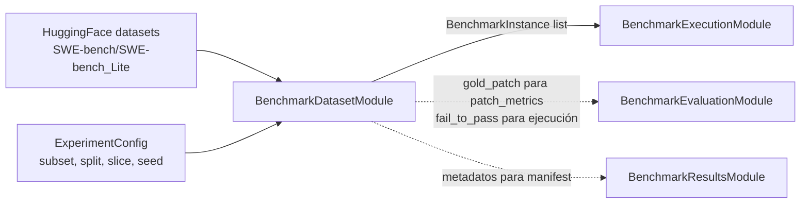

# Módulo de dataset (`BenchmarkDatasetModule`)

> Documento de especificación de **alto/medio nivel** del módulo. La spec global del Bloque 2 (arquitectura general, contratos transversales, configuración experimental inicial) está en `especificacion_benchmark.md`.

## 1. Función

Cargar un benchmark base compatible con el formato SWE-bench, seleccionar el subconjunto experimental (subset, split, slice, filtros), normalizar cada tarea a un contrato interno `BenchmarkInstance` y exponer los metadatos necesarios para la ejecución y la evaluación posteriores. El módulo de dataset es el **único productor** de `BenchmarkInstance` del Bloque 2.

El módulo **carga y normaliza**; no ejecuta agentes ni emite juicio funcional. Tampoco modifica el contenido del dataset original; lo lee y produce una vista normalizada y serializable.

## 2. Posición en el flujo



El módulo se invoca al inicio del experimento. Su salida alimenta a la ejecución y a la evaluación (`gold_patch` para `patch_metrics` en `evaluation_result.json`).

## 3. Entradas y dependencias

**Entradas por experimento (parámetros de `load_instances`):**

- `dataset_config: DatasetConfig` - configuración declarativa del subconjunto experimental:
  - `name: str` - identificador del benchmark base (`SWE-bench/SWE-bench_Lite`, `SWE-bench/SWE-bench_Verified`, etc.).
  - `subset: str` - alias compatible con `mini-SWE-agent` (`lite`, `verified`, `multilingual`, ...).
  - `split: str` - `train`, `dev`, `test`. Por defecto `test`.
  - `slice_strategy: str` ∈ `{stratified_by_repo, random, sequential, full}`.
  - `slice_size: int | None` - número de instancias deseadas; `None` para usar el subset completo.
  - `slice_seed: int` - semilla determinista para `random` y `stratified_by_repo`.
  - `shuffle: bool` - barajado posterior al slice (no afecta a la elección, solo al orden de iteración).
  - `instance_ids: list[str] | None` - si se define, filtra el pool al conjunto exacto de estos `instance_id`. Verificación estricta: aborta si algún ID no está presente en el dataset cargado. Útil para reejecutar instancias concretas o para configurar experimentos con un subconjunto predeterminado.

**Dependencias inyectadas en construcción:**

- Configuración del módulo (parte de `BenchmarkConfig`): rutas de cache, opciones de descarga, validaciones obligatorias por campo.

El módulo reutiliza `datasets.load_dataset` de HuggingFace para la carga base y respeta el cache local por defecto (`~/.cache/huggingface/`). No requiere claves de API.

## 4. Carga del dataset base

El módulo carga el dataset desde HuggingFace mediante `datasets.load_dataset(name, split=split)` y respeta los aliases nativos de `mini-SWE-agent`. Para el alcance inicial del TFG el alias relevante es `lite`, que mapea a `SWE-bench/SWE-bench_Lite`.

Tras la carga, el módulo realiza **dos pasadas** sobre los datos:

1. **Normalización**: convierte cada fila del dataset al contrato `BenchmarkInstance` (MD.9). Los campos opcionales (`gold_patch`, `test_patch`) se rellenan si están presentes y se marcan como `None` si no.
2. **Validación estructural**: comprueba la presencia de los campos obligatorios. Las instancias inválidas se descartan con un registro explícito en el log; el módulo no aborta el experimento por instancias individuales malformadas, salvo que **todas** lo estén.

## 5. Selección y muestreo del slice

### 5.1 Estrategia por defecto: estratificación por repositorio

La estrategia configurada para el lote principal es **estratificación por repo**. Garantiza que el slice cubra todos los repositorios presentes en el subset, lo que permite al Bloque 3 hacer análisis por repo sin que un repo concreto quede sin instancias.

Procedimiento:

1. Tras la normalización, agrupar las instancias por el campo `repo`.
2. Calcular `target_per_repo = ceil(slice_size / num_repos)` como cuota nominal por repo.
3. Para cada repo, muestrear hasta `target_per_repo` instancias usando `random.Random(slice_seed).sample(...)`. Si un repo tiene menos instancias disponibles que su cuota, se incluyen todas y la diferencia se redistribuye entre los repos restantes.
4. Concatenar las muestras por repo y devolver la lista resultante.

Para SWE-bench Lite con `slice_size=120` y 11 repos: cuota nominal `⌈120/11⌉ = 11`; el total efectivo puede variar ligeramente al alza o a la baja según cuántos repos tengan menos instancias disponibles que su cuota (ver el desglose real aplicado en MD.12).

Cuando un experimento posterior requiera otra estrategia, el campo `slice_strategy` admite los valores listados en MD.3 sin modificar el contrato del módulo.

### 5.2 Reproducibilidad

La tupla `(name, subset, split, slice_strategy, slice_size, slice_seed, shuffle)` define el conjunto de instancias. El módulo expone `selection_summary()` con `num_instances_loaded`, `discarded` y lista de `instance_id`.

**Nota:** el campo `instance_ids` reemplaza al antiguo `instance_filter` / `DatasetConfig.filter` (eliminados en la simplificación). Para depuración puntual se usa `instance_ids` o un `slice_size` pequeño; en tests se inyecta un loader fake.

## 6. Normalización a `BenchmarkInstance`

El contrato `BenchmarkInstance` (MD.9 y EB.7.1) abstrae el formato concreto del dataset. Reglas de normalización:

- `instance_id`: copia textual del campo nativo.
- `dataset_name` / `subset` / `split`: reflejan la fuente exacta de carga.
- `repo` / `base_commit`: copia desde los campos nativos cuando existen; `None` si el subset no los expone.
- `problem_statement`: texto del issue. Se conserva sin modificación.
- `gold_patch` / `test_patch`: se incluyen tal cual si están presentes; el módulo no intenta aplicarlos ni validarlos.
- `fail_to_pass` / `pass_to_pass`: se normalizan a `list[str]` (algunos formatos los entregan como JSON serializado dentro de un string; el módulo deserializa en ese caso).
- `metadata`: diccionario libre con cualquier campo adicional del dataset que pueda ser útil para el Bloque 3 (versiones, etiquetas de dificultad, autor del issue, etc.). El módulo no impone esquema interno a `metadata` salvo que sea serializable a JSON.

## 7. Validación (dentro de `InstanceNormalizer`)

Tras convertir cada fila a `BenchmarkInstance`, el propio normalizador aplica las comprobaciones estructurales siguientes, sin delegarlas en un módulo `instance_validator` independiente:

| Comprobación | Acción si falla |
|---|---|
| `instance_id` no vacío | descarte con motivo `missing_instance_id` |
| `problem_statement` no vacío | descarte con motivo `empty_problem_statement` |
| `fail_to_pass` y `pass_to_pass` son listas (posiblemente vacías) | normalización implícita; nunca descarta |
| `gold_patch` parseable como diff (si presente) | warning en log; **no** descarta |
| `repo` y `base_commit` presentes a la vez (si uno de los dos está) | warning en log; **no** descarta |

Las instancias descartadas se reportan en `selection_summary().discarded`. Si el descarte deja menos del 50% de la cuota objetivo, el módulo aborta con un error explícito (probablemente algo está roto en la carga).

La verificación de PR1 (repositorio git limpio en `cwd`) **no es responsabilidad del módulo de dataset**: ocurre en el módulo de ejecución cuando se prepara el entorno (módulo_ejecucion MD.5.2), porque depende del entorno aislado y no del contenido del dataset.

## 8. Interfaz pública del módulo

El módulo se materializa como una clase con instancia única por experimento, instanciada por el `BenchmarkRunner` (`EB.4.1`).

### 8.1 Clase `BenchmarkDatasetModule`

```text
BenchmarkDatasetModule
├─ __init__(config)
├─ load_instances(dataset_config) -> list[BenchmarkInstance]
├─ get_instance(instance_id) -> BenchmarkInstance
└─ selection_summary() -> dict
```

- **`__init__(config)`**: construye el módulo con su configuración (rutas de cache, opciones de descarga, validaciones obligatorias).
- **`load_instances(dataset_config) -> list[BenchmarkInstance]`**: punto de entrada principal. Carga el dataset (MD.4), aplica selección (MD.5), normaliza (MD.6) y valida (MD.7). Devuelve la lista final ordenada de instancias seleccionadas. **Idempotente** dentro del mismo proceso: llamadas sucesivas con el mismo `dataset_config` devuelven el mismo resultado sin reconsultar a HuggingFace.
- **`get_instance(instance_id) -> BenchmarkInstance`**: lookup directo sobre el conjunto cargado. Devuelve la instancia o lanza `KeyError` si no fue seleccionada por `load_instances`. Útil para el `BenchmarkEvaluationModule` cuando recompone resultados a partir de un `run_id` aislado.
- **`selection_summary() -> dict`**: devuelve los metadatos comprometidos con el manifiesto: configuración aplicada, número de instancias cargadas, descartadas, distribución por repo, lista de `instance_id` seleccionados.

### 8.2 Política ante fallos de carga

- Fallo de descarga del dataset (red, HuggingFace caído, dataset privado sin auth): el módulo **aborta el experimento**. No hay degradación posible: sin dataset no hay benchmark.
- Fallo de validación que afecta a una instancia individual: descarte silencioso registrado en `selection_summary().discarded`.
- Fallo masivo de validación (>50% del slice descartado): aborta con motivo explícito.

## 9. Submódulos internos

La descomposición interna se documenta para guiar el bajo nivel; no forma parte de la interfaz pública.

- **`DatasetLoader`** - fachada sobre `datasets.load_dataset` con manejo de cache, aliases y opciones de descarga.
- **`InstanceNormalizer`** - normaliza filas HF a `BenchmarkInstance` (MD.6) **y** valida (MD.7): descartes, warnings, `selection_summary().discarded`.
- **`SliceSelector`** - estrategias de slicing (MD.5.1) con seed determinista.

## 10. Salida: contrato `BenchmarkInstance`

El contrato base está definido en la EB.7.1. El módulo de dataset es su **único productor** y compromete los siguientes campos:

- `instance_id: str` - identificador único de la tarea dentro del dataset.
- `dataset_name: str` - nombre completo del dataset HuggingFace (`SWE-bench/SWE-bench_Lite`).
- `subset: str` - alias canónico (`lite`, `verified`, ...).
- `split: str` - `test` por defecto.
- `repo: str | None` - repositorio asociado, en formato `owner/repo` cuando esté disponible.
- `base_commit: str | None` - commit base sobre el que se aplica el cambio.
- `problem_statement: str` - texto del issue; obligatorio y no vacío tras validación.
- `gold_patch: str | None` - parche de referencia.
- `test_patch: str | None` - parche de tests asociado a la instancia.
- `fail_to_pass: list[str]` - tests que deben pasar de fallar a pasar.
- `pass_to_pass: list[str]` - tests que deben seguir pasando.
- `metadata: dict` - diccionario libre con campos adicionales del dataset.

El contrato es estable: el `BenchmarkExecutionModule`, el `BenchmarkEvaluationModule` y el `BenchmarkResultsModule` dependen exclusivamente de estos campos.

## 11. Organización del código

El módulo se ubica en `src/benchmark/dataset_module/`. La carpeta sigue la convención `*_module/` del Bloque 2 y el archivo principal lleva el mismo nombre que la carpeta para evitar ambigüedad en referencias.

```text
src/benchmark/dataset_module/
├── __init__.py                      # re-exporta BenchmarkDatasetModule, BenchmarkInstance
├── dataset_module.py                # BenchmarkDatasetModule (clase principal de MD.8)
├── benchmark_instance.py            # BenchmarkInstance (contrato de MD.10)
├── dataset_loader.py                # DatasetLoader (MD.9)
├── instance_normalizer.py           # normalización + validación (MD.6–MD.7)
└── slice_selector.py                # SliceSelector (MD.5)
```

Convenciones:

- **Superficie pública del paquete:** `BenchmarkDatasetModule` y `BenchmarkInstance`. El resto es detalle de implementación importable desde tests pero no parte de la API por defecto.
- **Una sola instancia por experimento** del `BenchmarkDatasetModule`, instanciada por el `BenchmarkRunner`.
- **Idempotencia y cache**: la carga del dataset usa el cache de HuggingFace; la selección y normalización son funciones puras del input.

## 12. Configuración experimental aplicada

Los valores concretos para el lote principal del benchmark se documentan en la EB.13. A nivel de este módulo:

- **`name`**: `SWE-bench/SWE-bench_Lite`.
- **`subset`**: `lite`.
- **`split`**: `test`.
- **`slice_strategy`**: `stratified_by_repo` (decisión D-A.A3).
- **`slice_size`**: 120 para el pool global de agentes principales; los dos agentes de ablación operan sobre un sub-slice de 40 instancias del mismo pool, vía `AgentRunConfig.dataset_slice_size` (EB.7.2), no vía un `DatasetConfig` independiente.
- **`slice_seed`**: `42`.

Estos valores son configurables y pueden ajustarse en tiradas posteriores sin alterar la arquitectura del módulo.

## 13. Referencias

- `especificacion_benchmark.md` - spec global del Bloque 2 (EB.2 selección de SWE-bench, EB.3 PB1, EB.7.1 `BenchmarkInstance`, EB.13 configuración experimental).
- `docs/especificaciones/benchmark/modulo_ejecucion.md` - consumidor principal de `BenchmarkInstance`; productor de `forbidden_test_ids` a partir de `fail_to_pass + pass_to_pass`.
- `src/agent/mini-swe-agent/src/minisweagent/run/benchmarks/swebench.py` - alias nativos del subset y carga base.
- HuggingFace datasets: `SWE-bench/SWE-bench_Lite` (https://huggingface.co/datasets/SWE-bench/SWE-bench_Lite).
