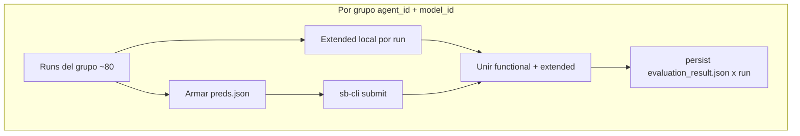

# Módulo de evaluación (`BenchmarkEvaluationModule`)

> Documento de especificación de **alto/medio nivel** del módulo. La spec global del Bloque 2 está en `especificacion_benchmark.md`. Los ejemplos de salida en JSON están en `ejemplo_evaluation_result.md`.

## 1. Función

Producir un único `EvaluationResult` por run y persistirlo en `evaluation_result.json`, combinando dos fuentes de juicio sobre el mismo run:

- **Functional** - el veredicto SWE-bench (`resolved`), obtenido vía `sb-cli` y calculado por **grupo** `(agent_id, model_id)`.
- **Extended** - `run_metrics` y `patch_metrics`, comparables entre todos los agentes, obtenidos por lectura local de la traza y del parche.

El Bloque 3 es quien agrega y analiza series a partir de `trajectory.traj.json`; el Bloque 2 no precalcula agregados ni métricas específicas de `robust_agent` (`robust_metrics`) en `evaluation_result.json`.

## 2. Flujo (por grupo, un solo momento de evaluación)



Dentro de un mismo grupo, el cálculo de `extended` en local y el `submit` a `sb-cli` son independientes entre sí y pueden ejecutarse en cualquier orden; lo único contractual es que la escritura a disco ocurre **una vez** por run, ya con el resultado unificado.

El módulo asume que `BenchmarkRunner` ya ha ejecutado los agentes; su única función es evaluar los artefactos que estos dejaron en disco, no orquestar su ejecución.

## 3. Entradas

El método `evaluate_runs` recibe `run_records`, `instances` y `experiment_config`. El preflight de `sb-cli` (comprobar que el servicio está accesible antes de gastar tiempo ejecutando agentes) vive en el runner, no en este módulo, porque debe ocurrir **antes** de la fase de ejecución.

Si `benchmark.evaluation_skip=True` o `benchmark.functional_backend='none'`, la fase funcional se omite -típicamente para ahorrar cuota de `sb-cli` durante tiradas de depuración-; las métricas locales (`run_metrics`, `patch_metrics`) se calculan igualmente y `functional.resolved` queda a `null`.

`evaluate_runs` es idempotente por `evaluation_result.json` cacheado, pero un resultado `functional.status` en `{"evaluation_error", "skipped", "unavailable"}` se reintenta si la evaluación está activa (p. ej. al pasar de `evaluation_skip=True` a `False` con `--evaluate`); solo `"evaluated"` (éxito real de `sb-cli`) es definitivo y nunca se reenvía. El `BenchmarkRunner` puede además restringir qué `agent_id` se pasan a `evaluate_runs` en una invocación dada (`only_agent_ids`, expuesto como `--evaluate-agents` en la CLI), sin que ese filtro forme parte de `ExperimentConfig` ni de la validación de reanudación — ver `modulo_resultados.md`, sección 6.1.

`BenchmarkRunner.run(evaluation_only=True)` (activado automáticamente por `--evaluate` en la CLI) omite por completo el paso de ejecución (`execution_module.run_matrix`) y el preflight de Docker: solo recopila los `BenchmarkRunRecord` ya persistidos en disco y los pasa a `evaluate_runs`. Es necesario porque, sin este flag, cualquier run no terminal se trataría como pendiente de reanudación durante una pasada pensada para "solo evaluar", gastando cuota del LLM y tiempo — ver también `modulo_resultados.md`, sección 4.

**Reintento forzado de un grupo ya `evaluated` (`force_agent_ids` / `--force-reevaluate-agents`, uso excepcional):** un `functional.status == "evaluated"` normalmente es definitivo (protege la cuota ya gastada), pero `sb-cli` puede devolver un resultado espurio (p. ej. 100% `Failed runs` por un fallo de su backend, no del parche). Para reintentar deliberadamente, `evaluate_runs(..., force_agent_ids=frozenset({"robust_v2"}))` ignora el cacheado `evaluated` solo para esos `agent_id` y somete el grupo de nuevo. Como `sb-cli` bloquea permanentemente las instancias ya sometidas bajo un `run_id` dado (no se pueden re-evaluar bajo el mismo identificador), el reenvío usa un `run_id` explícito distinto del `group_id` habitual (`f"{group_id}-retry{timestamp}"`, vía el parámetro `run_id` de `SbCliClient.submit`), de modo que `sb-cli` lo trate como una evaluación nueva. Expuesto en la CLI como `--force-reevaluate-agents agent_id1,agent_id2` (requiere `--evaluate`; amplía automáticamente el alcance de la pasada). Cada invocación gasta 1 unidad de cuota por grupo forzado, igual que una primera evaluación — es una decisión explícita del operador, nunca automática.

## 4. Contrato `EvaluationResult`

El contrato completo está fijado en EB.7.4, con ejemplos en `ejemplo_evaluation_result.md`. A nivel top-level incluye `run_id`, `instance_id`, `agent_id` y `trace_format`; el bloque `functional` aporta `resolved`, `status`, `evaluation_backend`, `report_path` y `evidence`; el bloque `extended` aporta `run_metrics`, `patch_metrics`, `availability` y `errors`.

## 5. Agrupación sb-cli

Un grupo de evaluación reúne todos los runs que comparten `(agent_id, model_id)`, identificado como `group_id = <agent_id>__<model_id>` (sin segmento `profile` en la ruta, por la misma razón que en EB.5.1: el perfil ya es parte del `agent_id`). Para la configuración del TFG, con cuatro agentes principales sobre el mismo modelo, esto se traduce en **4 submits** a `sb-cli` en lugar de uno por cada uno de los cientos de runs individuales, lo que reduce sustancialmente la cuota consumida.

## 6. Idempotencia

Si `evaluation_result.json` ya existe y es válido para un run, el módulo no lo recalcula. Esto permite que, tras una reanudación, la fase de evaluación se limite a rellenar los resultados que faltan sin repetir trabajo ya persistido.

## 7. Interfaz pública

```text
BenchmarkEvaluationModule
├─ __init__(config, results_module, sb_cli_client=None)
└─ evaluate_runs(run_records, instances, experiment_config) -> dict[str, EvaluationResult]
```

`evaluate_runs()` es el único punto de entrada público y devuelve un diccionario `{run_id: EvaluationResult}`. Los métodos `_evaluate_group_functional` y `_build_result` son privados del `Evaluator` interno y no forman parte de la API pública del módulo.

## 8. Organización del código

```text
src/benchmark/evaluation_module/
├── evaluation_module.py      # facade delgado
├── evaluator.py              # orquesta grupos + persist
├── evaluation_result.py
├── sb_cli_client.py
└── extractors/
    ├── run_metrics.py        # incluye lectura tolerante de .traj.json (ParsedTrace)
    └── patch_metrics.py
```

El módulo se mantiene deliberadamente compacto: no hay evaluadores separados por tipo (`functional_evaluator.py`, `extended_evaluator.py`), ni un parser de trazas independiente (`trace_parser.py`), ni constructores de resumen dedicados (`summary_builders/`). Toda esa lógica cabe con claridad en `evaluator.py` y en los dos extractores de `extractors/`.

## 9. Configuración experimental

El lote principal evalúa 120 instancias de SWE-bench Lite para cada uno de los cuatro agentes principales (`default`, `robust_strict`, `robust_balanced`, `robust_permissive`) y 40 instancias para cada una de las dos ablaciones (`robust_no_intervention`, `robust_v2`), gestionadas mediante `dataset_slice_size`. El modelo es Gemini 2.5 Flash con `N=1`; `sb-cli` es obligatorio al inicio del lote salvo que se desactive explícitamente con `evaluation_skip=True`.

## 10. Referencias

- `especificacion_benchmark.md`, `modulo_resultados.md`, `ejemplo_evaluation_result.md`
